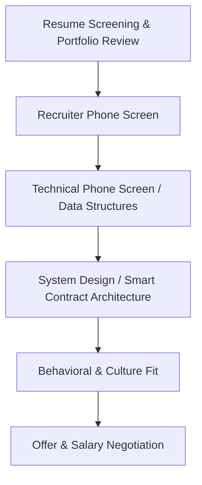

# 🎯 Career & Technical Interview Guide

This guide prepares software engineers for technical interviewing, resume optimization, and landing Full-Stack or Web3 engineering positions.

---

## 📌 Technical Interview Roadmap

---

## 💡 Preparation Pillars

### 1. Data Structures & Algorithms (DSA)
- Master fundamental patterns: Two Pointers, Sliding Window, Fast/Slow Pointers, Binary Search, Trees, Graphs, Dynamic Programming.
- Practice daily on platforms like LeetCode or NeetCode.

### 2. Full-Stack System Design
- Master client-server separation, REST & GraphQL API design, database indexing, caching strategies (Redis), message queues (RabbitMQ/Kafka), and microservices.

### 3. Web3 & Smart Contract Security
- Master Rust/Solidity memory layout, account model vs EVM, reentrancy guards, flash loan mechanics, and auditing standards.

---

## 📄 Resume Checklist

- Keep it to 1 page.
- Use the **XYZ Format**: "Accomplished [X], as measured by [Y], by doing [Z]".
- Link directly to GitHub repositories, live demo URLs, and your portfolio website.

---

## 🔗 Learning Links
- [Interview Reference Guide](../INTERVIEW.md)
- [Portfolio Showcase Guidelines](../Portfolio/README.md)
