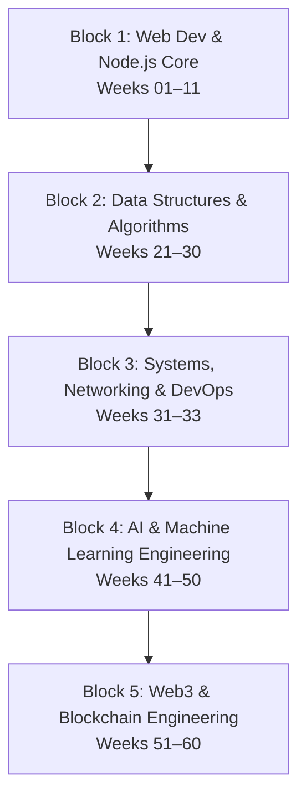

# 🗺️ Complete Software Engineering, Systems, AI & Web3 Roadmap

> **Outcome:** Build a solid computer science and full-stack foundation, master data structures, systems networking, containerization, deep learning models, and production blockchain applications.

## Specialization Overview

| Block | Focus | Active Weeks | Core Stack |
|---|---|---|---|
| **Block 1** | Web Development & Backend | 01–11 | HTML5, CSS3, JS, TS, React, Node.js, Express, MongoDB |
| **Block 2** | Algorithms & Data Structures | 21–30 | Recursion, Complexity, Linked Lists, Trees, Graphs, DP |
| **Block 3** | Linux, Networking & DevOps | 31–33 | Shell, SSH, TCP/IP, DNS, HTTP, Docker, Containerization |
| **Block 4** | Machine Learning & AI | 41–50 | Python, Linear Algebra, PyTorch, Transformers, RAG, Agents |
| **Block 5** | Web3 & Blockchain | 51–60 | Cryptography, Rust, Solana, Anchor, DeFi, Security Auditing |

---

## Detailed Weekly Focus

| Week | Focus | Hours | Portfolio evidence |
|---|---|---:|---|
| **01** | Git, Linux, networking and workflow | 20 | Cheat sheet, Git portfolio |
| **02** | Semantic HTML and accessibility | 18 | Portfolio and résumé sites |
| **03** | CSS, responsive design and Tailwind | 22 | Responsive product pages |
| **04** | JavaScript fundamentals and the DOM | 24 | Calculator, weather and todo apps |
| **05** | Asynchronous JavaScript and browser APIs | 26 | Movie, quiz and expense apps |
| **06** | TypeScript | 16 | Typed task and inventory apps |
| **07** | React fundamentals | 24 | Notes app, dashboard and blog UI |
| **08** | Advanced React | 26 | Admin, chat UI and Kanban board |
| **09** | Node.js, Express and REST APIs | 24 | Authentication, task and inventory APIs |
| **10** | MongoDB, Mongoose and deployment | 20 | Full-stack notes app |
| **11** | Advanced Node.js (Event Loop, Streams) | 40 | File compression server & custom streaming API |
| **21** | Complexity Analysis & Recursion | 20 | Recursion solver engine & Big O visualizer |
| **22** | Arrays, Strings & Sliding Window | 22 | Sliding window metrics analyzer |
| **23** | Linked Lists, Stacks & Queues | 24 | Stack-based expressions evaluator |
| **24** | Hash Maps, Heaps & Searching | 24 | LFU cache & Priority Queue scheduler |
| **25** | Trees, BST, AVL & Trie Structures | 24 | Trie-based autocomplete engine |
| **26** | Graph Algorithms & Routing | 24 | Dijkstra pathfinder & network routing simulator |
| **27** | Dynamic Programming | 24 | Knapsack solver & matrix optimization suite |
| **28** | Greedy & Backtracking | 24 | N-Queens puzzle solver |
| **29** | Advanced DSA & Strings | 24 | KMP pattern matcher & suffix tree tracker |
| **30** | Interview Engineering | 24 | Competitive programming solutions portfolio |
| **31** | Linux Mastery & Shell Scripting | 24 | Automated backup engine & server monitoring script |
| **32** | Computer Networking Fundamentals | 22 | TCP socket chat application |
| **33** | Docker & Containerization | 24 | Multi-stage Dockerized MERN application |
| **41** | Python for AI/ML | 24 | NumPy matrix solver & Pandas analysis suite |
| **42** | Mathematics for AI/ML | 24 | Gradient Descent optimizer script |
| **43** | Machine Learning Fundamentals | 24 | Scikit-learn classification & clustering suite |
| **44** | Deep Learning Fundamentals | 26 | Custom neural network built from scratch |
| **45** | PyTorch & TensorFlow Frameworks | 24 | Multi-class image classifier |
| **46** | NLP & Transformers | 24 | Sentiment analyzer using Hugging Face |
| **47** | LLM Engineering | 24 | Prompt engineering suite & API chains |
| **48** | Vector Databases & RAG | 22 | Q&A knowledge base using ChromaDB & LangChain |
| **49** | AI Agents & Systems | 24 | Multi-agent research crew using CrewAI |
| **50** | MLOps & Deployment | 24 | Model tracking suite using MLflow |
| **51** | Cryptography & Digital Signatures | 24 | Merkle Tree verification engine |
| **52** | Rust Systems Programming | 24 | Multi-threaded parser in Rust |
| **53** | Blockchain Architecture & Consensus | 24 | Mini block verification ledger |
| **54** | Solana Architecture & Web3.js | 24 | On-chain counter program & RPC script |
| **55** | Anchor Framework & PDAs | 24 | PDA vault program & Voting escrow contract |
| **56** | Web3 Frontend Integration | 24 | React Solana wallet dashboard |
| **57** | DeFi AMMs & Price Oracles | 24 | Swap contract with Pyth price checking |
| **58** | Smart Contract Security & Auditing | 24 | Static analysis program & security audit report |
| **59** | Scaling, Rollups & Bridges | 24 | L2 state compressor & token bridge simulator |
| **60** | Capstone DApp & Showcase | 24 | Full-stack Capstone DApp & Developer Portfolio |

---

## Weekly operating rhythm

| Day | Work |
|---|---|
| Monday–Thursday | Learn, take notes, then reproduce concepts from memory. |
| Friday | Solve practice exercises and repair weak spots. |
| Saturday | Build one focused project feature. |
| Sunday | Finish, document, test manually, publish and review. |

---

## Milestones

1. **Week 3:** Publish accessible, responsive static pages.
2. **Week 10:** Deploy a full-stack Node.js + React app with database persistence.
3. **Week 30:** Solve advanced algorithmic constraints and pass core technical tests.
4. **Week 33:** Containerize multi-service applications using Docker.
5. **Week 50:** Train, evaluate, register, and deploy AI models with MLOps tracking.
6. **Week 60:** Deploy a secure, audited Solana DApp and publish your developer portfolio website.

---

## Definition of done

- Complete the weekly guide checklist.
- Commit clean modifications with informative messages.
- Publish a portfolio project every second week.
- Write a short retrospective on what was built, what broke, and lessons learned.

Continue with [Week 01](weeks/Week-01.md) or pick a specialization block.
