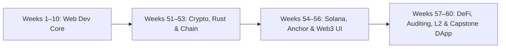

# 🗺️ Complete Software Engineering & Web3 Roadmap

> **Outcome:** Build a practical web development foundation, master Solana blockchain development & Anchor smart contracts, and deploy production Web3 applications.

| Week | Focus | Hours | Portfolio evidence |
|---|---|---:|---|
| 01 | Git, Linux, networking and workflow | 20 | Cheat sheet, Git portfolio |
| 02 | Semantic HTML and accessibility | 18 | Portfolio and résumé sites |
| 03 | CSS, responsive design and Tailwind | 22 | Responsive product pages |
| 04 | JavaScript fundamentals and the DOM | 24 | Calculator, weather and todo apps |
| 05 | Asynchronous JavaScript and browser APIs | 26 | Movie, quiz and expense apps |
| 06 | TypeScript | 16 | Typed task and inventory apps |
| 07 | React fundamentals | 24 | Notes app, dashboard and blog UI |
| 08 | Advanced React | 26 | Admin, chat UI and Kanban board |
| 09 | Node.js, Express and REST APIs | 24 | Authentication, task and inventory APIs |
| 10 | MongoDB, Mongoose and deployment | 20 | Full-stack notes app |
| 51 | Cryptography & Merkle Trees | 24 | Hash CLI & Merkle tree verifier |
| 52 | Rust Programming & Ownership | 24 | Systems CLI & Rust memory manager |
| 53 | Blockchain Fundamentals & PoH | 24 | Block explorer & Solana RPC client |
| 54 | Solana Development & Web3.js | 24 | On-chain counter program & SPL CLI |
| 55 | Anchor Framework & PDAs | 24 | Anchor vault & decentralized voting program |
| 56 | Web3 Frontend Integration | 24 | Wallet portfolio dashboard & token swap UI |
| 57 | DeFi AMMs & Price Oracles | 24 | AMM constant product pool & Pyth price feed |
| 58 | Smart Contract Security & Auditing | 24 | Vulnerability suite & security audit report |
| 59 | Scaling, Rollups & Cross-Chain | 24 | L2 rollup simulator & cross-chain bridge |
| 60 | Capstone Web3 DApp & Showcase | 24 | Full-stack Capstone DApp & Portfolio |

---

## Weekly operating rhythm

| Day | Work |
|---|---|
| Monday–Thursday | Learn, take notes, then reproduce concepts from memory. |
| Friday | Solve practice exercises and repair weak spots. |
| Saturday | Build one focused project feature. |
| Sunday | Finish, document, test manually, publish and review. |

---

## Milestones

1. **Week 3:** Publish accessible, responsive static pages.
2. **Week 6:** Write JavaScript with types, modules and predictable errors.
3. **Week 8:** Build client-side products with navigation and shared state.
4. **Week 10:** Deploy a full-stack application with safe configuration.
5. **Week 53:** Build cryptographic verification utilities and query live blockchain nodes.
6. **Week 56:** Deploy Anchor programs to Devnet with React wallet adapter UI.
7. **Week 60:** Deploy full-stack Web3 Capstone DApp and publish showcase portfolio.

---

## Definition of done

- Complete the checklist in each weekly guide.
- Commit work in small, meaningful changes with clear messages.
- Publish at least one project every two weeks.
- Write a short retrospective: what you learned, what broke, and what you would improve.

Continue with [Week 01](weeks/Week-01.md) or [Week 51](weeks/Week-51.md).
