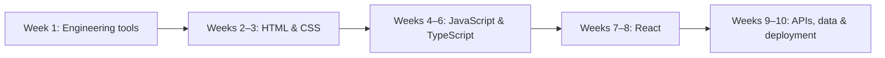

# 🗺️ Ten-Week Software Engineering Roadmap

> **Outcome:** build a practical web-development foundation, ship portfolio work, and understand the tools used by professional software teams.

| Week | Focus | Hours | Portfolio evidence |
|---|---|---:|---|
| 01 | Git, Linux, networking and workflow | 20 | cheat sheet, Git portfolio |
| 02 | Semantic HTML and accessibility | 18 | portfolio and résumé sites |
| 03 | CSS, responsive design and Tailwind | 22 | responsive product pages |
| 04 | JavaScript fundamentals and the DOM | 24 | calculator, weather and todo apps |
| 05 | Asynchronous JavaScript and browser APIs | 26 | movie, quiz and expense apps |
| 06 | TypeScript | 16 | typed task and inventory apps |
| 07 | React fundamentals | 24 | notes app, dashboard and blog UI |
| 08 | Advanced React | 26 | admin, chat UI and Kanban board |
| 09 | Node.js, Express and REST APIs | 24 | authentication, task and inventory APIs |
| 10 | MongoDB, Mongoose and deployment | 20 | full-stack notes app |

## Weekly operating rhythm

| Day | Work |
|---|---|
| Monday–Thursday | Learn, take notes, then reproduce concepts from memory. |
| Friday | Solve practice exercises and repair weak spots. |
| Saturday | Build one focused project feature. |
| Sunday | Finish, document, test manually, publish and review. |

## Milestones

1. **Week 3:** publish accessible, responsive static pages.
2. **Week 6:** write JavaScript with types, modules and predictable errors.
3. **Week 8:** build client-side products with navigation and shared state.
4. **Week 10:** deploy a full-stack application with safe configuration.

## Definition of done

- Complete the checklist in each weekly guide.
- Commit work in small, meaningful changes with clear messages.
- Publish at least one project every two weeks.
- Write a short retrospective: what you learned, what broke, and what you would improve.

Continue with [Week 01](weeks/Week-01.md).
