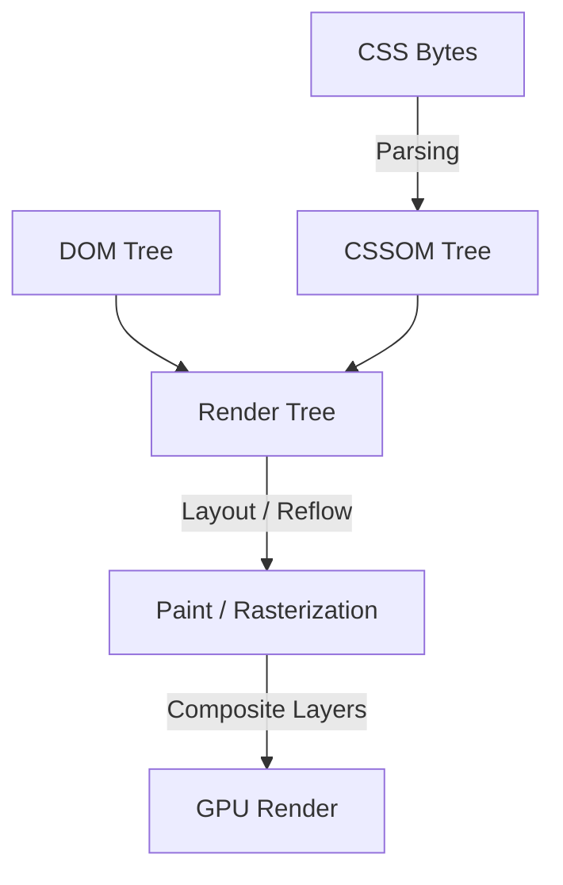

# CSS Deep Dive

## 📌 Core Learning Objectives
* **Beginner**: Master selectors, inheritance, cascades, the box model, standard positioning, and basic Flexbox layouts.
* **Intermediate**: Dominate responsive design (Media Queries & Container Queries), CSS custom properties (variables), transitions, keyframe animations, and Grid layouts.
* **Advanced**: Master layout engines (Subgrid), rendering performance (minimizing reflows/repaints, using hardware acceleration), and complex stacking contexts (z-index isolation layers).

---

## 🗺️ Core Architecture & Concept Map
Understanding how the browser processes stylesheets and layouts determines how fast a page renders:



### The Rendering Pipeline & Specificity Cascades
1. **The Cascade**: CSS parses styles by combining Browser Defaults (user agent), User Styles, and Developer Styles. Specificity is calculated as a four-part vector: Inline Styles (1,0,0,0) -> IDs (0,1,0,0) -> Classes/Pseudo-classes/Attributes (0,0,1,0) -> Elements/Pseudo-elements (0,0,0,1).
2. **Reflow vs. Repaint**: 
   - **Reflow (Layout)**: Occurs when structural dimensions change (e.g., `width`, `height`, `margin`, `top`). The browser recalculates the position and size of all elements, which is extremely expensive.
   - **Repaint**: Occurs when visual styles change without affecting layout (e.g., `color`, `background-color`, `box-shadow`).
   - **Composite**: Modifying properties that do not trigger layout or paint (e.g., `transform`, `opacity`). These operations run directly on the GPU, avoiding CPU rendering bottlenecks.

---

## 🛠️ Topic-by-Topic Breakdown

### 1. Modern Layouts (Flexbox & CSS Grid)
* **Description**: Using Flexbox for one-dimensional layouts (components, alignment) and CSS Grid for two-dimensional structures (page layouts, grid cards) to create clean, responsive systems without hacking widths or floats.
* **Code Implementation**:
  ```css
  /* Grid Container */
  .grid-container {
    display: grid;
    /* Automatically fit as many cards as possible, minimum width 280px, maximum 1fr */
    grid-template-columns: repeat(auto-fit, minmax(280px, 1fr));
    gap: 24px;
    padding: 32px;
  }

  /* Flex Card Item */
  .card-item {
    display: flex;
    flex-direction: column;
    justify-content: space-between;
    background: var(--bg-raised);
    border: 1px solid var(--line);
    border-radius: 12px;
    padding: 20px;
    height: 100%;
  }

  /* Subgrid Card content (aligns internal items across different cards) */
  .card-body {
    display: grid;
    grid-template-rows: subgrid;
    grid-row: span 3;
    gap: 8px;
  }
  ```
* **Common Pitfalls & Best Practices**:
  * **Pitfall - Fixed Height Grid Items**: Hardcoding `height` on grid container items, which breaks accessibility when text scales up or overflows.
    * *Fix*: Rely on content-driven heights, relative paddings, and the natural height capabilities of CSS Grid/Flexbox (`align-items: stretch`).
  * **Pitfall - Inflexible Grid Columns**: Creating rigid structures using percentage columns (`grid-template-columns: 33.3% 33.3% 33.3%`) instead of flexible units (`fr` or `minmax()`), leading to horizontal scrollbars on smaller viewports.
    * *Fix*: Implement `minmax()` and wrapping layouts (`repeat(auto-fill, minmax(300px, 1fr))`) to handle scaling dynamically.

---

### 2. Micro-Component Layouts (Container Queries)
* **Description**: Allowing components to adapt style logic based on the size of their parent container rather than the global viewport width, enabling reusable cards that render beautifully in both thin sidebars and wide body containers.
* **Code Implementation**:
  ```css
  /* 1. Define the parent component as a container context */
  .card-wrapper {
    container-type: inline-size;
    container-name: dashboard-card;
    width: 100%;
  }

  /* 2. Write styling queries matching parent container dimensions */
  .article-card {
    display: flex;
    flex-direction: column;
    gap: 12px;
  }

  /* When the wrapper container is wider than 500px, lay out card horizontally */
  @container dashboard-card (min-width: 500px) {
    .article-card {
      flex-direction: row;
      align-items: center;
      gap: 24px;
    }
    .article-card img {
      width: 150px;
      height: 150px;
    }
  }
  ```
* **Common Pitfalls & Best Practices**:
  * **Pitfall - Query Loop (Infinite resizing)**: Writing styles that modify the dimensions of the container element from *inside* a container query, causing a rendering loop where the component constantly expands and shrinks.
    * *Fix*: Only apply container queries to target descendant classes *within* the container, never resize the container container itself inside the query block.
  * **Pitfall - Missing fallback variables**: Not providing a fallback layout for browsers that do not support container queries.
    * *Fix*: Structure styles with a standard mobile-first layout as a fallback, and layer container query enhancements on top.

---

### 3. Rendering Performance & Hardware Acceleration
* **Description**: Optimizing layouts and animations to bypass layout and repaint calculations, delegating animation calculations directly to the GPU to hit solid 60 FPS interfaces.
* **Code Implementation**:
  ```css
  .interactive-button {
    position: relative;
    background: var(--accent);
    color: #fff;
    border: none;
    padding: 12px 24px;
    border-radius: 8px;
    /* Trigger GPU layer promotion */
    will-change: transform, opacity;
    transition: transform 0.2s cubic-bezier(0.16, 1, 0.3, 1), opacity 0.2s ease;
  }

  .interactive-button:hover {
    /* Safe GPU transform operations */
    transform: scale(1.04) translateY(-2px);
    opacity: 0.95;
  }

  .interactive-button:active {
    transform: scale(0.98) translateY(0);
  }
  ```
* **Common Pitfalls & Best Practices**:
  * **Pitfall - Animating Non-Composite Properties**: Animating properties like `top`, `left`, `margin`, `width`, or `height` for transitions. This forces the browser to run Reflow and Repaint calculations on every frame.
    * *Fix*: Always use `transform` (for translation, scale, rotation) and `opacity` for animations.
  * **Pitfall - Abuse of will-change**: Setting `will-change` on too many elements across a page. This locks up system resources on the GPU, degrading rendering performance.
    * *Fix*: Only apply `will-change` to elements currently causing visual lag or heavy transition animations, and consider removing it once the animation completes.

---

## 🔨 Hands-On Mini Projects

### 1. Reusable Adaptive Card Component
* **Goal**: Build a card component using Container Queries that functions as a profile banner in wide containers and a compressed column card in sidebars.
* **Key Concepts Applied**: Container type, inline-size query, fluid typography (`cqw`), subgrid alignments.
* **Step-by-Step Implementation Outline**:
  1. Define a card wrapper container with `container-type: inline-size`.
  2. Implement card element styles to be vertical-stacked by default.
  3. Set container queries mapping width limits to structure content into inline layouts.
  4. Use container container-query units (`cqw` / `cqh`) to scale font sizing dynamically.

### 2. High-Performance Dashboard Panel
* **Goal**: Create an interactive administrative grid panel utilizing CSS Grid with smooth, GPU-accelerated side-drawer slide transitions.
* **Key Concepts Applied**: CSS Grid layout, transform animations, hardware layer promotion, custom property controls.
* **Step-by-Step Outline**:
  1. Set up a multi-column dashboard dashboard layout utilizing `grid-template-areas`.
  2. Implement drawer toggle buttons modifying transform properties: `transform: translateX(...)`.
  3. Assign `will-change: transform` to optimize side menu layout sweeps.
  4. Verify rendering framerate targets using Google Chrome DevTools Performance panel.

---

## 📚 Official & Curated Resources
* **W3C Cascading Style Sheets Standard** - [w3.org/Style/CSS](https://www.w3.org/Style/CSS/) - The central repository for all CSS specs, drafts, and styling guidelines.
* **MDN Web Docs - CSS Guide** - [developer.mozilla.org](https://developer.mozilla.org/en-US/docs/Web/CSS) - A complete reference guide featuring specifications, guides, and browser layout compatibility matrix details.
* **web.dev - Learn CSS** - [web.dev/learn/css/](https://web.dev/learn/css/) - Interactive modern styling course covering selectors, specificity, custom grids, and container structures.
