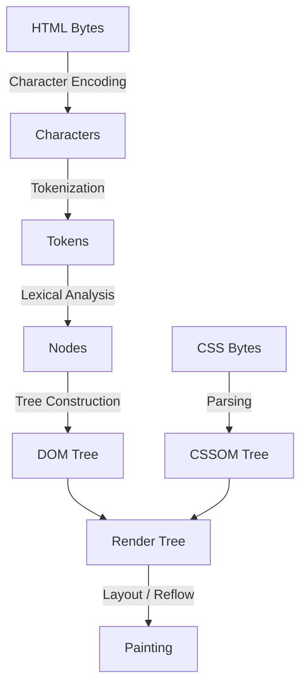

# HTML5 Deep Dive

## 📌 Core Learning Objectives
* **Beginner**: Understand semantic syntax, block vs. inline elements, form structure, validation, and standard page layout structures.
* **Intermediate**: Master accessibility standards (A11y, ARIA roles, landmark elements), SEO microdata/schema integration, and adaptive responsive media elements.
* **Advanced**: Dominate page speed optimization (preload, prefetch, loading parameters), the browser's parsing and rendering lifecycle (Critical Rendering Path), and secure sandboxing mechanisms for third-party embeds.

---

## 🗺️ Core Architecture & Concept Map
To write efficient HTML, a developer must understand how the browser parses and renders documents internally:



### The Critical Rendering Path (CRP)
1. **Tokenization**: The browser reads raw bytes of HTML from the network and converts them into individual tokens (e.g., `<html>`, `<body>`, start tags, end tags, attributes).
2. **DOM Tree Construction**: Tokens are turned into node objects, which are linked into a tree structure representing the document structure (DOM).
3. **Parser-Blocking Scripts**: By default, when the HTML parser encounters a `<script>` tag, parsing is paused until the script is downloaded and executed. This blocks DOM construction and delays the first paint.
4. **CSSOM Interdependency**: If a script requires CSSOM to execute, the browser pauses script execution until the CSS stylesheet is fully parsed, adding another link to the render blocking chain.

---

## 🛠️ Topic-by-Topic Breakdown

### 1. Semantic HTML & Accessibility (A11y)
* **Description**: Using native, descriptive HTML5 elements instead of general-purpose `<div>` and `<span>` tags. This creates a clean structural hierarchy, allowing screen readers, search engine crawlers, and assistive technologies to understand the content structure.
* **Code Implementation**:
  ```html
  <!DOCTYPE html>
  <html lang="en">
  <head>
    <meta charset="UTF-8">
    <title>Semantic Accessible Layout</title>
  </head>
  <body>
    <!-- Landmark header for global site branding & nav -->
    <header role="banner">
      <h1>Tech Blog</h1>
      <nav aria-label="Main Navigation">
        <ul>
          <li><a href="/home">Home</a></li>
          <li><a href="/articles">Articles</a></li>
        </ul>
      </nav>
    </header>

    <!-- Main content container (only one per page) -->
    <main id="main-content">
      <article>
        <header>
          <h2>Understanding Semantic Markups</h2>
          <p>Published <time datetime="2026-07-17">July 17, 2026</time> by Jane Doe</p>
        </header>
        <section>
          <h3>Why Semantics Matter</h3>
          <p>Semantic tags improve readability, SEO ranking, and navigation capability for blind users.</p>
        </section>
        <footer>
          <button aria-label="Bookmark this article">
            <svg aria-hidden="true" width="16" height="16"><path d="M12 2H4v16l4-4 4 4V2z"/></svg>
          </button>
        </footer>
      </article>
    </main>

    <!-- Aside containing secondary info -->
    <aside aria-label="Sidebar Resources">
      <h3>Related Links</h3>
      <ul>
        <li><a href="https://w3c.github.io/html-reference/">W3C HTML Reference</a></li>
      </ul>
    </aside>

    <!-- Global Footer -->
    <footer>
      <p>&copy; 2026 OpenCS. MIT Licensed.</p>
    </footer>
  </body>
  </html>
  ```
* **Common Pitfalls & Best Practices**:
  * **Pitfall - Divitis (Over-using divs)**: Using `<div class="nav">` instead of `<nav>` or `<div class="button" onclick="...">` instead of `<button>`. Assistive devices cannot keyboard-focus or recognize a interactive button styled inside a div.
    * *Fix*: Always use native elements. If a custom element is mandatory, assign explicit keyboard focus with `tabindex="0"`, add ARIA definitions `role="button"`, and handle keyboard event listeners (`keydown` for Space/Enter keys).
  * **Pitfall - Headings Out-of-Order**: Jumping directly from `<h1>` to `<h3>` or `<h4>` just because of font-size styles.
    * *Fix*: Headings represent the document outline. Use them strictly in sequential descending order (`h1` -> `h2` -> `h3`). Change sizing visuals using CSS, not heading tags.

---

### 2. Responsive Media & Layout Shift Optimization
* **Description**: Implementing media elements that adapt seamlessly to client viewports and device pixel ratios while preventing visual shifts during page load (Cumulative Layout Shift).
* **Code Implementation**:
  ```html
  <picture>
    <!-- Use next-gen WebP/AVIF images if supported by the browser -->
    <source srcset="./assets/images/hero-large.avif 1200w, ./assets/images/hero-medium.avif 800w" 
            sizes="(max-width: 768px) 100vw, 50vw" 
            type="image/avif">
    <source srcset="./assets/images/hero-large.webp 1200w, ./assets/images/hero-medium.webp 800w" 
            sizes="(max-width: 768px) 100vw, 50vw" 
            type="image/webp">
    <!-- fallback element must have dimensions to reserve layout space -->
    
  </picture>
  ```
* **Common Pitfalls & Best Practices**:
  * **Pitfall - Missing Dimensions on Images**: Omitting `width` and `height` attributes on the `` tag. When the page loads, the browser cannot allocate layout bounds for the image before it downloads, causing content below it to "jump" down (high CLS score).
    * *Fix*: Always provide native `width` and `height` attributes on the image tag to establish the default aspect-ratio. Use CSS (`width: 100%; height: auto;`) to make it responsive.
  * **Pitfall - Overusing lazy-loading**: Marking critical above-the-fold images (like the main hero banner) with `loading="lazy"`. This delays the Largest Contentful Paint (LCP) since the image download is deferred.
    * *Fix*: Only apply `loading="lazy"` to images situated below the fold. For primary hero images, consider adding a high-priority preload link in the head: `<link rel="preload" fetchpriority="high" as="image" href="...">`.

---

### 3. Security & Third-Party Web Sandboxing
* **Description**: Restricting capabilities of embedded third-party contexts (iframes) and external hyperlink references to protect users from Cross-Site Scripting (XSS), content hijacking, and resource abuse.
* **Code Implementation**:
  ```html
  <!-- Secure iframe sandbox -->
  <iframe src="https://third-party-embed.com/widget"
          title="Interactive Code Playground"
          sandbox="allow-scripts allow-popups"
          loading="lazy"
          referrerpolicy="no-referrer"
          width="100%"
          height="400">
  </iframe>

  <!-- Secure external links opening in new tabs -->
  <a href="https://external-website.com" 
     target="_blank" 
     rel="noopener noreferrer">
     Visit External Source
  </a>
  ```
* **Common Pitfalls & Best Practices**:
  * **Pitfall - Unrestricted iframe sandbox**: Embedding third-party widgets without a `sandbox` attribute, or adding too many permissions like `allow-same-origin` and `allow-scripts` together. When combined, a script inside the iframe can access cookies/localStorage of your main domain.
    * *Fix*: Always apply `sandbox` and enable only the narrowest permissions required. Never use `sandbox` alongside both `allow-scripts` and `allow-same-origin` unless the source is fully trusted.
  * **Pitfall - Vulnerable target="_blank" links**: Linking to external sites using `target="_blank"` without defining link relations. This permits the opened tab to gain a handle to your window via `window.opener`, allowing it to redirect your page to a malicious phishing site (Reverse Tabnabbing).
    * *Fix*: Always append `rel="noopener noreferrer"` when linking to untrusted third-party sites using `target="_blank"`.

---

## 🔨 Hands-On Mini Projects

### 1. The Accessible Form System
* **Goal**: Build a multi-step user registration form using strict semantic validation, accessibility attributes, and layout shift prevention.
* **Key Concepts Applied**: ARIA status roles (`aria-describedby`, `aria-invalid`), semantic inputs (`required`, `pattern`), keyboard navigability.
* **Step-by-Step Implementation Outline**:
  1. Create a stage layout with `<form>` and group inputs using `<fieldset>` and `<legend>`.
  2. For every input, add a corresponding `<label>` pointing to the input's `id`.
  3. Include a description field and link it to the input using `aria-describedby="desc-id"`.
  4. Write simple CSS styles to render error states and associate validation indicators using `aria-invalid="true"`.
  5. Test form accessibility by tab-navigating using only a keyboard.

### 2. High-Performance Media Landing Page
* **Goal**: Build a responsive media display gallery containing lazy-loaded cards, optimized art-directed images, and zero layout shift.
* **Key Concepts Applied**: `<picture>` tag, loading attributes, custom aspect ratios.
* **Step-by-Step Outline**:
  1. Set up a grid container of elements.
  2. Inside each card, add a `<picture>` container referencing next-gen AVIF/WebP formats.
  3. Add matching placeholder dimension cards with explicit `width` and `height` dimensions to prevent page shifts.
  4. Set `loading="lazy"` on all cards except the first fold items.

---

## 📚 Official & Curated Resources
* **HTML Living Standard (WHATWG)** - [html.spec.whatwg.org](https://html.spec.whatwg.org/multipage/) - The official, living specification containing detailed documentation for all elements, APIs, and parsing logic.
* **MDN Web Docs - HTML Reference** - [developer.mozilla.org](https://developer.mozilla.org/en-US/docs/Web/HTML) - The authoritative guide for web developers, containing tutorials, browser compatibility tables, and clear syntax examples.
* **web.dev - Learn HTML** - [web.dev/learn/html/](https://web.dev/learn/html/) - Highly structured developer tutorials focusing on clean syntax, web performance, and modern best practices.
