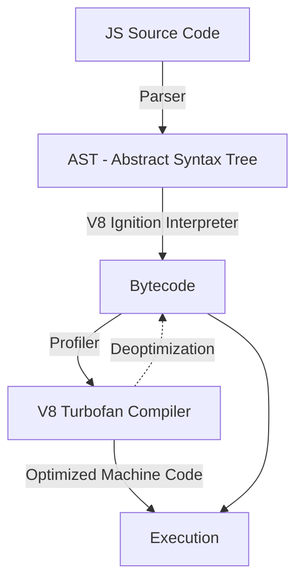

# JavaScript Deep Dive

## 📌 Core Learning Objectives
* **Beginner**: Master primitives, execution blocks, arrays, objects, functions, basic scopes, and ES6+ syntax rules.
* **Intermediate**: Master closures, scope chains, synchronous vs. asynchronous execution, arrays array operations (`map`, `filter`, `reduce`), and DOM event dispatch loops.
* **Advanced**: Master memory management (Garbage Collection, heap/stack models), Event Loop phases (Microtask vs. Macrotask queues), prototypical delegation, and custom optimization techniques for V8 Engine execution.

---

## 🗺️ Core Architecture & Concept Map
A developer must understand how the JavaScript engine operates under the hood to write highly performant code:



### The Event Loop & Concurrency Model
- **Call Stack**: Single-threaded execution stack keeping track of currently executing function contexts (LIFO order).
- **Memory Heap**: Unstructured memory allocator storage block for object declarations, functions, and dynamic variables.
- **Web APIs**: Background worker threads supplied by the environment (browser/Node.js) handling timeouts, AJAX requests, and DOM events.
- **Callback Queue**: 
  - **Microtask Queue**: High priority queue (Promises, `queueMicrotask`, `MutationObserver`). The engine fully exhausts this queue after *every* stack execution before yielding control to macrotasks.
  - **Macrotask Queue**: Standard event queue (e.g., `setTimeout`, `setInterval`, network requests, user input callbacks).

---

## 🛠️ Topic-by-Topic Breakdown

### 1. Execution Context, Scope, and Closures
* **Description**: Understanding how JavaScript manages variable accessibility through Lexical Scoping and Context Chains. Closures enable nested functions to retain memory references of their parent scopes even after the parent execution context has been popped off the Call Stack.
* **Code Implementation**:
  ```javascript
  "use strict";

  // Closure state encapsulation factory
  function createSecureCounter(initialValue = 0) {
    // Private variable scoped to context
    let count = initialValue;

    return {
      increment() {
        count += 1;
        return count;
      },
      decrement() {
        count -= 1;
        return count;
      },
      // Controlled access read function
      getValue() {
        return count;
      }
    };
  }

  const counter = createSecureCounter(10);
  console.log(counter.increment()); // 11
  console.log(counter.increment()); // 12
  console.log(counter.getValue());   // 12
  // console.log(count); // ReferenceError: count is not defined
  ```
* **Common Pitfalls & Best Practices**:
  * **Pitfall - Stale Memory Closures**: Retaining large, unnecessary objects inside a closure reference, preventing the Garbage Collector from freeing the memory.
    * *Fix*: Manually set unused inner-scoped variables to `null` once they are no longer required.
  * **Pitfall - Global Variable Leakage**: Assigning values to variables without declaration keywords (`let`, `const`, `var`), causing them to attach to the global namespace.
    * *Fix*: Always write `"use strict";` at the top of your scripts, or write code in ES Modules which enforce strict mode by default.

---

### 2. Asynchronous Programming & Concurrency
* **Description**: Managing non-blocking execution utilizing Promises and the Async/Await syntax, ensuring parallel processing runs smoothly without blocking the main rendering thread.
* **Code Implementation**:
  ```javascript
  // Fetch multiple API endpoints concurrently with safety checks
  async function fetchUserDashboardData(userId) {
    const urls = [
      `https://api.example.com/users/${userId}`,
      `https://api.example.com/users/${userId}/posts`,
      `https://api.example.com/users/${userId}/analytics`
    ];

    try {
      // Fetch all targets concurrently
      const fetchPromises = urls.map(async (url) => {
        const response = await fetch(url);
        if (!response.ok) {
          throw new Error(`Failed to fetch: ${url} (Status: ${response.status})`);
        }
        return response.json();
      });

      // Await concurrently
      const [profile, posts, analytics] = await Promise.all(fetchPromises);

      return { profile, posts, analytics };
    } catch (error) {
      console.error("Dashboard Loading Failed:", error.message);
      // Propagate handled error state
      throw error;
    }
  }
  ```
* **Common Pitfalls & Best Practices**:
  * **Pitfall - The Promise.all Trap**: Using `Promise.all` on arrays of independent promises where a single failure should not crash the entire list. `Promise.all` rejects immediately if *any* promise fails (short-circuiting).
    * *Fix*: Use `Promise.allSettled` to resolve all promises and inspect the individual success/failure statuses.
  * **Pitfall - Blocking the Event Loop**: Executing extremely complex mathematical equations or CPU-intensive data operations on the main execution thread, freezing the user interface.
    * *Fix*: Offload heavy computations to a Web Worker thread, or partition operations using generator yields or `requestIdleCallback`.

---

### 3. Prototypical Inheritance & Class Contexts
* **Description**: Understanding prototype delegation chains in JavaScript, constructor templates, and managing memory usage.
* **Code Implementation**:
  ```javascript
  // Base prototype-based class
  class EventEmitter {
    constructor() {
      this.events = {};
    }

    on(event, listener) {
      if (!this.events[event]) {
        this.events[event] = [];
      }
      this.events[event].push(listener);
      return () => this.off(event, listener);
    }

    emit(event, data) {
      if (!this.events[event]) return;
      this.events[event].forEach((listener) => listener(data));
    }

    off(event, listener) {
      if (!this.events[event]) return;
      this.events[event] = this.events[event].filter(
        (activeListener) => activeListener !== listener
      );
    }
  }

  const emitter = new EventEmitter();
  const unsubscribe = emitter.on("data", (msg) => console.log("Received:", msg));
  emitter.emit("data", "Event Loop triggered."); // Logs "Received: Event Loop triggered."
  unsubscribe();
  ```
* **Common Pitfalls & Best Practices**:
  * **Pitfall - Modifying Built-in Prototypes**: Extending standard objects like `Array.prototype` or `Object.prototype`. This can cause namespace collisions and breaking changes as specifications evolve.
    * *Fix*: Write standalone utility functions or inherit classes using explicit `extends`.
  * **Pitfall - Memory Leaks from Event Listeners**: Attaching event listeners to DOM elements without removing them when the elements are deleted, leaving active references in memory.
    * *Fix*: Always call `removeEventListener` when destroying components, or handle them via an `AbortController` signal parameter.

---

## 🔨 Hands-On Mini Projects

### 1. Concurrent Task Runner
* **Goal**: Build an asynchronous concurrency task runner limit pool that executes complex actions in parallel up to a maximum limit (e.g., maximum 3 operations concurrently).
* **Key Concepts Applied**: Promises, task queues, recursive scheduling.
* **Step-by-Step Outline**:
  1. Define a class `TaskQueue` with an argument representing `concurrencyLimit`.
  2. Implement an `add(task)` method returning a promise representing task execution completion.
  3. Inside the class, keep arrays storing active executions and pending jobs.
  4. Write a helper scheduler running tasks recursively when capacity permits, resolving corresponding task completion promises.

### 2. High-Performance Virtual List
* **Goal**: Build a simple virtual layout scroller capable of rendering 10,000 list items smoothly at 60 FPS using Event Delegation.
* **Key Concepts Applied**: Event propagation, dynamic coordinate bounding, DOM node recycling.
* **Step-by-Step Outline**:
  1. Set up a tall container with absolute heights representing scrollable space.
  2. Bind a scroll event listener to track parent viewport boundaries.
  3. Dynamically slice active data items matching the current scroll layout bounds.
  4. Use a single parent event listener click handler (Event Delegation) to dispatch event messages relative to child elements.

---

## 📚 Official & Curated Resources
* **ECMAScript Technical Committee 39 (TC39)** - [tc39.es](https://tc39.es/) - The official committee managing changes and updates to standard ECMAScript features.
* **MDN Web Docs - JavaScript Guide** - [developer.mozilla.org](https://developer.mozilla.org/en-US/docs/Web/JavaScript) - Comprehensive guides and specifications detailing standard classes, objects, and asynchronous patterns.
* **JavaScript Info** - [javascript.info](https://javascript.info/) - An incredibly structured guide covering everything from script basics to advanced architectural execution details.
