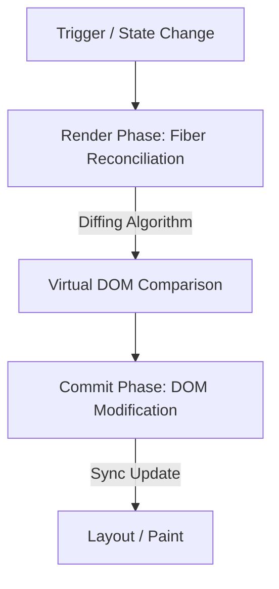

# React.js Deep Dive

## 📌 Core Learning Objectives
* **Beginner**: Master JSX, components, props, state declarations (`useState`), hook effects (`useEffect`), forms, and dynamic array renderings.
* **Intermediate**: Master component refactorings, Context API, state reducers (`useReducer`), performance caching (`useMemo`, `useCallback`), ref managers (`useRef`), and custom hook architectures.
* **Advanced**: Master React Fiber reconciliation internals, Concurrent Mode features (`useTransition`, `useDeferredValue`), React Server Components (RSC), Suspense-based data loading pipelines, and state managers (e.g., Zustand).

---

## 🗺️ Core Architecture & Concept Map
A developer must understand React's rendering phases to avoid performance bugs:



### The Reconciliation & React Fiber Engine
- **React Fiber**: React's core reconciliation algorithm. It operates on a work loop that can pause, resume, or discard rendering work to ensure the main thread remains responsive to user actions.
- **Render Phase (Virtual DOM)**: React recursively walks the component tree, executing render logic and calculating differences (diffing) between the new Virtual DOM and the current Fiber tree. This phase is asynchronous and can be paused or restarted.
- **Commit Phase (Real DOM)**: React executes the computed DOM updates (inserts, updates, deletes) in a single synchronous block. This phase cannot be interrupted.

---

## 🛠️ Topic-by-Topic Breakdown

### 1. Component Lifecycle, Reconciliation, and Keys
* **Description**: React compares Virtual DOM trees to minimize costly updates to the real DOM. When rendering dynamic lists, assigning a persistent, unique `key` is essential for React to track item identities across renders.
* **Code Implementation**:
  ```jsx
  import React, { useState } from 'react';

  // Optimized Task List Item
  const TaskItem = React.memo(({ task, onToggle }) => {
    console.log(`Rendering Task: ${task.title}`);
    return (
      <li className="task-item">
        <label>
          <input 
            type="checkbox" 
            checked={task.completed} 
            onChange={() => onToggle(task.id)} 
          />
          <span className={task.completed ? 'completed' : ''}>{task.title}</span>
        </label>
      </li>
    );
  });

  export default function TaskList() {
    const [tasks, setTasks] = useState([
      { id: 't1', title: 'Learn React Fiber', completed: false },
      { id: 't2', title: 'Master State Management', completed: false }
    ]);

    const handleToggle = (id) => {
      // Functional state updates to prevent mutation side-effects
      setTasks((prevTasks) =>
        prevTasks.map((task) =>
          task.id === id ? { ...task, completed: !task.completed } : task
        )
      );
    };

    return (
      <ul>
        {tasks.map((task) => (
          // Persistent unique key allows React to track elements correctly
          <TaskItem key={task.id} task={task} onToggle={handleToggle} />
        ))}
      </ul>
    );
  }
  ```
* **Common Pitfalls & Best Practices**:
  * **Pitfall - Using Array Index as Keys**: Using list indices (`key={index}`) when items can be reordered, inserted, or deleted. This causes UI state bugs, input mismatches, and unnecessary re-renders.
    * *Fix*: Always use persistent, unique database IDs (e.g., UUIDs) or generate distinct hash values.
  * **Pitfall - Direct State Mutation**: Modifying state variables directly (e.g., `tasks[0].completed = true`) instead of using setter updates. This bypasses React's reconciliation system, preventing UI updates.
    * *Fix*: Always treat state as immutable. Use helper functions like map or spread properties to create new object copies.

---

### 2. Caching & Context Re-Render Optimization
* **Description**: React components re-render when their parent context updates. To prevent rendering waterfalls, we can memoize values, cache functions, and split Context values.
* **Code Implementation**:
  ```jsx
  import React, { useState, useMemo, useCallback } from 'react';

  export default function FilteredUserDashboard({ users }) {
    const [query, setQuery] = useState('');
    const [count, setCount] = useState(0);

    // Cache the filter output to avoid recalculating on unrelated renders (e.g., when count changes)
    const filteredUsers = useMemo(() => {
      console.log('Filtering user list...');
      return users.filter((user) => 
        user.name.toLowerCase().includes(query.toLowerCase())
      );
    }, [users, query]);

    // Cache the handler function to prevent downstream child component re-renders
    const handleAddUser = useCallback((newUser) => {
      console.log('Adding new user:', newUser);
    }, []); // Empty dependencies array keep ref persistent

    return (
      <div>
        <input 
          type="text" 
          value={query} 
          onChange={(e) => setQuery(e.target.value)} 
          placeholder="Filter users..."
        />
        <button onClick={() => setCount(c => c + 1)}>Re-render Count: {count}</button>
        <UserList items={filteredUsers} onAdd={handleAddUser} />
      </div>
    );
  }

  const UserList = React.memo(({ items, onAdd }) => {
    console.log('Rendering UserList component...');
    return (
      <ul>
        {items.map((user) => <li key={user.id}>{user.name}</li>)}
      </ul>
    );
  });
  ```
* **Common Pitfalls & Best Practices**:
  * **Pitfall - Wrapping everything in useMemo/useCallback**: Memoizing simple, primitive variables or light inline functions. This adds overhead and degrades performance instead of improving it.
    * *Fix*: Reserve memoization for expensive computational loops, complex object initializations, or elements passed as dependencies to child components wrapped in `React.memo`.
  * **Pitfall - Context Cascade Re-Renders**: Wrapping values under a single massive context context. When any nested property updates, every component subscribing to that context re-renders.
    * *Fix*: Split contexts by concerns (e.g., separate read-only configurations from write-only state setters), or use lightweight state libraries like Zustand.

---

### 3. Concurrent Features & Transition Processing
* **Description**: Concurrency features allow React to prioritize user inputs over heavy background rendering tasks, keeping the UI responsive during intense computations.
* **Code Implementation**:
  ```jsx
  import React, { useState, useTransition } from 'react';

  export default function SearchDashboard({ items }) {
    const [searchTerm, setSearchTerm] = useState('');
    const [filteredItems, setFilteredItems] = useState(items);
    const [isPending, startTransition] = useTransition();

    const handleSearchChange = (e) => {
      const value = e.target.value;
      
      // Keep user input updates high priority (immediate response)
      setSearchTerm(value);

      // Downgrade heavy list rendering to lower priority
      startTransition(() => {
        const filtered = items.filter((item) =>
          item.name.toLowerCase().includes(value.toLowerCase())
        );
        setFilteredItems(filtered);
      });
    };

    return (
      <div>
        <input 
          type="text" 
          value={searchTerm} 
          onChange={handleSearchChange} 
          placeholder="Search products..." 
        />
        {isPending && <p>Processing update...</p>}
        <div style={{ opacity: isPending ? 0.6 : 1 }}>
          <ProductList products={filteredItems} />
        </div>
      </div>
    );
  }

  function ProductList({ products }) {
    return (
      <ul>
        {products.map((p) => <li key={p.id}>{p.name}</li>)}
      </ul>
    );
  }
  ```
* **Common Pitfalls & Best Practices**:
  * **Pitfall - Using Transition on Inputs**: Wrapping input text values inside `startTransition`. This delays the text updates on the input field itself, making the typing feel laggy.
    * *Fix*: Always update the text input value synchronously. Only wrap heavy downstream calculations or pagination filters in `startTransition`.
  * **Pitfall - API Fetch Waterfall Patterns**: Fetching data inside nested `useEffect` blocks. This triggers a sequential cascade of downloads, slowing down overall load times.
    * *Fix*: Fetch data in parallel at the routing level, or use Suspense-enabled data fetching libraries (such as React Query or SWR).

---

## 🔨 Hands-On Mini Projects

### 1. The Global State Manager (Context vs Zustand)
* **Goal**: Build a functional shopping cart using both Context API and Zustand to understand the trade-offs of Context re-renders.
* **Key Concepts Applied**: Context splitting, Zustand store updates, selector hooks.
* **Step-by-Step Outline**:
  1. Create a React app and set up a Context Provider wrapping state hooks.
  2. Implement cart count displays and verify the re-render boundaries.
  3. Rebuild the cart state utilizing Zustand stores.
  4. Write custom selector hooks (`useStore(state => state.items)`) to only trigger renders for target fields.

### 2. High-Performance Infinite List Explorer
* **Goal**: Build a dynamic search list containing 5,000 cards that handles heavy search inputs smoothly without freezing the browser.
* **Key Concepts Applied**: `useTransition`, `useDeferredValue`, lazy elements.
* **Step-by-Step Outline**:
  1. Initialize an array containing 5,000 mockup objects.
  2. Implement user search inputs modifying search queries.
  3. Wrap search result filter executions inside `startTransition`.
  4. Apply `useDeferredValue` to delay heavy card list paints until the user stops typing.

---

## 📚 Official & Curated Resources
* **React Official Documentation** - [react.dev](https://react.dev/) - The new documentation covering Hooks, Server Components, and interactive tutorials.
* **React Working Group Concurrency** - [github.com/reactwg/react-18](https://github.com/reactwg/react-18) - Core discussions detailing Concurrent Mode structures, transitions, and Suspense hook pipelines.
* **Zustand State Library Docs** - [zustand.docs.pmnd.rs](https://zustand.docs.pmnd.rs/) - Official documentation for Zustand, a lightweight, fast, and scalable state manager.
