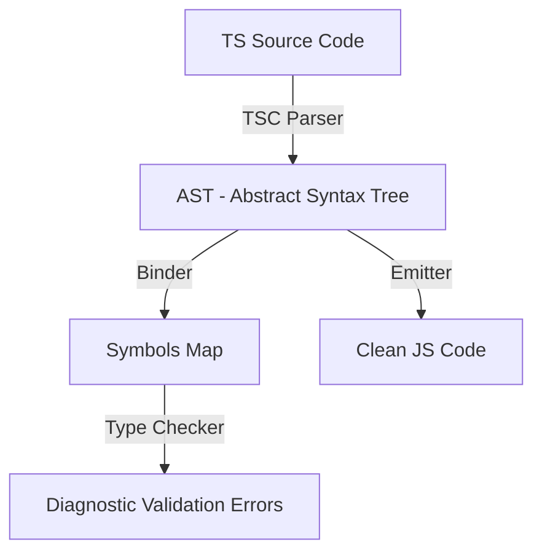

# TypeScript Deep Dive

## 📌 Core Learning Objectives
* **Beginner**: Master type primitives, type annotations, basic interfaces, aliases, unions, intersections, and compilation configurations.
* **Intermediate**: Master generics, key lookups (`keyof`), type narrowing/guards (`is`), and utility types (`Partial`, `Pick`, `Omit`, `Record`).
* **Advanced**: Master conditional types, template literal types, the `infer` keyword, mapped types, ambient declaration files (`.d.ts`), and advanced compiler flags.

---

## 🗺️ Core Architecture & Concept Map
To leverage TypeScript effectively, you must understand how its compiler resolves and enforces types:



### Structural vs. Nominal Type Systems
- **Nominal System (e.g., Java, C++)**: Type compatibility is defined by explicit declaration names. Two classes with identical shapes are incompatible if their names differ.
- **Structural System (TypeScript)**: Type compatibility is based solely on shape. If class A has all fields required by class B, then A is compatible with B (often called Duck Typing: *"if it walks like a duck, it's a duck"*).
- **The Emitter**: The emitter strips out all types, interfaces, and parameter modifiers during compile time. Types only exist for compilation check validation and have **zero runtime overhead**.

---

## 🛠️ Topic-by-Topic Breakdown

### 1. Structural Typing & Generics
* **Description**: Defining reusable type structures that handle different data shapes while enforcing compile-time type safety.
* **Code Implementation**:
  ```typescript
  // Generic API Response Wrapper
  interface ApiResponse<T> {
    data: T;
    status: "success" | "error";
    timestamp: number;
  }

  // Type definitions
  interface UserProfile {
    id: string;
    username: string;
    email: string;
  }

  // Generic fetching wrapper
  async function fetchJsonData<T>(url: string): Promise<ApiResponse<T>> {
    const response = await fetch(url);
    if (!response.ok) {
      throw new Error(`HTTP Error: ${response.status}`);
    }
    const data: T = await response.json();
    return {
      data,
      status: "success",
      timestamp: Date.now()
    };
  }

  // Usage: The response is strongly typed automatically
  async function loadProfile() {
    const result = await fetchJsonData<UserProfile>("https://api.example.com/me");
    console.log(result.data.email); // Auto-completes & validates 'email'
  }
  ```
* **Common Pitfalls & Best Practices**:
  * **Pitfall - Overusing the 'any' Type**: Resorting to `any` whenever a type is complex. This disables TypeScript's safety features and turns the code back into dynamic JavaScript.
    * *Fix*: Use `unknown` when a type is not yet known, forcing you to narrow the type with checks before using it.
  * **Pitfall - Shape compatibility gaps**: Assuming two shapes are incompatible because one has extra fields. TypeScript allows extra fields unless strictly validated through exact assignments.
    * *Fix*: Implement strict object checking techniques or use utility helpers like `Omit` to explicitly trim fields.

---

### 2. Type Narrowing & Guards
* **Description**: Refining broad union types into specific type branches using runtime assertions and compiler guards (`is` keyword).
* **Code Implementation**:
  ```typescript
  interface AdminUser {
    role: "admin";
    permissions: string[];
  }

  interface RegularUser {
    role: "user";
    email: string;
  }

  type SystemUser = AdminUser | RegularUser;

  // 1. User-Defined Type Guard (uses parameter is Type syntax)
  function isAdmin(user: SystemUser): user is AdminUser {
    return user.role === "admin";
  }

  function handleUserPermissions(user: SystemUser) {
    // 2. Discriminated Union Switch narrow
    switch (user.role) {
      case "admin":
        // Compiler knows user is AdminUser
        console.log("Admin permissions:", user.permissions.join(", "));
        break;
      case "user":
        // Compiler knows user is RegularUser
        console.log("User email:", user.email);
        break;
    }

    // 3. User Guard narrow
    if (isAdmin(user)) {
      console.log("Admin access approved.");
    }
  }
  ```
* **Common Pitfalls & Best Practices**:
  * **Pitfall - Type Assertion Abuse ('as Type')**: Using `as` to force TypeScript to accept an incorrect type without verifying it at runtime. This causes silent crashes in production.
    * *Fix*: Implement runtime type checks (type guards) instead of forced assertions.
  * **Pitfall - Weak Union Discriminators**: Using non-literal values (like broad numbers or strings) as discriminators, making it hard for the compiler to narrow unions reliably.
    * *Fix*: Use literal strings (e.g., `role: "admin"`) to create clear discriminated unions.

---

### 3. Conditional Types & Utility Generators
* **Description**: Creating dynamic, programmatic types using logical checks (`extends`) and type inference (`infer`) within the compilation loop.
* **Code Implementation**:
  ```typescript
  // 1. Conditional type: Flatten array types
  type Flatten<T> = T extends any[] ? T[number] : T;

  type StringArray = string[];
  type FlattenedString = Flatten<StringArray>; // resolves to string
  type NonArrayNumber = Flatten<number>;       // resolves to number

  // 2. Extract Return Type using infer
  type UnboxPromise<T> = T extends Promise<infer U> ? U : T;

  type AsyncOperation = Promise<{ userId: string }>;
  type UnboxedResult = UnboxPromise<AsyncOperation>; // resolves to { userId: string }

  // 3. DeepReadonly mapped conditional type
  type DeepReadonly<T> = {
    readonly [P in keyof T]: T[P] extends object ? DeepReadonly<T[P]> : T[P];
  };

  interface NestedConfig {
    api: {
      endpoint: string;
      timeout: number;
    };
  }

  const config: DeepReadonly<NestedConfig> = {
    api: { endpoint: "https://api.com", timeout: 5000 }
  };
  // config.api.timeout = 1000; // Cannot assign: read-only property
  ```
* **Common Pitfalls & Best Practices**:
  * **Pitfall - Over-Engineering Types**: Writing overly complex conditional types that act like full-blown algorithms. This slows down the compiler and makes the codebase hard to maintain.
    * *Fix*: Keep types simple and readable. Break down complex type manipulations into smaller helper utilities.
  * **Pitfall - Loose Config Compilation Flags**: Disabling strict type checking parameters inside `tsconfig.json`.
    * *Fix*: Always set `"strict": true` and `"noImplicitAny": true` in your compiler configuration.

---

## 🔨 Hands-On Mini Projects

### 1. Strict Event Emitter Bus
* **Goal**: Build a strongly-typed Event Emitter where event names and their payloads are strictly matched at compile time.
* **Key Concepts Applied**: Mapped types, Generics, index signatures.
* **Step-by-Step Outline**:
  1. Define a interface map matching event names to payload types.
  2. Implement an `EventEmitter<TEvents>` class.
  3. Declare `on` and `emit` methods using generic signatures constraint to key configurations: `keyof TEvents`.
  4. Verify that calling `emit` with an incorrect payload triggers a compiler warning.

### 2. Type-Safe Form Validator
* **Goal**: Build a form validation helper that takes a dataset template and outputs structured errors matching the inputs' exact keys.
* **Key Concepts Applied**: Mapped types, mapped modifiers, utility extensions (`Partial`, `Record`).
* **Step-by-Step Outline**:
  1. Define a generic input interface: `FormValidator<TInput>`.
  2. Map properties to validation check functions: `(value: TInput[K]) => boolean`.
  3. Return validation errors matching key values: `Partial<Record<keyof TInput, string>>`.
  4. Verify that changing fields in the original form automatically updates the validation types.

---

## 📚 Official & Curated Resources
* **TypeScript Official Documentation** - [typescriptlang.org](https://www.typescriptlang.org/) - The official home containing language specs, reference manuals, and compiler guidelines.
* **TypeScript Playground** - [typescriptlang.org/play](https://www.typescriptlang.org/play) - Interactive online compiler playground environment for testing type structures.
* **TypeScript Deep Dive** - [basarat.gitbook.io/typescript](https://basarat.gitbook.io/typescript/) - A detailed open-source guide covering compiling internals, styling, and design patterns.
