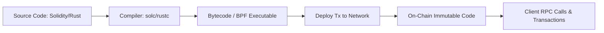

# 📜 Smart Contracts Reference

Smart contracts are self-executing programs deployed directly to blockchain state storage. They execute deterministically across network nodes in response to signed user transactions.

---

## 🏛️ Smart Contract Paradigms

| Property | EVM (Ethereum Virtual Machine) | SVM (Solana Virtual Machine) |
|---|---|---|
| **State Storage** | Code and state bundled together in contract address. | Code and account state stored separately in distinct accounts. |
| **Execution Model** | Sequential execution per block. | Parallel transaction processing via Sealevel. |
| **Programming Language** | Solidity, Vyper | Rust, C, C++ |
| **Resource Cost** | Gas fees based on instruction computational weight. | Compute Units (CU) + Account Rent storage fee. |

---

## 🔒 Smart Contract Lifecycle

---

## ⚡ Best Practices & Design Principles

1. **Reentrancy Protection**: Follow the Checks-Effects-Interactions (CEI) pattern or use Mutex guards.
2. **Access Control**: Enforce explicit owner/authority restrictions on administrative methods.
3. **Integer Overflow Guarding**: Always use checked arithmetic (e.g. `checked_add`, `SafeMath`).
4. **Upgradability vs Immutability**: Implement proxy patterns or multisig authority upgrades carefully, or burn upgrade authority for trustless immutability.

---

## 🔗 Learning Links
- [Ethereum Smart Contract Guide](https://ethereum.org/en/developers/docs/smart-contracts/)
- [Solana Program Model](https://docs.solana.com/developing/programming-model/overview)
- [Smart Contract Security Guide (Week 58)](../../weeks/Week-58.md)
