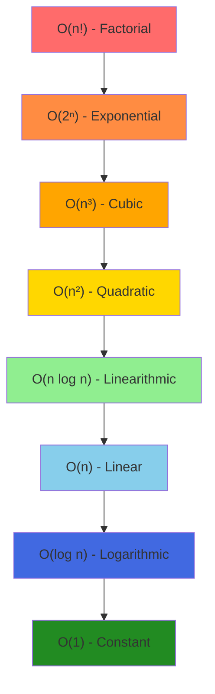
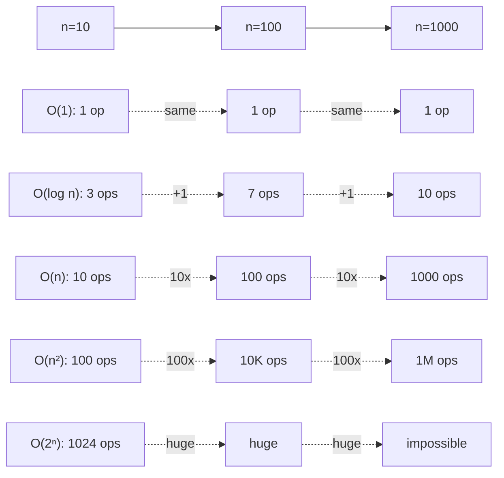

# 🎯 Week 21: Programming Foundations & Complexity Analysis

> **Duration:** 20 hours | **Difficulty:** 🟡 Intermediate | **Prerequisites:** Basic programming knowledge

## 📌 Goal

Master the mathematical foundations of algorithm analysis, understand Big O notation, and learn recursion principles that form the foundation for all data structure and algorithm problems.

## 🎓 Learning Objectives

By the end of this week, you will:
- ✅ Understand and calculate time complexity using Big O notation
- ✅ Analyze space complexity of algorithms
- ✅ Master recursion and recursive thinking
- ✅ Learn mathematical analysis techniques
- ✅ Understand bit manipulation fundamentals
- ✅ Solve complexity analysis problems

## 📚 Prerequisites

- Basic programming knowledge (any language)
- Basic mathematics (logarithms, factorial)
- Completion of Weeks 1-10 recommended

## 📖 Concepts

### Big O Notation

**Big O** measures the worst-case time complexity of an algorithm.

#### Complexity Classes (Best to Worst)

```
O(1)      → Constant
O(log n)  → Logarithmic
O(n)      → Linear
O(n log n)→ Linearithmic
O(n²)     → Quadratic
O(n³)     → Cubic
O(2ⁿ)     → Exponential
O(n!)     → Factorial
```

#### Visual Representation



### Time Complexity Analysis

#### Example 1: Simple Loop

```javascript
function printNumbers(n) {
    for (let i = 0; i < n; i++) {      // Runs n times
        console.log(i);                 // O(1) operation
    }
}
// Time Complexity: O(n)
```

#### Example 2: Nested Loops

```javascript
function printMatrix(n) {
    for (let i = 0; i < n; i++) {      // Outer loop: n times
        for (let j = 0; j < n; j++) {  // Inner loop: n times
            console.log(i, j);         // O(1)
        }
    }
}
// Time Complexity: O(n²)
```

#### Example 3: Logarithmic

```javascript
function binarySearch(arr, target) {
    let left = 0;
    let right = arr.length - 1;
    
    while (left <= right) {             // Runs log(n) times
        let mid = Math.floor((left + right) / 2);
        if (arr[mid] === target) return mid;
        if (arr[mid] < target) left = mid + 1;
        else right = mid - 1;
    }
    return -1;
}
// Time Complexity: O(log n)
```

### Space Complexity Analysis

Measures the auxiliary space used by an algorithm (excluding input).

```javascript
// O(1) - Constant space
function sum(n) {
    let result = 0;                    // One variable
    for (let i = 0; i < n; i++) {
        result += i;
    }
    return result;
}

// O(n) - Linear space
function createArray(n) {
    let arr = [];                      // Array of size n
    for (let i = 0; i < n; i++) {
        arr.push(i);
    }
    return arr;
}

// O(n) - Recursion depth
function factorial(n) {
    if (n <= 1) return 1;              // Call stack depth: n
    return n * factorial(n - 1);
}
```

### Recursion Fundamentals

#### Structure of Recursive Function

```javascript
function recursiveFunction(problem) {
    // 1. Base case: when to stop
    if (isBaseCase(problem)) {
        return baseValue;
    }
    
    // 2. Recursive case: break into smaller problem
    let smallerProblem = problem - 1;
    let result = recursiveFunction(smallerProblem);
    
    // 3. Combine results
    return process(result);
}
```

#### Example: Factorial

```javascript
function factorial(n) {
    // Base case
    if (n === 0 || n === 1) {
        return 1;
    }
    // Recursive case
    return n * factorial(n - 1);
}

factorial(5);
// = 5 * factorial(4)
// = 5 * 4 * factorial(3)
// = 5 * 4 * 3 * 2 * 1
// = 120
```

#### Call Stack Visualization

```
factorial(5)
├── 5 * factorial(4)
│   ├── 4 * factorial(3)
│   │   ├── 3 * factorial(2)
│   │   │   ├── 2 * factorial(1)
│   │   │   │   └── 1 (BASE CASE)
│   │   │   └── 2 * 1 = 2
│   │   └── 3 * 2 = 6
│   └── 4 * 6 = 24
└── 5 * 24 = 120
```

### Bit Manipulation Basics

#### Bitwise Operators

| Operator | Symbol | Example | Result |
|----------|--------|---------|--------|
| AND | & | 5 & 3 | 1 |
| OR | \| | 5 \| 3 | 7 |
| XOR | ^ | 5 ^ 3 | 6 |
| NOT | ~ | ~5 | -6 |
| Left Shift | << | 5 << 1 | 10 |
| Right Shift | >> | 5 >> 1 | 2 |

#### Common Bit Manipulation Tricks

```javascript
// Check if bit is set
function isBitSet(n, i) {
    return (n & (1 << i)) !== 0;  // O(1)
}

// Set bit
function setBit(n, i) {
    return n | (1 << i);           // O(1)
}

// Clear bit
function clearBit(n, i) {
    return n & ~(1 << i);          // O(1)
}

// Check if power of 2
function isPowerOfTwo(n) {
    return n > 0 && (n & (n - 1)) === 0;  // O(1)
}

// Count set bits
function countSetBits(n) {
    let count = 0;
    while (n) {
        count += n & 1;
        n >>= 1;
    }
    return count;                  // O(log n)
}
```

## 📅 Daily Study Plan

### Monday: Big O Notation & Time Complexity
**Duration:** 4 hours

- **Hour 1-2:** Big O notation fundamentals
  - Study complexity classes
  - Learn asymptotic analysis
  - Understand worst, average, best cases
  
- **Hour 2-3:** Time complexity analysis
  - Analyze simple algorithms
  - Practice identifying complexity patterns
  - Solve 3 analysis problems
  
- **Hour 3-4:** Interactive practice
  - Use complexity visualizers
  - Quiz yourself on complexity calculations

### Tuesday: Space Complexity & Recursion Basics
**Duration:** 4 hours

- **Hour 1:** Space complexity analysis
  - Understand auxiliary space
  - Calculate stack space for recursion
  - Study space optimization
  
- **Hour 2-3:** Recursion fundamentals
  - Understand call stack
  - Base case and recursive case
  - Solve 5 basic recursion problems
  
- **Hour 3-4:** Practice
  - Implement recursive functions
  - Draw call stack diagrams

### Wednesday: Mathematical Analysis
**Duration:** 4 hours

- **Hour 1-2:** Mathematical foundations
  - Logarithms and exponentials
  - Summation notation
  - Recurrence relations
  
- **Hour 2-3:** Analyzing algorithms
  - Solve recurrence relations
  - Analyze algorithm efficiency
  - Practice complexity proofs
  
- **Hour 3-4:** Advanced analysis
  - Amortized analysis introduction
  - Practice complex analysis

### Thursday: Bit Manipulation
**Duration:** 4 hours

- **Hour 1-2:** Bitwise operations
  - Understand binary representation
  - Learn bitwise operators
  - Practice bit manipulation tricks
  
- **Hour 2-3:** Bit problems
  - Solve 5 bit manipulation problems
  - Learn common patterns
  
- **Hour 3-4:** Advanced bit tricks
  - Power of two patterns
  - Counting set bits
  - Practice problems

### Friday: Problem Solving & Projects
**Duration:** 3 hours

- **Hour 1:** Mixed complexity problems
  - Solve 10 diverse problems
  - Analyze each thoroughly
  
- **Hour 2-3:** Start mini projects
  - Setup project environments
  - Plan architecture

### Saturday & Sunday: Mini Projects
**Duration:** 3 hours each

- Build three mini projects (see Projects section)
- Test thoroughly
- Document with analysis

## 🧠 Theory & Visualization

### Complexity Growth Rates



### Recursion Tree Example: Fibonacci

```
fib(4)
├── fib(3)
│   ├── fib(2)
│   │   ├── fib(1) → 1
│   │   └── fib(0) → 0
│   └── fib(1) → 1
└── fib(2)
    ├── fib(1) → 1
    └── fib(0) → 0

Time: O(2ⁿ) - Very inefficient!
Space: O(n) - Recursion depth
```

## ⏱️ Complexity Analysis Table

| Operation | Time | Space | Notes |
|-----------|------|-------|-------|
| Sequential loops | O(n) | O(1) | n times |
| Nested loops | O(n²) | O(1) | n × n times |
| Divide in half | O(log n) | O(1) | Binary search |
| Divide + combine | O(n log n) | O(n) | Merge sort |
| Recursion tree | O(2ⁿ) | O(n) | Exponential |
| Dynamic array | O(n) | O(n) | All elements |
| Hash table lookup | O(1) avg | O(n) | Worst: O(n) |

## 🎯 Best Practices

✅ **Always identify the bottleneck** - Find the slowest part of your algorithm

✅ **Think in terms of scale** - How does algorithm behave with large n?

✅ **Consider both time and space** - Trade-off analysis is crucial

✅ **Trace through examples** - Small examples reveal the pattern

✅ **Use correct terminology** - Big O, Big Omega, Big Theta

✅ **Test edge cases** - Empty input, single element, large numbers

## ⚠️ Common Mistakes

❌ **Confusing O(n) with O(n²)** - Count all loops carefully

❌ **Ignoring constant factors** - O(2n) is still O(n), but matters in practice

❌ **Missing recursive calls** - Each recursive call adds to complexity

❌ **Forgetting about call stack** - Recursion uses O(n) space by default

❌ **Assuming best case** - Big O is worst case (unless specified)

## 📋 Practice Problems

### Complexity Analysis (Easy)

1. **Identify complexity of simple loop**
   - Given code, state time complexity
   - Resources: GeeksforGeeks, LeetCode Complexity Problems

2. **Factorial calculation**
   - Time: O(n), Space: O(n)
   - Resources: LeetCode 172, GeeksforGeeks

3. **Power of Two**
   - Time: O(log n), Space: O(1)
   - Resources: LeetCode 231, HackerRank

4. **Find missing number in array**
   - Time: O(n), Space: O(1)
   - Resources: LeetCode 268

5. **Binary search implementation**
   - Time: O(log n), Space: O(1) or O(log n)
   - Resources: LeetCode 704, HackerRank

### Recursion (Easy-Medium)

1. **Sum of array elements**
   - [LeetCode](https://leetcode.com/problems/sum-of-digits-in-base-k/)
   - Time: O(n), Space: O(n)

2. **Fibonacci number**
   - [LeetCode 509](https://leetcode.com/problems/fibonacci-number/)
   - Time: O(2ⁿ) naive, O(n) optimized, Space: O(n)

3. **Power function (x^n)**
   - [LeetCode 50](https://leetcode.com/problems/powx-n/)
   - Time: O(log n), Space: O(log n)

4. **String reversal**
   - [GeeksforGeeks](https://www.geeksforgeeks.org/recursively-reverse-a-string-in-java/)
   - Time: O(n), Space: O(n)

5. **Check palindrome**
   - [LeetCode 125](https://leetcode.com/problems/valid-palindrome/)
   - Time: O(n), Space: O(1) or O(n)

### Bit Manipulation (Easy)

1. **Single number**
   - [LeetCode 136](https://leetcode.com/problems/single-number/)
   - Time: O(n), Space: O(1)

2. **Power of Two**
   - [LeetCode 231](https://leetcode.com/problems/power-of-two/)
   - Time: O(1), Space: O(1)

3. **Hamming weight**
   - [LeetCode 191](https://leetcode.com/problems/number-of-1-bits/)
   - Time: O(log n), Space: O(1)

4. **Missing number**
   - [LeetCode 268](https://leetcode.com/problems/missing-number/)
   - Time: O(n), Space: O(1)

5. **Sum of two integers**
   - [LeetCode 371](https://leetcode.com/problems/sum-of-two-integers/)
   - Time: O(1), Space: O(1)

## 📚 Resources

### Official Documentation
- [MDN: Asymptotic Notation](https://developer.mozilla.org/en-US/docs/Web/JavaScript/Reference/Global_Objects/Array)
- [Python: Complexity Analysis](https://docs.python.org/3/library/collections.html)
- [C++ Reference: Algorithm Complexity](https://en.cppreference.com/w/)

### YouTube Playlists
- [Abdul Bari - Asymptotic Notation](https://www.youtube.com/watch?v=A03oI0znAqo&list=PLlxmoA0rQ7l3NdDV3o-YSVqOgVLvpImHJ) (Urdu, English subtitles)
- [MIT OpenCourseWare - Algorithm Analysis](https://www.youtube.com/watch?v=Qtjg8phiUJo)
- [William Fiset - Algorithm Analysis](https://www.youtube.com/watch?v=V42FBiohc6c&list=PLDV1Zeh2NRsB6SWUrDFW2RmDtyx7gJ2G1)

### Books
- **Introduction to Algorithms (CLRS)** - Chapters 2-4: Complexity analysis
- **Algorithm Design Manual** - Chapter 2: Algorithm analysis
- **Grokking Algorithms** - Chapter 1: Introduction and big O notation

### Practice Platforms
- [LeetCode](https://leetcode.com/problems/two-sum/) - Complexity tagged problems
- [HackerRank](https://www.hackerrank.com/domains/algorithms?filters%5Bstatus%5D%5B%5D=unsolved) - Complexity challenges
- [GeeksforGeeks](https://www.geeksforgeeks.org/analysis-of-algorithms-big-o-analysis/) - Detailed explanations

### Visualization Tools
- [Big O Cheat Sheet](https://www.bigocheatsheet.com/)
- [VisuAlgo - Algorithm Visualizer](https://visualgo.net/)
- [Recursion Visualizer](https://www.recursionvisualizer.com/)

## 💻 Mini Projects

### Project 1: Complexity Visualizer
**Duration:** 4 hours | **Difficulty:** 🟡 Intermediate

#### Goal
Create an interactive tool that visualizes how different complexities grow with input size.

#### Tech Stack
- Frontend: React/Vue
- Charting: Chart.js or Plotly
- Backend: Node.js (optional)

#### Features
1. Input size slider (10 to 1,000,000)
2. Display multiple complexity curves
3. Show operation counts
4. Algorithm examples for each complexity
5. Dark/Light theme

#### Skills
- Data visualization
- User interface design
- Mathematical calculations
- State management

#### Extensions
- Add logarithmic scale option
- Compare actual vs theoretical complexity
- Add more complexity classes
- Export visualizations

#### Expected Output
```
[Interactive Chart with curves for O(1), O(log n), O(n), O(n²), O(2ⁿ)]
When user moves slider, all curves update
Show current operations count for each complexity
```

### Project 2: Recursion Visualizer
**Duration:** 4 hours | **Difficulty:** 🟡 Intermediate

#### Goal
Create a tool that visualizes recursive function calls as a tree.

#### Tech Stack
- Frontend: React
- Tree visualization: d3.js or cytoscape.js

#### Features
1. Input function (Fibonacci, Factorial, etc.)
2. Input parameter
3. Draw recursive call tree
4. Show step-by-step execution
5. Highlight current node
6. Show time/space complexity
7. Animation controls

#### Skills
- Tree data structures
- Graph visualization
- Animation
- Algorithm understanding

#### Extensions
- Add memoization visualization
- Compare recursive vs iterative
- Show memory usage over time
- Profile execution

#### Deliverables
1. **GitHub Repository**
   - Main branch with complete code
   - README with setup instructions
   - Live demo link

2. **Documentation**
   - How to use the visualizer
   - Supported functions
   - Future roadmap

### Project 3: Bitwise Calculator
**Duration:** 3 hours | **Difficulty:** 🟡 Intermediate

#### Goal
Build a calculator that shows bitwise operations step-by-step.

#### Tech Stack
- Frontend: React or Vue
- Backend: Node.js

#### Features
1. Input two numbers
2. Show binary representation
3. Perform bitwise operations (AND, OR, XOR, NOT, <<, >>)
4. Show result in binary, decimal, hexadecimal
5. Step-by-step explanation
6. Truth tables for operations

#### Skills
- Bit manipulation
- Number systems
- UI/UX design
- Educational content

#### Extensions
- Add complex bit problems solver
- Generate practice problems
- Show bit patterns visually
- Include bit manipulation tricks

#### Learning Outcomes
After completing these projects:
- ✅ Strong understanding of complexity analysis
- ✅ Ability to visualize algorithms
- ✅ Practical bit manipulation skills
- ✅ Portfolio projects demonstrating understanding

## ✅ Revision Checklist

- [ ] Understand all Big O complexity classes
- [ ] Can calculate time complexity of any algorithm
- [ ] Can calculate space complexity
- [ ] Understand recursion depth and complexity
- [ ] Know all bitwise operators and tricks
- [ ] Can identify complexity patterns in code
- [ ] Completed all 3 mini projects
- [ ] Solved 15+ practice problems
- [ ] Can explain complexity tradeoffs
- [ ] Ready for Week 22 (Arrays & Strings)

## 🎓 Interview Questions

### Conceptual Questions

1. **What is Big O notation?**
   - Answer: Describes how algorithm performance scales with input size
   - Focus on worst case

2. **Why is O(n²) worse than O(n) for large n?**
   - Answer: Quadratic growth is much faster than linear
   - Example with numbers

3. **What's the difference between space and time complexity?**
   - Answer: Time = operations, Space = memory used
   - Both important for optimization

4. **When would you use recursion?**
   - Answer: Tree traversal, divide-and-conquer, backtracking
   - Trade-off: clarity vs efficiency

5. **What is tail recursion?**
   - Answer: Recursive call is last operation
   - Can be optimized to O(1) space by compiler

### Coding Questions

1. Write a function to calculate time complexity
2. Implement recursive factorial with optimization
3. Solve a bit manipulation problem
4. Analyze given code for complexity
5. Compare iterative vs recursive approaches

## 📄 Cheat Sheet

### Big O Complexity Reference

```
O(1)       Constant      Dictionary lookup
O(log n)   Logarithmic   Binary search
O(n)       Linear        Simple loop
O(n log n) Linearithmic  Merge sort, Quick sort
O(n²)      Quadratic     Nested loops
O(n³)      Cubic         Triple nested loops
O(2ⁿ)      Exponential   Recursive problems
O(n!)      Factorial     All permutations
```

### Recursion Template

```javascript
function solve(problem) {
    // 1. Base case
    if (isBase(problem)) return base;
    
    // 2. Break down
    smaller = breakDown(problem);
    
    // 3. Solve recursively
    result = solve(smaller);
    
    // 4. Combine
    return combine(result);
}
```

### Bit Manipulation Quick Reference

```javascript
// Basic operations
n & (1 << i)        // Check if i-th bit is set
n | (1 << i)        // Set i-th bit
n & ~(1 << i)       // Clear i-th bit
n ^ (1 << i)        // Toggle i-th bit

// Useful tricks
n & (n - 1)         // Clear lowest set bit
n | (n - 1)         // Set all bits to right
(n >> 1) & 0x55...  // Get even bits
```

---

**Next:** [Week 22 - Arrays & Strings →](Week-22.md)
