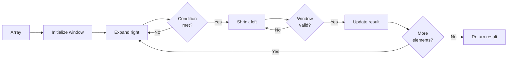

# 🎯 Week 22: Arrays, Strings & Sliding Window Technique

> **Duration:** 22 hours | **Difficulty:** 🟡 Intermediate | **Prerequisites:** Week 21

## 📌 Goal

Master array and string manipulation techniques, learn the powerful sliding window pattern, and understand two-pointer techniques for efficient problem solving.

## 🎓 Learning Objectives

By the end of this week, you will:
- ✅ Master array manipulation and indexing
- ✅ Understand string operations and immutability
- ✅ Implement sliding window pattern
- ✅ Use two-pointer technique effectively
- ✅ Learn prefix sum and difference arrays
- ✅ Solve complex matrix problems
- ✅ Optimize from brute force to efficient solutions

## 📚 Prerequisites
- Big O notation and complexity analysis (Week 21)
- Basic array operations
- String basics

## 📖 Concepts

### Array Fundamentals

#### Array Properties

```javascript
const arr = [1, 2, 3, 4, 5];

// Access: O(1)
arr[0];              // 1
arr[arr.length - 1]; // 5

// Insert: O(n) - shifts elements
arr.splice(2, 0, 99); // [1, 2, 99, 3, 4, 5]

// Delete: O(n) - shifts elements
arr.splice(2, 1);    // [1, 2, 3, 4, 5]

// Search: O(n)
arr.indexOf(3);      // 2
arr.includes(3);     // true
```

#### Common Array Operations

| Operation | Time | Space | Example |
|-----------|------|-------|----------|
| Access | O(1) | O(1) | arr[i] |
| Insert | O(n) | O(1) | arr.insert() |
| Delete | O(n) | O(1) | arr.remove() |
| Search | O(n) | O(1) | arr.find() |
| Sort | O(n log n) | O(n) | arr.sort() |

### Sliding Window Pattern

The sliding window is a technique for solving problems involving **subarrays** or **substrings** efficiently.

#### Key Idea

```
Instead of recalculating for each window, 
slide the window across the array,
adding new elements and removing old ones.

Time: O(n) instead of O(n²)
```

#### Visual Example

```
Array: [1, 3, 2, 6, -1, 4, 1, 8]

Find max sum of 3 consecutive elements:

[1, 3, 2]      sum = 6
   [3, 2, 6]   sum = 11  ← new element added
      [2, 6, -1] sum = 7  ← old element removed
         [6, -1, 4] sum = 9
            [-1, 4, 1] sum = 4
               [4, 1, 8] sum = 13  ← MAX
```

#### Pattern Structure

```javascript
function slidingWindow(arr, k) {
    // 1. Initialize window
    let window = new Map(); // or Set
    let left = 0;
    let result = 0;
    
    // 2. Expand window with right pointer
    for (let right = 0; right < arr.length; right++) {
        // Add right element to window
        window.set(arr[right], (window.get(arr[right]) || 0) + 1);
        
        // Shrink window from left if needed
        while (window.size > k) {
            window.set(arr[left], window.get(arr[left]) - 1);
            if (window.get(arr[left]) === 0) {
                window.delete(arr[left]);
            }
            left++;
        }
        
        // Process window
        result = Math.max(result, right - left + 1);
    }
    
    return result;
}
```

#### Example 1: Maximum Sum Subarray of Size K

```javascript
function maxSumSubarray(arr, k) {
    let windowSum = 0;
    let maxSum = 0;
    
    // Calculate sum of first window
    for (let i = 0; i < k; i++) {
        windowSum += arr[i];
    }
    maxSum = windowSum;
    
    // Slide the window
    for (let i = k; i < arr.length; i++) {
        windowSum += arr[i] - arr[i - k]; // Add new, remove old
        maxSum = Math.max(maxSum, windowSum);
    }
    
    return maxSum;
}

// Example
maxSumSubarray([1, 3, 2, 6, -1, 4, 1, 8], 3);
// Answer: 13 (from [4, 1, 8])
// Time: O(n), Space: O(1)
```

#### Example 2: Longest Substring Without Repeating Characters

```javascript
function lengthOfLongestSubstring(s) {
    const charIndex = {};
    let maxLen = 0;
    let left = 0;
    
    for (let right = 0; right < s.length; right++) {
        // If character exists and is in current window
        if (charIndex[s[right]] >= left) {
            left = charIndex[s[right]] + 1; // Move left pointer
        }
        
        charIndex[s[right]] = right; // Update last seen index
        maxLen = Math.max(maxLen, right - left + 1);
    }
    
    return maxLen;
}

// Example
lengthOfLongestSubstring("abcabcbb");
// Answer: 3 ("abc")
// Time: O(n), Space: O(min(m, n)) - m=alphabet size
```

### Two-Pointer Technique

Use two pointers to traverse data structure from different positions.

#### Pattern 1: Opposite Ends

```javascript
function twoPointerOppositeEnds(arr) {
    let left = 0;
    let right = arr.length - 1;
    
    while (left < right) {
        // Process
        left++;
        right--;
    }
}
```

**Example: Container with Most Water**

```javascript
function maxArea(heights) {
    let left = 0;
    let right = heights.length - 1;
    let maxArea = 0;
    
    while (left < right) {
        // Calculate area
        const width = right - left;
        const height = Math.min(heights[left], heights[right]);
        maxArea = Math.max(maxArea, width * height);
        
        // Move pointer pointing to shorter line
        if (heights[left] < heights[right]) {
            left++;
        } else {
            right--;
        }
    }
    
    return maxArea;
}
// Time: O(n), Space: O(1)
```

#### Pattern 2: Same Direction (Fast & Slow)

```javascript
function twoPointerSameDirection(arr) {
    let slow = 0;
    let fast = 1;
    
    while (fast < arr.length) {
        // Process
        fast++;
        if (condition) {
            slow++;
        }
    }
}
```

**Example: Remove Duplicates from Sorted Array**

```javascript
function removeDuplicates(nums) {
    let slow = 0;
    
    for (let fast = 1; fast < nums.length; fast++) {
        if (nums[fast] !== nums[slow]) {
            slow++;
            nums[slow] = nums[fast];
        }
    }
    
    return slow + 1; // New length
}

// Example: [1, 1, 2] → [1, 2, _] → return 2
// Time: O(n), Space: O(1)
```

### Prefix Sum Array

Precompute prefix sums for fast range sum queries.

```javascript
function buildPrefixSum(arr) {
    const prefix = [0];
    
    for (let i = 0; i < arr.length; i++) {
        prefix[i + 1] = prefix[i] + arr[i];
    }
    
    return prefix;
}

function getRangeSum(prefix, left, right) {
    // Sum of elements from index left to right (inclusive)
    return prefix[right + 1] - prefix[left];
}

// Example
const arr = [1, 2, 3, 4, 5];
const prefix = buildPrefixSum(arr);
// prefix = [0, 1, 3, 6, 10, 15]

getRangeSum(prefix, 1, 3); // sum of arr[1..3] = 2+3+4 = 9
// Build: O(n), Query: O(1)
```

### Difference Array

Efficient range updates.

```javascript
function updateRange(arr, left, right, delta) {
    const diff = new Array(arr.length + 1).fill(0);
    
    // Mark changes
    diff[left] += delta;
    diff[right + 1] -= delta;
    
    // Apply changes
    let change = 0;
    for (let i = 0; i < arr.length; i++) {
        change += diff[i];
        arr[i] += change;
    }
}

// Example: Add 5 to elements from index 1 to 3
const arr = [1, 2, 3, 4, 5];
updateRange(arr, 1, 3, 5);
// Result: [1, 7, 8, 9, 5]
// Operations: O(n) for all updates
```

### Matrix Problems

#### 2D Array Traversal

```javascript
// Row-major traversal
for (let i = 0; i < rows; i++) {
    for (let j = 0; j < cols; j++) {
        console.log(matrix[i][j]);
    }
}
// Time: O(rows × cols), Space: O(1)
```

#### Example: Rotate Matrix 90 Degrees

```javascript
function rotateMatrix(matrix) {
    const n = matrix.length;
    
    // Transpose
    for (let i = 0; i < n; i++) {
        for (let j = i + 1; j < n; j++) {
            [matrix[i][j], matrix[j][i]] = [matrix[j][i], matrix[i][j]];
        }
    }
    
    // Reverse each row
    for (let i = 0; i < n; i++) {
        matrix[i].reverse();
    }
}
// Time: O(n²), Space: O(1) - in-place
```

## 📅 Daily Study Plan

### Monday: Array Fundamentals & Basic Operations
**Duration:** 4 hours

- **Hour 1-2:** Array basics
  - Indexing, insertion, deletion
  - Common operations and their complexity
  - Study 5 basic array problems
  
- **Hour 2-3:** Array optimization
  - Identify when O(n²) can be O(n)
  - Practice with 5 intermediate problems
  
- **Hour 3-4:** Review and practice
  - Solve 5 diverse array problems
  - Create summary notes

### Tuesday: String Operations & Sliding Window
**Duration:** 4 hours

- **Hour 1:** String fundamentals
  - String immutability
  - Common string operations
  - Performance implications
  
- **Hour 2-3:** Sliding window pattern
  - Learn the pattern
  - Solve 5 sliding window problems
  - Identify when to use sliding window
  
- **Hour 3-4:** Practice
  - Solve 5 more sliding window problems
  - Optimize solutions

### Wednesday: Two-Pointer Technique
**Duration:** 4 hours

- **Hour 1-2:** Two-pointer patterns
  - Opposite ends technique
  - Same direction (fast/slow)
  - Practice with 5 problems
  
- **Hour 2-3:** More complex problems
  - Merge sorted arrays
  - Remove duplicates
  - Solve 5 problems
  
- **Hour 3-4:** Advanced two-pointer
  - 3-sum and k-sum problems
  - Practice 5 problems

### Thursday: Prefix Sum & Matrix
**Duration:** 4 hours

- **Hour 1-2:** Prefix sum arrays
  - Build and query prefix sums
  - Solve 5 prefix sum problems
  - Understand difference arrays
  
- **Hour 2-3:** Matrix operations
  - 2D traversal patterns
  - Matrix manipulation
  - Solve 5 matrix problems
  
- **Hour 3-4:** Integrated problems
  - Combine techniques
  - Practice 5 problems

### Friday: Problem Solving & Review
**Duration:** 3 hours

- **Hour 1:** Mixed problems
  - Solve 10 diverse problems
  - Choose appropriate technique
  
- **Hour 2-3:** Start projects
  - Setup environments
  - Plan architecture

### Saturday & Sunday: Mini Projects
**Duration:** 3 hours each

- Build three mini projects (see Projects section)
- Test and document thoroughly

## 🧠 Theory & Visualization

### Sliding Window Visualization



### Two-Pointer Convergence

```
Left pointer starts at beginning:
                    ↓
[1, 2, 3, 4, 5, 6, 7, 8]
↑                       ↑
Right pointer starts at end

Move towards each other:
   ↓              ↑
[1, 2, 3, 4, 5, 6, 7, 8]

      ↓        ↑
[1, 2, 3, 4, 5, 6, 7, 8]

         ↓  ↑
[1, 2, 3, 4, 5, 6, 7, 8] → Meet
```

## ⏱️ Complexity Reference

| Technique | Time | Space | When to Use |
|-----------|------|-------|-------------|
| Brute Force | O(n²) | O(1) | Small inputs only |
| Sliding Window | O(n) | O(k) | Subarrays/substrings |
| Two Pointer | O(n) | O(1) | Sorted arrays |
| Prefix Sum | O(n) build, O(1) query | O(n) | Range queries |
| Matrix DP | O(rows×cols) | O(rows×cols) | 2D optimization |

## 🎯 Best Practices

✅ **Always start with examples** - Draw small examples to understand the pattern

✅ **Think about edge cases** - Empty array, single element, all same elements

✅ **Use appropriate data structures** - Map for two-pointer, Set for sliding window

✅ **Precompute when possible** - Prefix sums for range queries

✅ **Test thoroughly** - Edge cases catch many bugs

## ⚠️ Common Mistakes

❌ **Off-by-one errors** - Be careful with inclusive/exclusive bounds

❌ **Modifying array while iterating** - Causes unexpected behavior

❌ **Not resetting state** - Between iterations or test cases

❌ **Ignoring negative numbers** - Changes sum calculations

❌ **Wrong window condition** - Leads to missed solutions

## 📋 Practice Problems

### Sliding Window (Easy-Medium)

1. **Maximum Sum Subarray of Size K**
   - [GeeksforGeeks](https://www.geeksforgeeks.org/maximum-sum-subarray-of-size-k/)
   - Time: O(n), Space: O(1)

2. **Longest Substring Without Repeating Characters**
   - [LeetCode 3](https://leetcode.com/problems/longest-substring-without-repeating-characters/)
   - Time: O(n), Space: O(min(m, n))

3. **Minimum Window Substring**
   - [LeetCode 76](https://leetcode.com/problems/minimum-window-substring/)
   - Time: O(m + n), Space: O(1) - 26 lowercase letters

4. **Sliding Window Maximum**
   - [LeetCode 239](https://leetcode.com/problems/sliding-window-maximum/)
   - Time: O(n), Space: O(k)

5. **Permutation in String**
   - [LeetCode 567](https://leetcode.com/problems/permutation-in-string/)
   - Time: O(n), Space: O(1)

### Two Pointer (Easy-Medium)

1. **Two Sum II Input Array Is Sorted**
   - [LeetCode 167](https://leetcode.com/problems/two-sum-ii-input-array-is-sorted/)
   - Time: O(n), Space: O(1)

2. **Container with Most Water**
   - [LeetCode 11](https://leetcode.com/problems/container-with-most-water/)
   - Time: O(n), Space: O(1)

3. **Remove Duplicates from Sorted Array**
   - [LeetCode 26](https://leetcode.com/problems/remove-duplicates-from-sorted-array/)
   - Time: O(n), Space: O(1)

4. **Valid Palindrome**
   - [LeetCode 125](https://leetcode.com/problems/valid-palindrome/)
   - Time: O(n), Space: O(1)

5. **3Sum**
   - [LeetCode 15](https://leetcode.com/problems/3sum/)
   - Time: O(n²), Space: O(1) or O(n)

### Prefix Sum (Easy-Medium)

1. **Subarray Sum Equals K**
   - [LeetCode 560](https://leetcode.com/problems/subarray-sum-equals-k/)
   - Time: O(n), Space: O(n)

2. **Range Sum Query Immutable**
   - [LeetCode 303](https://leetcode.com/problems/range-sum-query-immutable/)
   - Time: O(n) build, O(1) query

3. **Continuous Subarray Sum**
   - [LeetCode 523](https://leetcode.com/problems/continuous-subarray-sum/)
   - Time: O(n), Space: O(n)

### Matrix (Easy-Medium)

1. **Spiral Matrix**
   - [LeetCode 54](https://leetcode.com/problems/spiral-matrix/)
   - Time: O(m × n), Space: O(1)

2. **Rotate Image**
   - [LeetCode 48](https://leetcode.com/problems/rotate-image/)
   - Time: O(n²), Space: O(1)

3. **Set Matrix Zeroes**
   - [LeetCode 73](https://leetcode.com/problems/set-matrix-zeroes/)
   - Time: O(m × n), Space: O(1)

## 📚 Resources

### Official Documentation
- [MDN: Array Methods](https://developer.mozilla.org/en-US/docs/Web/JavaScript/Reference/Global_Objects/Array)
- [Python: List Methods](https://docs.python.org/3/tutorial/datastructures.html)
- [Java: ArrayList API](https://docs.oracle.com/javase/8/docs/api/java/util/ArrayList.html)

### YouTube Playlists
- [NeetCode - Sliding Window](https://www.youtube.com/playlist?list=PLot-Xpze53lfQmUeJRo5P-YsU6ePJKP7G)
- [William Fiset - Arrays](https://www.youtube.com/watch?v=HGs2051XsRE&list=PLDV1Zeh2NRsB6SWUrDFW2RmDtyx7gJ2G1)
- [Striver - Array Problems](https://www.youtube.com/playlist?list=PLgUwDviBIf0rPG3Ictpu74YSCA33LyCSf)

### Books
- **Grokking Algorithms** - Array patterns
- **Leetcode Premium** - Array & String section
- **Algorithm Design Manual** - Chapter on arrays

## 💻 Mini Projects

### Project 1: Text Analyzer
**Duration:** 4 hours | **Difficulty:** 🟡 Intermediate

#### Goal
Build a tool that analyzes text using sliding window and string techniques.

#### Features
1. Longest word without repeating characters
2. Most frequent substring of length k
3. Anagrams finder
4. Text statistics
5. Pattern matching

#### Tech Stack
- Frontend: React
- Backend: Node.js
- Libraries: None (implement yourself)

#### Skills
- String manipulation
- Sliding window
- Pattern recognition
- UI/UX

### Project 2: Image Matrix Operations
**Duration:** 4 hours | **Difficulty:** 🟡 Intermediate

#### Goal
Implement matrix operations used in image processing.

#### Features
1. Rotate image 90/180/270 degrees
2. Transpose matrix
3. Flip matrix horizontally/vertically
4. Spiral matrix traversal visualization
5. Matrix statistics

#### Tech Stack
- Frontend: Canvas API or p5.js
- Matrix operations in JavaScript

#### Skills
- Matrix manipulation
- Visual representation
- Algorithm optimization
- Canvas/Graphics

### Project 3: Spreadsheet Engine
**Duration:** 3 hours | **Difficulty:** 🟡 Intermediate

#### Goal
Build a simple spreadsheet with range operations.

#### Features
1. Create and edit cells
2. Range sum queries (using prefix sum)
3. Range updates (using difference array)
4. Column/row operations
5. Export to CSV

#### Tech Stack
- Frontend: React
- State management: Redux or Context

#### Skills
- Data structures
- Prefix sum implementation
- UI components
- State management

## ✅ Revision Checklist

- [ ] Understand all array operations and their complexity
- [ ] Can implement sliding window from scratch
- [ ] Can solve two-pointer problems
- [ ] Understand and can use prefix sum
- [ ] Can solve matrix problems
- [ ] Know when to use each technique
- [ ] Completed 3 mini projects
- [ ] Solved 20+ practice problems
- [ ] Can optimize brute force solutions
- [ ] Ready for Week 23 (Linked Lists)

## 🎓 Interview Questions

1. **What is sliding window? When would you use it?**
2. **Explain two-pointer technique**
3. **What is prefix sum? How to build it?**
4. **Solve: Maximum subarray sum**
5. **Solve: Longest substring without repeating characters**

## 📄 Cheat Sheet

### Sliding Window Template
```javascript
let left = 0, result = 0;
for (let right = 0; right < arr.length; right++) {
    // Add right element
    while (/* invalid condition */) {
        // Remove left element
        left++;
    }
    // Update result
}
return result;
```

### Two-Pointer Template
```javascript
let left = 0, right = arr.length - 1;
while (left < right) {
    if (condition) {
        left++;
    } else {
        right--;
    }
}
```

---

**Next:** [Week 23 - Linked Lists →](Week-23.md)
