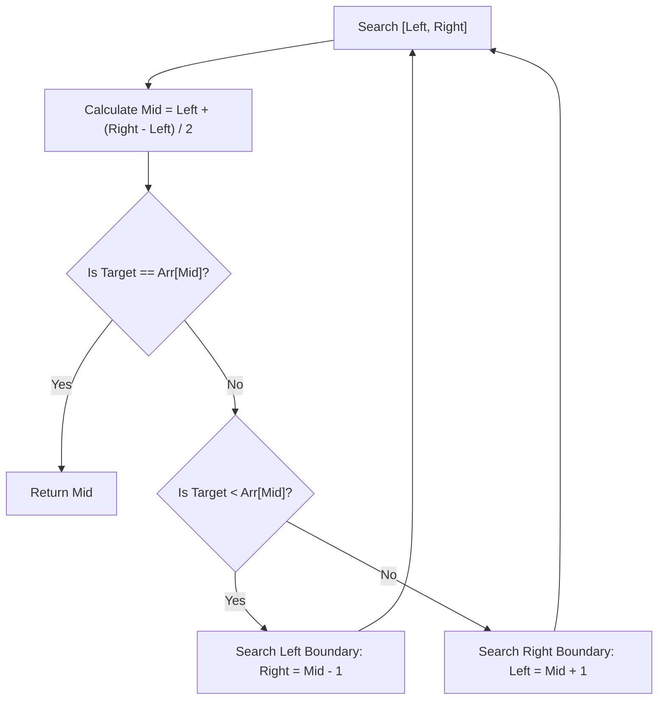

# 🎯 Week 24: Hash Maps, Heaps & Searching Algorithms

> **Duration:** 24 hours | **Difficulty:** 🟡 Intermediate | **Prerequisites:** Week 21–23

## 📌 Goal
Master hash-based key-value lookups, understand heap architectures, and implement sorting and binary searching algorithms.

---

## 🎓 Learning Objectives
By the end of this week, you will:
- ✅ Understand Hash Map chaining and open addressing collision resolutions
- ✅ Build Min/Max Heaps and Priority Queues
- ✅ Implement Binary Search and search boundary optimization
- ✅ Understand quicksort, mergesort, and heap sort
- ✅ Apply Hash Maps and Heaps to solve complex array/string questions

---

## 📚 Prerequisites & Study Hours
- **Prerequisites**: Week 21 (Complexity Analysis), Week 22 (Arrays/Strings), Week 23 (Queues/Stacks)
- **Estimated Study Hours**: 24 hours (divided into 3-4 hours daily)
- **Difficulty**: 🟡 Intermediate

---

## 📖 Concepts & Theory

### 1. Hash Maps & Hashing
A Hash Map uses a **Hash Function** to map keys to bucket indices. 

#### Collision Resolution
- **Separate Chaining**: Buckets store linked lists. Colliding elements are appended to the list.
- **Open Addressing**: Find alternative empty slots (Linear Probing, Quadratic Probing, Double Hashing).

```
Key ──► [ Hash Function ] ──► Index ──► [ Buckets ] ──► [ Value ]
                                           ├── [ Collision Chain ] ──► [ Value ]
```

### 2. Heaps & Priority Queues
A **Heap** is a complete binary tree storing key-value pairs where the root satisfies the **Heap Property** (Min-Heap: parent $\le$ children; Max-Heap: parent $\ge$ children).

#### Complexity Table
| Operation | Average | Worst Case |
| :--- | :--- | :--- |
| **Insertion** | $O(\log n)$ | $O(\log n)$ |
| **Get Max/Min** | $O(1)$ | $O(1)$ |
| **Deletion (Extract)** | $O(\log n)$ | $O(\log n)$ |
| **Heapify (Build)** | $O(n)$ | $O(n)$ |

### 3. Binary Search
An $O(\log n)$ search algorithm on sorted structures. Halves the search space on each comparison.



---

## 💻 Daily Study Plan

### 📅 Monday: Hashing Internals & Collisions
- Read up on hash function safety (avoiding hash collisions) and load factor reallocation.
- Implement a basic Hash Map with separate chaining in JavaScript/Python.

### 📅 Tuesday: Heaps & Priority Queues
- Learn array-based binary heap representations: `left_child = 2i + 1`, `right_child = 2i + 2`, `parent = (i - 1) / 2`.
- Implement `heapifyUp()` and `heapifyDown()` operations.

### 📅 Wednesday: Binary Search on Values & Ranges
- Master standard binary search templates.
- Understand binary searching on non-index limits (e.g., searching for the minimum allocation capacity).

### 📅 Thursday: Sorting Paradigms
- Study Mergesort ($O(n \log n)$ stable) and Quicksort ($O(n \log n)$ average, unstable).
- Implement custom sorting comparators.

### 📅 Friday: Projects Implementation
- Build the **Task Scheduler** and **Leaderboard** projects.

### 📅 Saturday: Problem Practice
- Solve the 30 practice problems listed below on LeetCode and other platforms.

### 📅 Sunday: Revision & Interview Prep
- Review time complexities of sorting algorithms. Solve the company interview questions.

---

## ⚠️ Best Practices & Common Mistakes

### Best Practices
- **Prevent Overflow**: Calculate mid using `left + (right - left) / 2` instead of `(left + right) / 2` to prevent integer overflows.
- **Initialize Hash Maps with Capacities**: If size is known, initialize to prevent dynamic array allocations during resize thresholds.

### Common Mistakes
- **Infinite Binary Search Loops**: Occurs when update bounds do not exclude mid (`left = mid` instead of `left = mid + 1` or `right = mid` instead of `right = mid - 1`).
- **Incorrect Heap Array Indexing**: Zero-indexed heap trees have left child at `2i + 1`, NOT `2i`.

---

## 🧪 Projects & Implementation Guide

### Project 1: Real-Time Game Leaderboard
- **Architecture**: A module storing players in a Hash Map (for $O(1)$ lookup/update) and a Max-Heap (for $O(1)$ top ranking updates).
- **Folder Structure**:
  ```
  leaderboard/
  ├── index.js
  ├── Leaderboard.js
  └── README.md
  ```
- **Implementation Guide**: Use a balance of structures to support $O(\log N)$ updates and score retrieval.

### Project 2: Priority Task Scheduler
- **Architecture**: A job scheduler using a Min-Heap sorted by custom priorities (lower numbers = higher priority).
- **Extension Ideas**: Add task timeouts and dependency execution queues.

### Project 3: Search Engine Page Ranker
- **Architecture**: Index websites using hash maps. Sort by reference weights using QuickSelect or heap sorting.

---

## 📝 Practice Problems (30 Questions)

### Easy (10 Problems)
1. LeetCode 1: Two Sum
2. LeetCode 217: Contains Duplicate
3. LeetCode 704: Binary Search
4. LeetCode 387: First Unique Character in a String
5. LeetCode 35: Search Insert Position
6. GeeksforGeeks: Find element in sorted array
7. HackerRank: Hash Tables: Ransom Note
8. InterviewBit: Binary Search - Square Root of Integer
9. Codeforces 230B: T-primes
10. AtCoder abc077_b: Around Square

### Medium (10 Problems)
11. LeetCode 347: Top K Frequent Elements
12. LeetCode 215: Kth Largest Element in an Array
13. LeetCode 34: Find First and Last Position of Element in Sorted Array
14. LeetCode 973: K Closest Points to Origin
15. LeetCode 162: Find Peak Element
16. GeeksforGeeks: K-largest elements
17. InterviewBit: Kth Node From Middle
18. Codeforces 1613C: Poisoned Dagger
19. AtCoder abc119_d: Lazy Faith
20. CodeChef: Chef and Hashing

### Hard (10 Problems)
21. LeetCode 4: Median of Two Sorted Arrays
22. LeetCode 23: Merge k Sorted Lists
23. LeetCode 295: Find Median from Data Stream
24. LeetCode 410: Split Array Largest Sum
25. LeetCode 154: Find Minimum in Rotated Sorted Array II
26. GeeksforGeeks: Allocate minimum number of pages
27. InterviewBit: Median of Array
28. Codeforces 1201C: Maximum Median
29. AtCoder abc149_e: Handshake
30. CodeChef: K-th Largest Query

---

## 💼 Interview Questions & Answers
- **Q**: Explain how Hash Map resizing works.
- **A**: When the load factor exceeds a threshold (typically 0.75), a new array of double the size is allocated. All keys are re-hashed and re-inserted into the new buckets. This is an amortized $O(1)$ operation, but a single insertion can take $O(n)$ time.

---

## 📖 Official Resources
- [MDT Docs: Map Reference](https://developer.mozilla.org/en-US/docs/Web/JavaScript/Reference/Global_Objects/Map)
- [Python heapq Module Documentation](https://docs.python.org/3/library/heapq.html)
- [C++ Priority Queue reference](https://en.cppreference.com/w/cpp/container/priority_queue)
