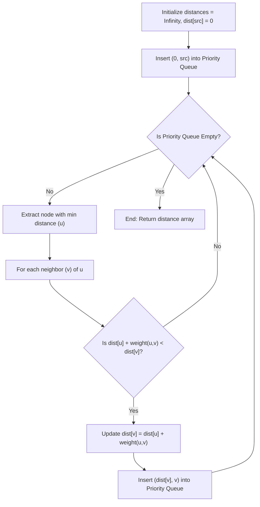

# 🎯 Week 26: Graph Algorithms & Network Routing

> **Duration:** 24 hours | **Difficulty:** 🔴 Advanced | **Prerequisites:** Week 25

## 📌 Goal
Understand structural graph systems, traverse node network models, compile dependency orders, and calculate optimal paths.

---

## 🎓 Learning Objectives
By the end of this week, you will:
- ✅ Model graphs using Adjacency Lists and Adjacency Matrices
- ✅ Traverse networks using Depth-First Search (DFS) and Breadth-First Search (BFS)
- ✅ Resolve dependency structures using Topological Sort (Kahn's Algorithm)
- ✅ Manage partitions using Disjoint Set Union (DSU / Union-Find)
- ✅ Calculate Minimum Spanning Trees (MST) using Kruskal's & Prim's
- ✅ Compute Single-Source Shortest Paths using Dijkstra's & Bellman-Ford

---

## 📚 Prerequisites & Study Hours
- **Prerequisites**: Week 21 (Complexity Analysis), Week 23 (Queues & Stacks), Week 25 (Trees)
- **Estimated Study Hours**: 24 hours
- **Difficulty**: 🔴 Advanced

---

## 📖 Concepts & Theory

### 1. Graph Representations
- **Adjacency Matrix**: A 2D array of size $V \times V$. Query edge exists in $O(1)$ time, but consumes $O(V^2)$ space.
- **Adjacency List**: An array of size $V$ where each slot holds a list of neighboring vertices. Consumes $O(V + E)$ space. Preferred for sparse graphs.

```
Graph: (0) ── (1) ── (2)

Adjacency List:
0: [1]
1: [0, 2]
2: [1]
```

### 2. Disjoint Set Union (Union-Find)
DSU keeps track of set partitions. It supports two main operations:
- **Find**: Determine which set an element belongs to (using path compression to flatten tree branches).
- **Union**: Merge two sets together (using rank/size to attach the smaller tree under the larger).

```javascript
class DSU {
  constructor(n) {
    this.parent = Array.from({ length: n }, (_, i) => i);
    this.rank = Array(n).fill(0);
  }
  
  find(i) {
    if (this.parent[i] === i) return i;
    // Path compression
    return this.parent[i] = this.find(this.parent[i]);
  }
  
  union(i, j) {
    const rootI = this.find(i);
    const rootJ = this.find(j);
    if (rootI !== rootJ) {
      if (this.rank[rootI] < this.rank[rootJ]) {
        this.parent[rootI] = rootJ;
      } else if (this.rank[rootI] > this.rank[rootJ]) {
        this.parent[rootJ] = rootI;
      } else {
        this.parent[rootJ] = rootI;
        this.rank[rootI]++;
      }
      return true;
    }
    return false;
  }
}
```

### 3. Shortest Path (Dijkstra's Algorithm)
Finds the shortest path from a source node to all other nodes in a weighted graph (with non-negative weights).
- Runs in $O((V + E) \log V)$ time using a Min-Priority Queue.



---

## 💻 Daily Study Plan

### 📅 Monday: Graph Implementations & BFS/DFS
- Implement Adjacency lists using hash maps/arrays.
- Code recursive DFS and queue-based BFS, tracking visited nodes in a Set.

### 📅 Tuesday: Topological Sort & Cycles
- Learn Cycle Detection in directed graphs (using recursion stack state).
- Implement Topological Sort using DFS and Kahn's BFS Algorithm (in-degree tracker).

### 📅 Wednesday: Union-Find (DSU)
- Study Path Compression and Union by Rank complexities (Amortized $O(\alpha(N))$ time).
- Solve disjoint set partition problems.

### 📅 Thursday: Minimum Spanning Trees (MST)
- Learn Kruskal's (greedy sorting of edge weights + DSU validations).
- Learn Prim's (Priority Queue tracking minimum cut boundaries).

### 📅 Friday: Shortest Paths
- Implement Dijkstra's algorithm using custom Min-Heaps.
- Study Bellman-Ford (allows negative edge weights; detects negative-weight cycles in $O(VE)$ time).

### 📅 Saturday: Projects & Practice
- Build the **Course Scheduler** and **Navigation System** projects.
- Practice graph problems on LeetCode.

### 📅 Sunday: Revision & Interview Prep
- Walk through graph templates. Review cycle-detection details.

---

## ⚠️ Best Practices & Common Mistakes

### Best Practices
- **Use Set for Visited Tracking**: Never query/traverse nodes without tracking `visited` states to prevent infinite recursive loops.
- **Fast Priority Queue in JS**: Since JS lacks a native priority queue, write or import a Min-Heap instead of sorting array buffers on every iteration.

### Common Mistakes
- **Dijkstra with Negative Weights**: Dijkstra's algorithm fails with negative weights. Always use Bellman-Ford if weights are negative.
- **Topological Sort on Cyclic Graphs**: Kahn's algorithm fails if there is a cycle. Verify the returned list size matches $V$ to check for cycles.

---

## 🧪 Projects & Implementation Guide

### Project 1: GPS Routing Navigation System
- **Architecture**: A pathfinding API calculating shortest routing paths between coordinate intersections using Dijkstra's algorithm.
- **Folder Structure**:
  ```
  navigation/
  ├── Graph.js
  ├── dijkstra.js
  └── server.js
  ```
- **Implementation Guide**: Model intersections as vertices, and roads as weighted edges representing transit distances.

### Project 2: Social Network Friend Recommendations
- **Architecture**: Graph network parsing degree separation (BFS) to recommend secondary connections.

### Project 3: Course Syllabus Scheduler
- **Architecture**: A Kahn's algorithm scheduler resolving academic course requirements and cycles.

---

## 📝 Practice Problems (30 Questions)

### Easy (10 Problems)
1. LeetCode 1971: Find if Path Exists in Graph
2. LeetCode 733: Flood Fill
3. LeetCode 997: Find the Town Judge
4. LeetCode 463: Island Perimeter
5. GeeksforGeeks: Print Adjacency List
6. HackerRank: Roads and Libraries
7. InterviewBit: Path in Directed Graph
8. AtCoder abc054_c: One-stroke Path
9. Codeforces 115A: Party
10. CodeChef: Graph Gg

### Medium (10 Problems)
11. LeetCode 200: Number of Islands
12. LeetCode 133: Clone Graph
13. LeetCode 207: Course Schedule
14. LeetCode 743: Network Delay Time
15. LeetCode 547: Number of Provinces
16. GeeksforGeeks: Topological Sort
17. InterviewBit: Cycle in Directed Graph
18. Codeforces 20C: Dijkstra?
19. AtCoder abc126_d: Even Relation
20. CodeChef: Fire Escape Routes

### Hard (10 Problems)
21. LeetCode 269: Alien Dictionary (Premium / GfG equivalent)
22. LeetCode 787: Cheapest Flights Within K Stops
23. LeetCode 1192: Critical Connections in a Network
24. LeetCode 1584: Min Cost to Connect All Points
25. LeetCode 827: Making A Large Island
26. GeeksforGeeks: Prim's MST
27. InterviewBit: Word Ladder II
28. Codeforces 500D: New Year Transportation
29. AtCoder abc135_f: Strings of Heritage
30. CodeChef: Shortest Path Queries

---

## 💼 Interview Questions & Answers
- **Q**: How does Kahn's algorithm for Topological Sort work?
- **A**: Count the in-degrees (incoming edges) of all vertices. Add vertices with an in-degree of 0 to a Queue. Loop: dequeue a vertex, append it to the sorted list, decrement the in-degrees of all its neighbors. If a neighbor’s in-degree drops to 0, enqueue it. If the sorted list contains all vertices, sorting was successful; otherwise, a cycle exists.

---

## 📖 Official Resources
- [C++ Boost Graph Library Reference](https://www.boost.org/doc/libs/release/libs/graph/)
- [GeeksforGeeks Graph Theory references](https://www.geeksforgeeks.org/graph-data-structure-and-algorithms/)
