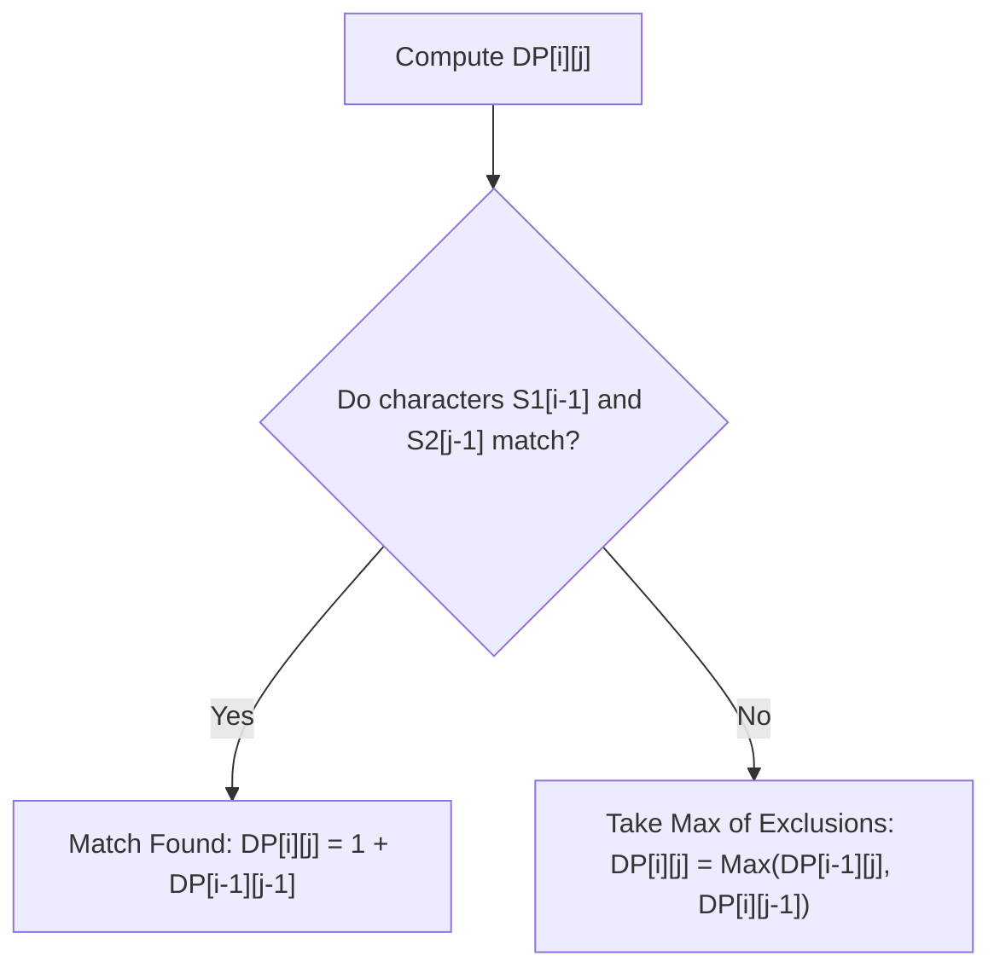

# 🎯 Week 27: Dynamic Programming & Complexity Optimization

> **Duration:** 24 hours | **Difficulty:** 🔴 Advanced | **Prerequisites:** Week 24 & Week 25

## 📌 Goal
Understand state-caching principles, transition from recursion to iterative tabulation, model multi-stage decisions, and optimize runtime from exponential to linear.

---

## 🎓 Learning Objectives
By the end of this week, you will:
- ✅ Identify problems containing Overlapping Subproblems and Optimal Substructure
- ✅ Implement Memoization (top-down) using cache maps
- ✅ Build Tabulation matrices (bottom-up)
- ✅ Master Knapsack (0/1 and Fractional/Unbounded) setups
- ✅ Resolve Sequence problems: Longest Common Subsequence (LCS) & Longest Increasing Subsequence (LIS)
- ✅ Apply state-space optimization to reduce memory complexities

---

## 📚 Prerequisites & Study Hours
- **Prerequisites**: Week 21 (Complexity & Recursion), Week 24 (Arrays & Searching)
- **Estimated Study Hours**: 24 hours
- **Difficulty**: 🔴 Advanced

---

## 📖 Concepts & Theory

### 1. Memoization (Top-Down) vs. Tabulation (Bottom-Up)
- **Memoization (Top-Down)**: Solves the problem recursively, caching results of subproblems. Good when you don't need to visit all states.
- **Tabulation (Bottom-Up)**: Fills a DP table iteratively starting from the base case. Avoids recursion overhead (stack overflow).

```
Top-Down (Recursion + Cache):
F(n) ──► F(n-1) ──► F(n-2)
          └─► [ Cache Hit? Yes: Return; No: Compute ]

Bottom-Up (Iterative Array):
[ Base Case ] ──► [ DP[1] ] ──► [ DP[2] ] ──► [ Target DP[n] ]
```

### 2. The 0/1 Knapsack Problem
Given weights and values of $n$ items, put these items in a knapsack of capacity $W$ to get the maximum total value.
- **State Transition Formula**:
  $$DP[i][w] = \max(value[i-1] + DP[i-1][w - weight[i-1]],\ DP[i-1][w])$$

```
DP Matrix Structure:
          Capacity (W) ──►
Item (i)  [ 0 | 1 | 2 | 3 | ... | W ]
  0       [ 0 | 0 | 0 | 0 | ... | 0 ]
  1       [ 0 | v | v | v | ... | v ]
```

### 3. Longest Common Subsequence (LCS)
Find the length of the longest subsequence present in both strings.
- **Transition**:
  - If $S1[i-1] == S2[j-1] \implies DP[i][j] = 1 + DP[i-1][j-1]$
  - Else $\implies DP[i][j] = \max(DP[i-1][j],\ DP[i][j-1])$



---

## 💻 Daily Study Plan

### 📅 Monday: Introduction to DP & Memoization
- Learn the two indicators of DP (Overlapping Subproblems, Optimal Substructure).
- Implement Fibonacci and Climbing Stairs using standard recursion, memoization, and tabulation.

### 📅 Tuesday: 1D DP Patterns
- Study House Robber and Min Cost Climbing Stairs.
- Learn how to optimize space complexity from $O(n)$ array to $O(1)$ variables.

### 📅 Wednesday: Grid / 2D DP
- Learn Unique Paths and Minimum Path Sum in a matrix.
- Formulate recursive relationships and write tabulation loops.

### 📅 Thursday: Knapsack Problems
- Implement 0/1 Knapsack recursively and iteratively.
- Study Coin Change and Partition Equal Subset Sum variations.

### 📅 Friday: Sequence & String DP
- Implement Longest Common Subsequence (LCS) and Longest Increasing Subsequence (LIS).
- Learn Edit Distance and Wildcard Matching rules.

### 📅 Saturday: Projects & Practice
- Build the **Stock Market Optimizer** and **Game Solver** projects.
- Practice problems on LeetCode.

### 📅 Sunday: Revision & Interview Prep
- Review state compression techniques (using single-row buffers instead of 2D matrices).

---

## ⚠️ Best Practices & Common Mistakes

### Best Practices
- **Define Base Cases First**: Ensure base conditions (e.g. `dp[0] = 0`, `dp[1] = 1`) are initialized explicitly in tabulations.
- **Space Optimize When Possible**: If $DP[i]$ only depends on $DP[i-1]$, compress space from $O(N)$ to $O(1)$.

### Common Mistakes
- **Incorrect DP Array Offsets**: Since DP tables often use size $N+1$ to store base cases, ensure indices match correctly with 0-indexed values arrays.
- **Ignoring Stack Overflows**: Large recursive call stacks in JavaScript can exceed memory limits. Prefer tabulation for very large ranges.

---

## 🧪 Projects & Implementation Guide

### Project 1: Stock Trading Portfolio Optimizer
- **Architecture**: A decision engine calculating maximum profits from buying/selling stock options under trading limits/fees.
- **Folder Structure**:
  ```
  portfolio-opt/
  ├── Optimizer.js
  ├── data.csv
  └── test.js
  ```
- **Implementation Guide**: Model states as `buy`, `sell`, and `cooldown` states using state-machine DP.

### Project 2: Interactive Game Bot Solver
- **Architecture**: Minimax bot using DP caching to determine optimal moves in a grid puzzle.

### Project 3: Shortest Travel Path Optimizer
- **Architecture**: A traveling salesperson solver optimizing routing routes using Held-Karp algorithm.

---

## 📝 Practice Problems (30 Questions)

### Easy (10 Problems)
1. LeetCode 70: Climbing Stairs
2. LeetCode 509: Fibonacci Number
3. LeetCode 746: Min Cost Climbing Stairs
4. LeetCode 121: Best Time to Buy and Sell Stock
5. GeeksforGeeks: Padovan Sequence
6. HackerRank: Fibonacci Modified
7. InterviewBit: Stairs
8. AtCoder dp_a: Frog 1
9. Codeforces 1180A: Alex and a Rhombus
10. CodeChef: Chef and Easy Queries

### Medium (10 Problems)
11. LeetCode 198: House Robber
12. LeetCode 300: Longest Increasing Subsequence
13. LeetCode 1143: Longest Common Subsequence
14. LeetCode 322: Coin Change
15. LeetCode 62: Unique Paths
16. GeeksforGeeks: 0/1 Knapsack Problem
17. InterviewBit: Edit Distance
18. AtCoder dp_b: Frog 2
19. Codeforces 189A: Cut Ribbon
20. CodeChef: AltARay

### Hard (10 Problems)
21. LeetCode 72: Edit Distance
22. LeetCode 1235: Maximum Profit in Job Scheduling
23. LeetCode 312: Burst Balloons
24. LeetCode 188: Best Time to Buy and Sell Stock IV
25. LeetCode 10: Regular Expression Matching
26. GeeksforGeeks: Matrix Chain Multiplication
27. InterviewBit: Max Product Subarray
28. AtCoder dp_e: Knapsack 2
29. Codeforces 118D: Caesar's Legions
30. CodeChef: Triples with sum K

---

## 💼 Interview Questions & Answers
- **Q**: What is Space Compression in DP and how is it done?
- **A**: If a state $DP[i][j]$ in a 2D matrix only depends on values from the previous row $DP[i-1][k]$, we do not need to store the entire $2D$ table. We can maintain just one or two 1D rows, updating them in place. This reduces space complexity from $O(N \times M)$ to $O(M)$.

---

## 📖 Official Resources
- [MIT OpenCourseWare: Introduction to Dynamic Programming](https://ocw.mit.edu/courses/electrical-engineering-and-computer-science/)
- [GeeksforGeeks Dynamic Programming Tutorials](https://www.geeksforgeeks.org/dynamic-programming/)
