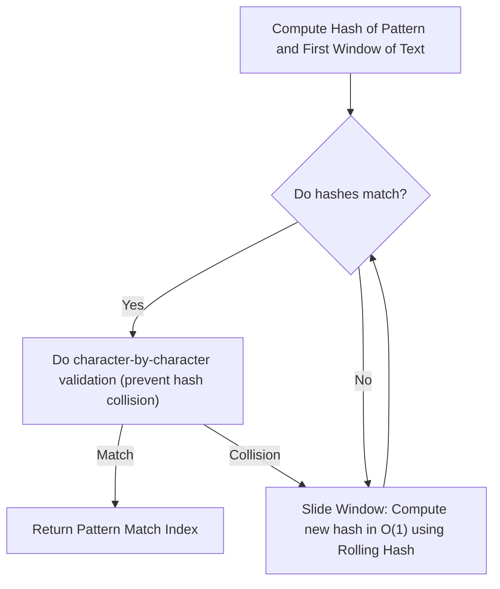

# 🎯 Week 29: Advanced Data Structures & String Algorithms

> **Duration:** 24 hours | **Difficulty:** 🔴 Advanced | **Prerequisites:** Weeks 21, 24, 25 & 26

## 📌 Goal
Understand advanced segment range queries, implement prefix/suffix trees, and master string matching patterns (KMP, Rabin-Karp, Rolling Hash).

---

## 🎓 Learning Objectives
By the end of this week, you will:
- ✅ Build and query a **Segment Tree** for range minimum/sum queries in $O(\log n)$
- ✅ Construct a **Fenwick Tree** (Binary Indexed Tree) for range updates
- ✅ Utilize **Sparse Tables** for constant time $O(1)$ Range Minimum Queries (RMQ)
- ✅ Master the **Knuth-Morris-Pratt (KMP)** algorithm using prefix functions
- ✅ Implement **Rabin-Karp** using Rolling Hash systems
- ✅ Analyze Suffix Arrays for pattern search optimizations

---

## 📚 Prerequisites & Study Hours
- **Prerequisites**: Week 21 (Math & Complexity), Week 24 (Hashing), Week 25 (Trees)
- **Estimated Study Hours**: 24 hours
- **Difficulty**: 🔴 Advanced

---

## 📖 Concepts & Theory

### 1. Segment Trees
A Segment Tree is a binary tree used for storing intervals or segments. It allows querying and updating ranges in $O(\log n)$ time.

```
                  [0-7] (Root)
                 /     \
            [0-3]       [4-7]
            /   \       /   \
          [0-1] [2-3] [4-5] [6-7]
```

### 2. KMP (Knuth-Morris-Pratt) Algorithm
Searches for occurrences of a "pattern" $P$ within a "text" $T$ in $O(N + M)$ time.
- Uses an auxiliary **LPS Array** (Longest Proper Prefix which is also Suffix) to skip unnecessary character comparisons.

```
Pattern:   a b a b c a
LPS Array: [0, 0, 1, 2, 0, 1]

When a mismatch occurs, use the LPS values to backtrack the pattern pointer 
rather than resetting the text pointer back to the start.
```

### 3. Rabin-Karp & Rolling Hash
Uses a **hashing function** to check for pattern matching.
- **Rolling Hash**: Computes the hash of the next window in $O(1)$ time using the previous hash:
  $$H_{new} = d \times (H_{old} - T[i] \times h) + T[i+m]$$



---

## 💻 Daily Study Plan

### 📅 Monday: Segment Trees
- Learn Segment Tree array representations.
- Implement `build()`, `update()`, and `query()` operations for Range Sum Queries.

### 📅 Tuesday: Fenwick Trees (Binary Indexed Trees)
- Understand the bit manipulation tricks behind Fenwick Trees (`i & (-i)`).
- Implement dynamic point updates and prefix sum queries.

### 📅 Wednesday: Sparse Tables
- Study the dynamic programming state relation for Range Minimum Queries:
  $$Table[i][j] = \min(Table[i][j-1],\ Table[i + 2^{j-1}][j-1])$$
- Implement $O(1)$ range queries.

### 📅 Thursday: Knuth-Morris-Pratt (KMP)
- Learn how to construct the LPS array (pi table).
- Implement KMP search algorithm.

### 📅 Friday: Rabin-Karp & Rolling Hashing
- Learn modular arithmetic guidelines to prevent hash overflows.
- Implement Rabin-Karp search algorithm.

### 📅 Saturday: Projects & Practice
- Build the **Compiler Tokenizer** and **Text Search Engine** projects.

### 📅 Sunday: Revision & Interview Prep
- Review advanced range query complexities.

---

## ⚠️ Best Practices & Common Mistakes

### Best Practices
- **Modulo Arithmetic**: In Rabin-Karp, always apply modulo divisions (using a large prime like $10^9 + 7$) on every arithmetic step to prevent number overflows.
- **Size Segment Trees to 4N**: Array-based Segment Trees for an input array of size $N$ require up to $4N$ memory slots.

### Common Mistakes
- **Off-by-One Bit Shifts**: Fenwick trees are 1-indexed. Starting at index 0 will cause infinite loops.
- **Handling Negative Modulo**: In JavaScript, `%` can return negative values. Always adjust: `hash = (hash + prime) % prime`.

---

## 🧪 Projects & Implementation Guide

### Project 1: Text Search Engine Indexer
- **Architecture**: A module indexing documents, matching keyword patterns in $O(N + M)$ using KMP.
- **Folder Structure**:
  ```
  search-indexer/
  ├── indexer.js
  ├── kmp.js
  └── documents/
  ```
- **Implementation Guide**: Search files using KMP. Output matched lines with highlight spans.

### Project 2: Compiler Lexical Tokenizer
- **Architecture**: Code parser using string search structures to tokenize keywords.

### Project 3: Real-Time Log File Monitor
- **Architecture**: App tracking keywords inside log streams using rolling hashes.

---

## 📝 Practice Problems (30 Questions)

### Easy (10 Problems)
1. LeetCode 303: Range Sum Query - Immutable
2. LeetCode 28: Find the Index of the First Occurrence in a String (Implement strStr)
3. LeetCode 459: Repeated Substring Pattern
4. GeeksforGeeks: Binary Indexed Tree
5. HackerRank: Sparse Arrays
6. InterviewBit: Implement StrStr
7. AtCoder abc125_c: GCD on Blackboard
8. Codeforces 271D: Good Substrings
9. CodeChef: Range Sum Queries
10. CodeChef: Subsegment Align

### Medium (10 Problems)
11. LeetCode 307: Range Sum Query - Mutable
12. LeetCode 187: Repeated DNA Sequences
13. LeetCode 796: Rotate String
14. LeetCode 1392: Longest Happy Prefix
15. GeeksforGeeks: KMP Algorithm for Pattern Searching
16. InterviewBit: KMP algorithm
17. AtCoder abc185_f: Range Xor Query
18. Codeforces 474F: Ant colony
19. Codeforces 126B: Password
20. CodeChef: Niceness of Subarrays

### Hard (10 Problems)
21. LeetCode 315: Count of Smaller Numbers After Self
22. LeetCode 214: Shortest Palindrome
23. LeetCode 1157: Online Majority Element In Subarray
24. LeetCode 327: Count of Range Sum
25. GeeksforGeeks: Segment Tree | Set 1
26. InterviewBit: Distinct Subsequences
27. AtCoder abc179_f: Simplified Bookshelf
28. Codeforces 220E: Little Elephant and Inversions
29. Codeforces 1043F: Make It One
30. CodeChef: Distinct Characters Query

---

## 💼 Interview Questions & Answers
- **Q**: What is the difference between a Segment Tree and a Fenwick Tree?
- **A**: A Segment Tree consumes more memory ($4N$ slots) but is highly flexible, supporting general range queries (Min, Max, GCD) and range updates. A Fenwick Tree consumes less memory ($N$ slots) and is simpler to implement, but only supports prefix-based operations (like range sums) and point updates.

---

## 📖 Official Resources
- [CP-Algorithms: String Algorithms Reference](https://cp-algorithms.com/string/prefix_function.html)
- [CP-Algorithms: Segment Tree References](https://cp-algorithms.com/data_structures/segment_tree.html)
