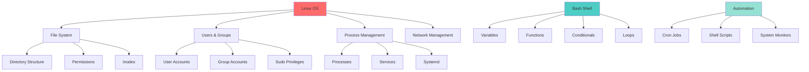

# 🐧 Week 31: Linux Mastery & Shell Scripting

> **Duration:** 24 hours | **Difficulty:** 🟡 Intermediate | **Prerequisites:** Week 1

## 🎯 Goal

Become proficient in Linux system administration, master the bash shell, and automate tasks through shell scripting. Build production-ready automation tools.

## 🎓 Learning Objectives

By the end of this week, you will:
- ✅ Understand Linux file system and directory structure
- ✅ Master file permissions and ownership
- ✅ Manage users and groups
- ✅ Write production-grade bash scripts
- ✅ Automate tasks with cron jobs
- ✅ Secure systems with SSH
- ✅ Manage services with systemd
- ✅ Build automation tools

## 📋 Architecture Overview



## 📖 Daily Study Plan

### Monday: Linux Fundamentals (4 hours)

**Hour 1-2: File System & Directory Structure**
- Understanding FHS (Filesystem Hierarchy Standard)
- `/`, `/home`, `/usr`, `/var`, `/etc`, `/tmp` directories
- Navigating with `cd`, `pwd`, `ls`, `tree`
- Creating, moving, copying, deleting files

**Hour 2-3: File Permissions & Ownership**
- Understanding chmod, chown, chgrp
- Reading permission notation (rwx)
- Setting permissions with octal notation (755, 644)
- Understanding umask

**Hour 3-4: Labs & Practice**
- Create directory structures
- Set up proper permissions
- Practice permission scenarios

### Tuesday: Users, Groups & SSH (4 hours)

**Hour 1-2: User & Group Management**
- Creating users: `useradd`, `adduser`
- Creating groups: `groupadd`
- Managing sudo privileges
- Understanding `/etc/passwd` and `/etc/shadow`
- User home directories and shell configuration

**Hour 2-3: SSH Security**
- SSH key generation
- SSH configuration
- SSH authentication
- Port forwarding
- SCP for file transfer

**Hour 3-4: Hands-on Setup**
- Generate SSH keys
- Configure SSH config
- Test connections

### Wednesday: Bash Fundamentals (4 hours)

**Hour 1-2: Bash Basics**
- Variables and data types
- String operations
- Command substitution
- Piping and redirection
- Arrays and associative arrays

**Hour 2-3: Control Flow**
- If-else statements
- Case statements
- For loops
- While loops
- Functions

**Hour 3-4: Practice**
- Write 10 simple scripts
- Test each script
- Debug issues

### Thursday: Advanced Bash & Scripting (4 hours)

**Hour 1-2: Advanced Scripting**
- Regular expressions with grep, sed, awk
- Error handling and exit codes
- Input validation
- Logging and debugging

**Hour 2-3: Systemd & Services**
- Understanding systemd
- Creating systemd services
- Managing services with systemctl
- Creating timers

**Hour 3-4: Cron Jobs**
- Understanding cron syntax
- Setting up cron jobs
- Monitoring cron execution
- Best practices for automation

### Friday: Projects Setup (3 hours)

- Set up development environment
- Clone project templates
- Install dependencies

### Saturday & Sunday: Projects (6 hours total)

- Build three automation projects
- Deploy and test

## 📚 Core Concepts

### Linux File System Structure

```
/
├── /bin          Binary executables
├── /etc          Configuration files
├── /home         User home directories
├── /var          Variable data
├── /tmp          Temporary files
├── /usr          User programs and data
├── /root         Root user home
└── /boot         Boot files
```

### File Permissions Explained

```
-rwxr-xr-x
│││ │││ │││
│││ │││ └┴┴ Others: r-x (read, execute)
│││ └┴┴────Group: r-x (read, execute)
└┴┴────────Owner: rwx (read, write, execute)
```

**Octal Notation:**
- `r` (read) = 4
- `w` (write) = 2
- `x` (execute) = 1

```bash
chmod 755 script.sh   # rwxr-xr-x
chmod 644 file.txt    # rw-r--r--
chmod 700 private     # rwx------
```

### Bash Script Template

```bash
#!/bin/bash

# Script purpose
# Author: Your Name
# Date: 2024

set -euo pipefail  # Exit on error, undefined vars, pipe failures

# Colors for output
RED='\033[0;31m'
GREEN='\033[0;32m'
YELLOW='\033[1;33m'
NC='\033[0m' # No Color

# Logging functions
log_info() {
    echo -e "${GREEN}[INFO]${NC} $1"
}

log_error() {
    echo -e "${RED}[ERROR]${NC} $1" >&2
}

log_warn() {
    echo -e "${YELLOW}[WARN]${NC} $1"
}

# Main function
main() {
    log_info "Starting script..."
    
    # Your code here
    
    log_info "Script completed successfully"
}

# Error handling
trap 'log_error "Script failed at line $LINENO"' ERR

# Run main
main "$@"
```

### SSH Key Setup

```bash
# Generate SSH key
ssh-keygen -t rsa -b 4096 -C "your-email@example.com"

# Copy to remote server
ssh-copy-id -i ~/.ssh/id_rsa.pub user@remote-host

# Connect without password
ssh user@remote-host

# Configure SSH config file
cat ~/.ssh/config
# Host myserver
#     HostName example.com
#     User ubuntu
#     IdentityFile ~/.ssh/id_rsa
#     Port 22
```

### Systemd Service Example

```ini
# /etc/systemd/system/myapp.service
[Unit]
Description=My Application
After=network.target

[Service]
Type=simple
User=appuser
WorkingDirectory=/opt/myapp
ExecStart=/usr/bin/python3 /opt/myapp/main.py
Restart=on-failure
RestartSec=10s
StandardOutput=journal
StandardError=journal

[Install]
WantedBy=multi-user.target
```

```bash
# Manage service
sudo systemctl start myapp
sudo systemctl stop myapp
sudo systemctl restart myapp
sudo systemctl status myapp
sudo systemctl enable myapp  # Start on boot
```

### Cron Job Syntax

```
┌───────────── minute (0 - 59)
│ ┌───────────── hour (0 - 23)
│ │ ┌───────────── day of month (1 - 31)
│ │ │ ┌───────────── month (1 - 12)
│ │ │ │ ┌───────────── day of week (0 - 6) (Sunday to Saturday)
│ │ │ │ │
│ │ │ │ │
* * * * * command-to-execute
```

```bash
# Examples
0 0 * * * /home/user/backup.sh           # Daily at midnight
0 */4 * * * /home/user/check.sh          # Every 4 hours
0 9 * * 1 /home/user/weekly.sh           # Mondays at 9 AM
*/5 * * * * /home/user/monitor.sh        # Every 5 minutes
0 0 1 * * /home/user/monthly.sh          # First day of month
```

## 💻 Hands-on Labs

### Lab 1: User and Permission Management

```bash
# Create a user
sudo useradd -m -s /bin/bash -c "Developer User" devuser

# Create a group
sudo groupadd developers

# Add user to group
sudo usermod -aG developers devuser

# Create project directory
sudo mkdir -p /projects/myapp
sudo chown -R devuser:developers /projects/myapp
sudo chmod 775 /projects/myapp

# Verify permissions
ls -la /projects/
```

### Lab 2: Bash Script Development

```bash
#!/bin/bash

# Backup Script

BACKUP_DIR="/backups"
SOURCE_DIR="/home/user/data"
DATE=$(date +%Y%m%d_%H%M%S)

log_info() {
    echo "[$(date '+%Y-%m-%d %H:%M:%S')] $1"
}

if [ ! -d "$BACKUP_DIR" ]; then
    mkdir -p "$BACKUP_DIR"
fi

log_info "Starting backup..."
tar -czf "$BACKUP_DIR/backup_$DATE.tar.gz" "$SOURCE_DIR"
log_info "Backup completed: backup_$DATE.tar.gz"

# Cleanup old backups (keep last 7 days)
find "$BACKUP_DIR" -type f -name 'backup_*.tar.gz' -mtime +7 -delete
log_info "Old backups cleaned up"
```

## 🔨 Mini Projects

### Project 1: Linux Automation Toolkit
**Duration:** 4 hours | **Difficulty:** 🟡 Intermediate

#### Features
1. System information collector
2. User management helper
3. Permission checker
4. Log analyzer
5. Performance monitor

#### Deliverables
- Collection of 5 bash scripts
- README with usage instructions
- Systemd service files
- Cron job examples

### Project 2: Backup & Recovery Script
**Duration:** 4 hours | **Difficulty:** 🟡 Intermediate

#### Features
1. Incremental backups
2. Compression
3. Remote upload
4. Recovery functionality
5. Logging and monitoring

#### Tech Stack
- Bash scripting
- tar and rsync
- Cron for scheduling

### Project 3: System Monitor
**Duration:** 3 hours | **Difficulty:** 🟡 Intermediate

#### Features
1. Real-time monitoring
2. Alert generation
3. Log collection
4. Performance metrics
5. Email notifications

## 📚 Resources

### Official Documentation
- [Linux Foundation - Linux Basics](https://www.linuxfoundation.org/)
- [GNU Bash Manual](https://www.gnu.org/software/bash/manual/)
- [Linux man pages](https://linux.die.net/man/)
- [Filesystem Hierarchy Standard](https://refspecs.linuxfoundation.org/FHS_3.0/fhs-3.0.pdf)

### YouTube Playlists
- [TechWorld with Nana - Linux Basics](https://www.youtube.com/watch?v=BGjrpoI94c0)
- [NetworkChuck - Linux for Beginners](https://www.youtube.com/playlist?list=PLIhvC56v63ILPDA2DQBv0IKzqnb3-cGA7)
- [FreeCodeCamp - Linux Command Line](https://www.youtube.com/watch?v=ZtqBQ60celY)
- [The Linux Foundation - Linux Basics](https://www.youtube.com/watch?v=V1y-mbWM3B9)

### Books
- **The Linux Command Line** - William Shotts
- **Linux Bible** - Christopher Negus
- **Pro Bash Programming** - Carl Albing
- **System Administration Best Practices** - Dennis Matotek

### GitHub Repositories
- [bash-it/bash-it](https://github.com/bash-it/bash-it) - Bash framework
- [awesome-shell](https://github.com/alebcay/awesome-shell) - Shell resources
- [pure-bash-bible](https://github.com/dylanaraps/pure-bash-bible) - Bash snippets

## 📋 Cheat Sheet

### Essential Linux Commands

```bash
# Navigation
pwd                      # Print working directory
cd /path                 # Change directory
ls -la                   # List files with details
tree                     # Show directory tree

# File Operations
touch file.txt           # Create file
cp src dst               # Copy file
mv src dst               # Move/rename file
rm file                  # Delete file
cat file                 # Display file content
less file                # View file paginated

# Permissions
chmod 755 script.sh      # Change permissions
chown user:group file    # Change ownership
chgrp group file         # Change group

# Users & Groups
whoami                   # Current user
id                       # User ID info
groups                   # User groups
sudo command             # Run as root

# System Info
uname -a                 # System information
df -h                    # Disk usage
du -sh *                 # Directory sizes
top                      # Process monitor
free -h                  # Memory usage
ps aux                   # Process list

# Networking
ip addr                  # IP addresses
ss -tlnp                 # Open ports
ping host                # Test connectivity
curl/wget url            # Download files

# Archive
tar -czf file.tar.gz dir # Compress
tar -xzf file.tar.gz     # Extract
zip -r file.zip dir      # ZIP compress
```

### Bash Script Template Snippets

```bash
# Check if file exists
if [ -f "$file" ]; then
    echo "File exists"
fi

# Check if directory exists
if [ -d "$dir" ]; then
    echo "Directory exists"
fi

# Command substitution
result=$(command)
echo "Result: $result"

# Loop through files
for file in *.txt; do
    echo "Processing: $file"
done

# String comparison
if [ "$var" = "value" ]; then
    echo "Match"
fi

# Error handling
command || { echo "Failed"; exit 1; }
```

## ✅ Weekly Checklist

- [ ] Understand Linux file system structure
- [ ] Master file permissions and ownership
- [ ] Create and manage users and groups
- [ ] Write production-grade bash scripts
- [ ] Set up SSH keys and access
- [ ] Configure systemd services
- [ ] Create and manage cron jobs
- [ ] Complete 3 mini projects
- [ ] Solve 10+ Linux problems
- [ ] Ready for Week 32 (Networking)

## 🎤 Interview Questions

1. **Explain Linux file permissions**
   - Answer: rwx for owner, group, others
   - Octal notation: read=4, write=2, execute=1

2. **What is the difference between `sudo` and `su`?**
   - sudo: Execute single command as root
   - su: Switch user, requires password

3. **How do you debug a bash script?**
   - Use `set -x` for debugging
   - Add trap handlers
   - Use `set -euo pipefail`

4. **What is a cron job and how does it work?**
   - Scheduled task runner
   - Crontab file specifies timing
   - Runs at specified intervals

5. **Explain SSH and why it's secure**
   - Encrypts all data
   - Public-key cryptography
   - No password transmission

---

**Next:** [Week 32 - Computer Networking →](Week-32.md)
