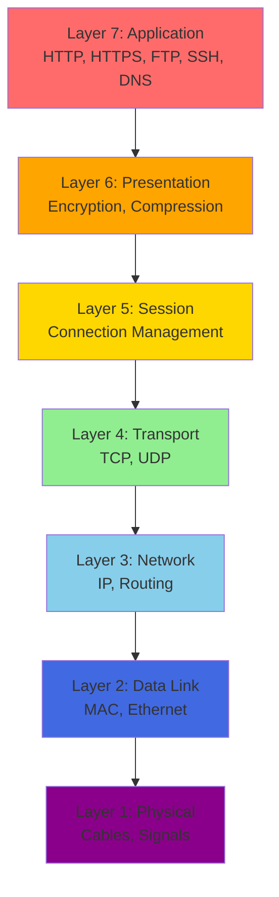
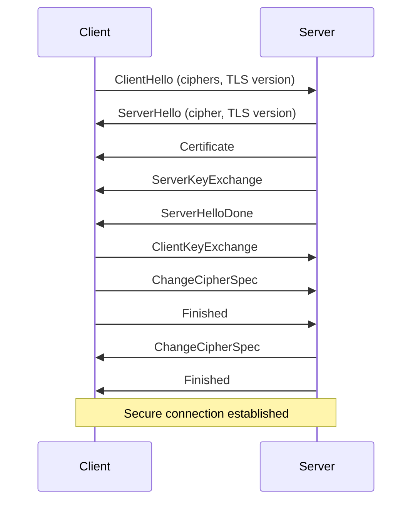

# 🌐 Week 32: Computer Networking Fundamentals

> **Duration:** 22 hours | **Difficulty:** 🟡 Intermediate | **Prerequisites:** Week 31

## 🎯 Goal

Understand the complete networking stack from physical layer to application layer. Master protocols, network architecture, and real-world networking concepts essential for DevOps and backend development.

## 🎓 Learning Objectives

By the end of this week, you will:
- ✅ Understand the OSI model completely
- ✅ Master TCP/IP protocol suite
- ✅ Understand HTTP/HTTPS in depth
- ✅ Learn DNS resolution process
- ✅ Master TLS/SSL encryption
- ✅ Understand load balancing
- ✅ Learn reverse proxies
- ✅ Understand firewalls and VPNs

## 📋 OSI Model Architecture



## 📖 Daily Study Plan

### Monday: OSI Model & TCP/IP (4 hours)

**Hour 1-2: OSI Model**
- 7 layers of OSI model
- Data flow through layers
- PDUs at each layer
- Encapsulation/Decapsulation

**Hour 2-3: TCP/IP Suite**
- TCP/IP model vs OSI
- Internet Protocol (IP)
- IPv4 vs IPv6
- Subnetting and CIDR

**Hour 3-4: Hands-on**
- Analyze network packets
- Calculate subnets
- Practice IP addressing

### Tuesday: HTTP/HTTPS & DNS (4 hours)

**Hour 1-2: HTTP Protocol**
- HTTP request/response
- Methods: GET, POST, PUT, DELETE
- Status codes (1xx, 2xx, 3xx, 4xx, 5xx)
- Headers and bodies
- HTTP/1.1, HTTP/2, HTTP/3

**Hour 2-3: HTTPS & TLS**
- SSL/TLS handshake
- Certificate chain
- Encryption algorithms
- DNS over HTTPS

**Hour 3-4: DNS**
- DNS resolution process
- DNS records (A, AAAA, CNAME, MX, TXT)
- DNS caching
- DNS tools: dig, nslookup

### Wednesday: TCP/UDP & Transport Layer (4 hours)

**Hour 1-2: TCP Protocol**
- Three-way handshake
- Connection states
- Flow control and congestion
- TCP reliability

**Hour 2-3: UDP Protocol**
- Connectionless protocol
- Use cases: DNS, streaming
- UDP vs TCP

**Hour 3-4: Tools & Practice**
- netstat, ss, lsof
- tcpdump for packet analysis
- Wireshark basics

### Thursday: Advanced Networking (4 hours)

**Hour 1-2: Load Balancing**
- Load balancer types
- Algorithms (round-robin, least connections, IP hash)
- Session persistence
- Health checks

**Hour 2-3: Firewalls & VPN**
- Firewall types (stateful, stateless)
- iptables and ufw
- VPN concepts
- Tunneling protocols

**Hour 3-4: Reverse Proxies**
- Nginx/Apache as reverse proxy
- Load distribution
- SSL termination
- Caching

### Friday: Projects Setup (3 hours)

- Set up networking tools
- Create project structure

### Saturday & Sunday: Projects (6 hours total)

- Build networking projects

## 📚 Core Concepts

### TCP Three-Way Handshake

```
Client                          Server
  |                              |
  |------------ SYN ------------->|
  |     (SYN_SENT)               (LISTEN)
  |                              |
  |<---------- SYN+ACK -----------|
  |     (ESTABLISHED)        (SYN_RECEIVED)
  |                              |
  |------------ ACK ------------->|
  |                       (ESTABLISHED)
  |                              |
  | <------- Data Exchange -----> |
```

### DNS Resolution Process

```
Client                                     DNS Resolver
  |
  |--- Query: A example.com ---->
  |<---- Answer: 93.184.216.34 ---

DNS Resolver                           Root Nameserver
  |
  |--- Query: A example.com ---->
  |<---- Referral to TLD ----------

DNS Resolver                           TLD Nameserver
  |
  |--- Query: A example.com ---->
  |<---- Referral to Authoritative -

DNS Resolver                        Authoritative Nameserver
  |
  |--- Query: A example.com ---->
  |<---- Answer: 93.184.216.34 ---
```

### TLS/SSL Handshake



### HTTP Status Codes

| Code | Category | Examples |
|------|----------|----------|
| 1xx | Informational | 100 Continue, 101 Switching Protocols |
| 2xx | Success | 200 OK, 201 Created, 204 No Content |
| 3xx | Redirection | 301 Moved Permanently, 302 Found, 304 Not Modified |
| 4xx | Client Error | 400 Bad Request, 401 Unauthorized, 404 Not Found |
| 5xx | Server Error | 500 Internal Server Error, 502 Bad Gateway, 503 Service Unavailable |

## 💻 Hands-on Labs

### Lab 1: Packet Analysis with tcpdump

```bash
# Capture packets on interface eth0
sudo tcpdump -i eth0

# Capture specific port
sudo tcpdump -i eth0 port 80

# Save to file
sudo tcpdump -i eth0 -w capture.pcap

# Read from file
tcpdump -r capture.pcap

# Filter by host
sudo tcpdump host 192.168.1.100

# Filter by protocol
sudo tcpdump tcp
sudo tcpdump udp
sudo tcpdump icmp
```

### Lab 2: DNS Resolution

```bash
# Query DNS
dig example.com
dig example.com A
dig example.com MX

# Specific nameserver
dig @8.8.8.8 example.com

# Reverse DNS
dig -x 93.184.216.34

# Trace DNS resolution
dig +trace example.com

# nslookup alternative
nslookup example.com
nslookup -type=MX example.com
```

### Lab 3: Network Diagnostics

```bash
# Test connectivity
ping -c 4 example.com

# Trace route
traceroute example.com
mtr example.com    # Better traceroute

# Check open ports
ss -tlnp
netstat -tulnp

# Test specific port
nc -zv example.com 80
telnet example.com 80

# HTTP requests
curl -v https://example.com
wget -S https://example.com

# Check SSL certificate
openssl s_client -connect example.com:443
```

## 🔨 Mini Projects

### Project 1: Packet Analyzer
**Duration:** 4 hours | **Difficulty:** 🟡 Intermediate

#### Features
1. Capture live packets
2. Parse packet headers
3. Display statistics
4. Filter by protocol
5. Export results

#### Tech Stack
- Python with scapy or dpkt
- Tkinter for GUI (optional)
- JSON for export

### Project 2: Mini DNS Resolver
**Duration:** 4 hours | **Difficulty:** 🟡 Intermediate

#### Features
1. DNS query implementation
2. Record type support (A, AAAA, MX, CNAME)
3. Caching mechanism
4. Query tracing
5. Performance metrics

#### Tech Stack
- Python with dnspython library
- Redis for caching
- Web UI

### Project 3: HTTP Server
**Duration:** 3 hours | **Difficulty:** 🟡 Intermediate

#### Features
1. HTTP request handling
2. Multiple endpoints
3. HTTPS support
4. Request logging
5. Error handling

#### Tech Stack
- Python with Flask or Node.js
- OpenSSL for certificates

## 📊 Networking Commands Cheat Sheet

```bash
# IP Configuration
ip addr show              # Show IP addresses
ip route show             # Show routing table
ip link show              # Show network interfaces
ip addr add 192.168.1.10/24 dev eth0
ip route add default via 192.168.1.1

# DNS
dig example.com           # Query DNS
nslookup example.com      # DNS lookup
host example.com          # Host lookup
getent hosts example.com  # Check /etc/hosts

# Connection Monitoring
ss -tlnp                  # Show listening ports (modern)
netstat -tulnp            # Show ports (legacy)
lsof -i :8080             # Show process on port
netstat -an | grep ESTABLISHED

# Packet Analysis
tcpdump -i eth0 port 80   # Capture HTTP
tcpdump host 192.168.1.1  # Specific host
capinfos capture.pcap     # Analyze capture file

# Network Testing
ping -c 4 8.8.8.8         # Test connectivity
traceroute 8.8.8.8        # Trace route
mtr -c 4 8.8.8.8          # Better traceroute
nc -zv example.com 443    # Test port
curl -vI https://example.com  # HTTP headers

# Firewall
sudo ufw status           # UFW status
sudo ufw allow 22/tcp     # Allow SSH
sudo iptables -L          # List iptables rules
```

## 📚 Resources

### Official Documentation
- [MDN - HTTP Documentation](https://developer.mozilla.org/en-US/docs/Web/HTTP)
- [RFC 7230 - HTTP/1.1](https://tools.ietf.org/html/rfc7230)
- [RFC 3986 - URI Generic Syntax](https://tools.ietf.org/html/rfc3986)
- [ISC - DNS Documentation](https://www.isc.org/dns/)

### YouTube Playlists
- [NetworkChuck - Networking Fundamentals](https://www.youtube.com/playlist?list=PLIhvC56v63IKV4Bx6LW5g4-PnL2dBz1JC)
- [Hussein Nasser - Networking](https://www.youtube.com/watch?v=qiQR5rTSshw)
- [Google Cloud Tech - Networking](https://www.youtube.com/watch?v=mnxPfmB4PnM)

### Books
- **Computer Networking: A Top-Down Approach** - Kurose & Ross
- **TCP/IP Illustrated** - W. Richard Stevens
- **DNS and BIND** - Paul Albitz
- **High Performance Browser Networking** - Ilya Grigorik

## ✅ Weekly Checklist

- [ ] Understand all 7 OSI layers
- [ ] Master TCP/IP protocol suite
- [ ] Understand HTTP/HTTPS completely
- [ ] Know DNS resolution process
- [ ] Master TLS/SSL handshake
- [ ] Complete 3 networking projects
- [ ] Solve 10+ networking problems
- [ ] Ready for Week 33 (Docker)

---

**Next:** [Week 33 - Docker Fundamentals →](Week-33.md)
