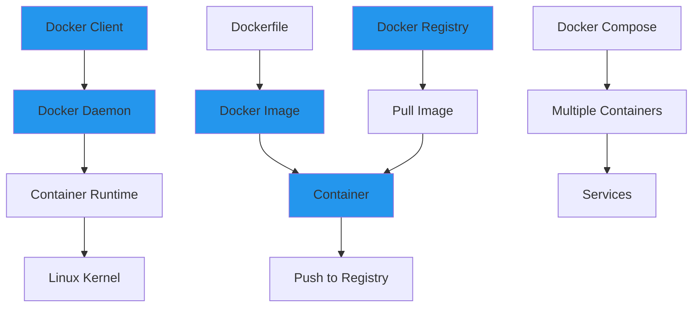

# 🐳 Week 33: Docker & Containerization

> **Duration:** 24 hours | **Difficulty:** 🟠 Advanced | **Prerequisites:** Week 31-32

## 🎯 Goal

Master Docker containerization from fundamentals to production deployment. Build, push, and orchestrate containerized applications.

## 🎓 Learning Objectives

By the end of this week, you will:
- ✅ Understand containerization concepts
- ✅ Master Docker CLI and commands
- ✅ Write production-grade Dockerfiles
- ✅ Use Docker Compose for multi-container apps
- ✅ Manage volumes and networking
- ✅ Optimize Docker images
- ✅ Implement security best practices
- ✅ Deploy containerized applications

## 📋 Docker Architecture



## 📖 Daily Study Plan

### Monday: Docker Fundamentals (4 hours)

**Hour 1-2: Container Concepts**
- Containerization vs virtualization
- Images and containers
- Docker architecture
- Docker daemon and client
- Container lifecycle

**Hour 2-3: Docker CLI**
- Basic commands: run, ps, ls, rm
- Container management
- Image management
- Logging and debugging

**Hour 3-4: Hands-on**
- Run containers
- Manage containers
- Basic troubleshooting

### Tuesday: Dockerfile & Image Building (4 hours)

**Hour 1-2: Dockerfile Syntax**
- Base images
- FROM, RUN, COPY, ADD
- WORKDIR, ENV, EXPOSE
- ENTRYPOINT, CMD
- Multi-stage builds

**Hour 2-3: Best Practices**
- Image optimization
- Layer caching
- Security practices
- Minimal images

**Hour 3-4: Practice**
- Write 5 Dockerfiles
- Build and test images
- Optimize images

### Wednesday: Docker Compose (4 hours)

**Hour 1-2: Compose Basics**
- docker-compose.yml syntax
- Services definition
- Networks and volumes
- Environment variables

**Hour 2-3: Multi-Container Apps**
- Frontend + Backend + Database
- Service dependencies
- Health checks
- Scaling services

**Hour 3-4: Practice**
- Create docker-compose files
- Deploy multi-container apps
- Test and troubleshoot

### Thursday: Advanced Docker (4 hours)

**Hour 1-2: Volumes & Networking**
- Volume types
- Network drivers
- Container communication
- Port mapping

**Hour 2-3: Registry & Image Management**
- Docker Hub
- Private registries
- Image tagging
- Push and pull

**Hour 3-4: Security & Optimization**
- Security scanning
- Image signing
- Resource limits
- Health checks

### Friday: Projects Setup (3 hours)

- Prepare development environment
- Clone templates

### Saturday & Sunday: Projects (6 hours total)

- Build three Docker projects

## 📚 Core Concepts

### Dockerfile Example

```dockerfile
# Multi-stage build
FROM node:18-alpine AS builder

WORKDIR /app
COPY package*.json ./
RUN npm ci --only=production

FROM node:18-alpine

WORKDIR /app

# Create non-root user
RUN addgroup -g 1001 -S nodejs
RUN adduser -S nodejs -u 1001

# Copy from builder
COPY --from=builder /app/node_modules ./node_modules
COPY --chown=nodejs:nodejs . .

EXPOSE 3000

USER nodejs

HEALTHCHECK --interval=30s --timeout=3s --start-period=5s --retries=3 \
    CMD node healthcheck.js

CMD ["node", "server.js"]
```

### Docker Compose Example

```yaml
version: '3.8'

services:
  api:
    build:
      context: ./api
      dockerfile: Dockerfile
    ports:
      - "3000:3000"
    environment:
      - NODE_ENV=production
      - DATABASE_URL=postgresql://user:password@db:5432/app
    depends_on:
      db:
        condition: service_healthy
    volumes:
      - ./api:/app
      - /app/node_modules
    networks:
      - app-network
    restart: unless-stopped

  frontend:
    build:
      context: ./frontend
      dockerfile: Dockerfile
    ports:
      - "3001:3000"
    environment:
      - REACT_APP_API_URL=http://api:3000
    depends_on:
      - api
    networks:
      - app-network

  db:
    image: postgres:15-alpine
    environment:
      - POSTGRES_USER=user
      - POSTGRES_PASSWORD=password
      - POSTGRES_DB=app
    volumes:
      - db-data:/var/lib/postgresql/data
    healthcheck:
      test: ["CMD-SHELL", "pg_isready -U user"]
      interval: 10s
      timeout: 5s
      retries: 5
    networks:
      - app-network

volumes:
  db-data:

networks:
  app-network:
    driver: bridge
```

### Docker Commands Cheat Sheet

```bash
# Container Management
docker run -d -p 8080:80 --name myapp nginx
docker ps                          # List running
docker ps -a                       # List all
docker start/stop/restart myapp    # Container control
docker rm myapp                    # Remove container
docker logs -f myapp               # View logs
docker exec -it myapp /bin/bash    # Interactive shell

# Image Management
docker build -t myapp:1.0 .       # Build image
docker images                      # List images
docker tag myapp:1.0 myapp:latest # Tag image
docker push myrepo/myapp:1.0       # Push to registry
docker pull ubuntu:20.04           # Pull image
docker rmi myapp:1.0               # Remove image
docker inspect myapp:1.0           # Image details

# Debugging
docker logs myapp                  # View logs
docker stats myapp                 # Resource usage
docker top myapp                   # Running processes
docker diff myapp                  # File changes

# Docker Compose
docker-compose up -d               # Start services
docker-compose down                # Stop services
docker-compose logs -f             # View logs
docker-compose exec api bash       # Execute in service
docker-compose restart             # Restart services
```

## 💻 Hands-on Labs

### Lab 1: Create a Node.js App Docker Image

```dockerfile
# Dockerfile
FROM node:18-alpine

WORKDIR /app

# Copy package files
COPY package*.json ./

# Install dependencies
RUN npm ci

# Copy application
COPY . .

# Expose port
EXPOSE 3000

# Run application
CMD ["node", "index.js"]
```

```bash
# Build image
docker build -t my-app:1.0 .

# Run container
docker run -d -p 3000:3000 --name app my-app:1.0

# Check logs
docker logs app

# Stop container
docker stop app
```

### Lab 2: Multi-Container App with Compose

```bash
# Create directory structure
mkdir mern-app
cd mern-app
mkdir api frontend database

# Create docker-compose.yml
# (see example above)

# Run all services
docker-compose up -d

# View status
docker-compose ps

# View logs
docker-compose logs -f

# Stop services
docker-compose down
```

## 🔨 Mini Projects

### Project 1: Containerize MERN Stack
**Duration:** 4 hours | **Difficulty:** 🟠 Advanced

#### Features
1. Node.js API containerization
2. React frontend containerization
3. MongoDB containerization
4. Docker Compose orchestration
5. Development and production configs

#### Deliverables
- Dockerfile for each service
- docker-compose.yml
- .dockerignore files
- Environment configuration

### Project 2: Dockerized REST API
**Duration:** 4 hours | **Difficulty:** 🟠 Advanced

#### Features
1. Multi-stage build
2. Health checks
3. Graceful shutdown
4. Logging
5. Security scanning

#### Tech Stack
- Node.js/Python/Go
- PostgreSQL/MongoDB
- Docker

### Project 3: Dockerized React Application
**Duration:** 3 hours | **Difficulty:** 🟠 Advanced

#### Features
1. Multi-stage build for optimization
2. Nginx reverse proxy
3. Environment configuration
4. Development and production images
5. CI/CD integration

## 📚 Resources

### Official Documentation
- [Docker Documentation](https://docs.docker.com/)
- [Docker CLI Reference](https://docs.docker.com/engine/reference/commandline/)
- [Dockerfile Reference](https://docs.docker.com/engine/reference/builder/)
- [Docker Compose Reference](https://docs.docker.com/compose/compose-file/)

### YouTube Playlists
- [TechWorld with Nana - Docker Tutorial](https://www.youtube.com/watch?v=3c-iBn73dRM)
- [Bret Fisher - Docker Training](https://www.youtube.com/watch?v=V-pYKGjNYLc)
- [FreeCodeCamp - Docker Complete Guide](https://www.youtube.com/watch?v=9V1h-GlucRE)

### Books
- **Docker Deep Dive** - Nigel Poulton
- **Docker in Action** - Jeff Nickoloff
- **Kubernetes in Action** - Marko Lukša

## ✅ Weekly Checklist

- [ ] Understand containerization concepts
- [ ] Master Docker CLI
- [ ] Write production-grade Dockerfiles
- [ ] Create docker-compose files
- [ ] Manage volumes and networking
- [ ] Complete 3 Docker projects
- [ ] Implement security best practices
- [ ] Ready for Week 34 (Kubernetes)

---

**Next:** [Week 34 - Kubernetes Orchestration →](Week-34.md)
