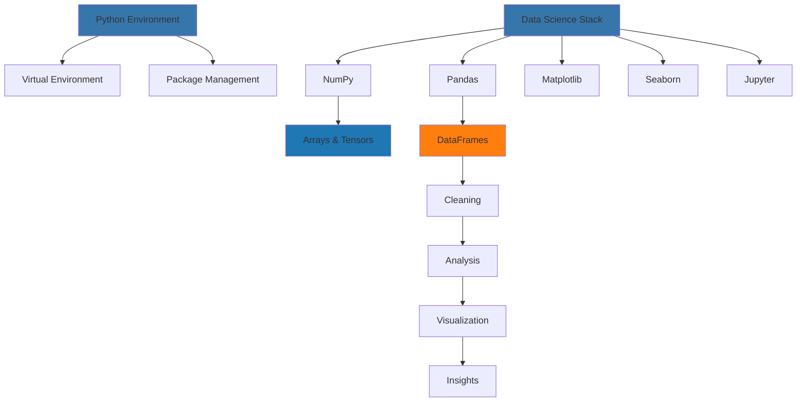

# 🐍 Week 41: Python for AI/ML & Data Science Fundamentals

> **Duration:** 24 hours | **Difficulty:** 🟠 Advanced | **Prerequisites:** Weeks 1-10, Python basics

## 🎯 Goal

Master Python ecosystem tools for data science and AI. Set up professional development environment and learn data manipulation, visualization, and exploration.

## 🎓 Learning Objectives

By the end of this week, you will:
- ✅ Create and manage Python virtual environments
- ✅ Master NumPy for numerical computing
- ✅ Use Pandas for data manipulation
- ✅ Create visualizations with Matplotlib and Seaborn
- ✅ Work with Jupyter notebooks
- ✅ Handle large datasets efficiently
- ✅ Perform exploratory data analysis (EDA)
- ✅ Build data pipelines

## 📊 Architecture Overview



## 📅 Daily Study Plan

### Monday: Python Environment Setup (4 hours)

**Hour 1-2: Virtual Environments**
- Why virtual environments matter
- Creating with venv
- Creating with conda
- Managing dependencies
- requirements.txt files

**Hour 2-3: Package Installation**
- pip package manager
- conda package manager
- PyPI repository
- Version management
- Dependency conflicts

**Hour 3-4: Hands-on Setup**
- Create project structure
- Set up virtual environment
- Install data science packages
- Verify installations

### Tuesday: NumPy Fundamentals (4 hours)

**Hour 1-2: NumPy Arrays**
- Array creation methods
- Array indexing and slicing
- Broadcasting
- Shape and reshape operations
- Data types

**Hour 2-3: NumPy Operations**
- Mathematical operations
- Linear algebra
- Random number generation
- Aggregation functions
- Statistical functions

**Hour 3-4: Practice**
- Create and manipulate arrays
- Solve 10 NumPy challenges
- Benchmark operations

### Wednesday: Pandas Mastery (4 hours)

**Hour 1-2: DataFrames**
- DataFrame creation
- Indexing and selection
- Data types
- Missing data handling
- Data cleaning

**Hour 2-3: Data Manipulation**
- Filtering and grouping
- Aggregation
- Merging and joining
- Reshaping data
- Time series operations

**Hour 3-4: Practice**
- Load and explore datasets
- Clean real data
- Perform complex queries

### Thursday: Visualization & Jupyter (4 hours)

**Hour 1-2: Matplotlib**
- Basic plotting
- Figure and axes
- Customization
- Multiple plots
- Subplots

**Hour 2-3: Seaborn & Jupyter**
- Statistical visualizations
- Jupyter notebooks
- Magic commands
- Interactive widgets
- Notebook best practices

**Hour 3-4: Practice**
- Create 10+ visualizations
- Build exploratory notebook
- Test interactive widgets

### Friday: Projects Initiation (3 hours)

- Set up project repositories
- Prepare datasets
- Install dependencies

### Saturday & Sunday: Projects (6 hours total)

- Build three data science projects

## 📖 Core Concepts

### Virtual Environment Setup

```bash
# Using venv
python -m venv venv
source venv/bin/activate  # Linux/Mac
venv\Scripts\activate     # Windows

# Using conda
conda create -n ds-env python=3.11
conda activate ds-env

# Install packages
pip install numpy pandas matplotlib seaborn jupyter

# Create requirements.txt
pip freeze > requirements.txt

# Install from requirements
pip install -r requirements.txt
```

### NumPy Example

```python
import numpy as np

# Array creation
arr = np.array([1, 2, 3, 4, 5])
matrix = np.zeros((3, 4))
identity = np.eye(3)
random = np.random.rand(5, 5)

# Broadcasting
a = np.array([[1, 2, 3]])
b = np.array([[1], [2], [3]])
c = a + b  # Shape (3, 3)

# Vectorized operations (efficient!)
arr = np.array([1, 2, 3, 4, 5])
result = np.sqrt(arr)
result = arr * 2 + 1

# Linear algebra
A = np.array([[1, 2], [3, 4]])
B = np.array([[5, 6], [7, 8]])

dot_product = np.dot(A, B)
inverse = np.linalg.inv(A)
eigenvalues, eigenvectors = np.linalg.eig(A)
```

### Pandas Example

```python
import pandas as pd

# Create DataFrame
df = pd.DataFrame({
    'name': ['Alice', 'Bob', 'Charlie'],
    'age': [25, 30, 35],
    'salary': [50000, 60000, 70000]
})

# Load data
df = pd.read_csv('data.csv')
df = pd.read_excel('data.xlsx')

# Data exploration
df.head()
df.info()
df.describe()
df.shape

# Data cleaning
df.dropna()  # Remove missing
df.fillna(0)  # Fill missing
df.drop_duplicates()  # Remove duplicates

# Filtering and selection
df[df['age'] > 25]
df.loc[0, 'name']  # Label-based
df.iloc[0, 0]  # Position-based

# Grouping and aggregation
df.groupby('department')['salary'].mean()
df.groupby('age').agg({'salary': ['min', 'max', 'mean']})

# Merging
df_merged = pd.merge(df1, df2, on='id')

# Time series
df['date'] = pd.to_datetime(df['date'])
df.set_index('date').resample('M').mean()
```

### Matplotlib & Seaborn

```python
import matplotlib.pyplot as plt
import seaborn as sns

# Basic plot
plt.figure(figsize=(10, 6))
plt.plot(x, y, label='Line')
plt.scatter(x, y, label='Points')
plt.xlabel('X Label')
plt.ylabel('Y Label')
plt.legend()
plt.show()

# Multiple subplots
fig, axes = plt.subplots(2, 2, figsize=(12, 10))
axes[0, 0].plot(x, y)
axes[0, 1].scatter(x, y)
axes[1, 0].hist(data)
axes[1, 1].boxplot(data)
plt.tight_layout()
plt.show()

# Seaborn statistical plots
sns.scatterplot(data=df, x='x', y='y', hue='category')
sns.lineplot(data=df, x='date', y='value')
sns.histplot(data=df, x='age', kde=True)
sns.boxplot(data=df, x='category', y='value')
sns.heatmap(corr_matrix, annot=True, cmap='coolwarm')
sns.clustermap(data)
```

### Jupyter Notebook Usage

```python
# Magic commands
%matplotlib inline  # Display plots
%timeit code  # Time execution
%pwd  # Current directory
%ls  # List files

# Run shell commands
!pip install package
!git status

# Interactive widgets
from ipywidgets import interact

@interact
def plot(n=(1, 100)):
    plt.plot(np.sin(np.linspace(0, 2*np.pi, 1000)) * n)
    plt.show()
```

## 🔬 Hands-on Labs

### Lab 1: NumPy Operations

```python
import numpy as np

# Create arrays
a = np.array([[1, 2], [3, 4]])
b = np.array([[5, 6], [7, 8]])

# Matrix operations
print(np.dot(a, b))
print(np.linalg.det(a))
print(np.linalg.inv(a))

# Statistical operations
data = np.random.randn(1000)
print(f"Mean: {np.mean(data)}")
print(f"Std: {np.std(data)}")
print(f"Percentile 95: {np.percentile(data, 95)}")
```

### Lab 2: Pandas Data Analysis

```python
import pandas as pd

# Load dataset
df = pd.read_csv('sales.csv')

# Explore
print(df.info())
print(df.describe())
print(df.isnull().sum())

# Clean and analyze
df = df.dropna()
df['date'] = pd.to_datetime(df['date'])

# Group analysis
sales_by_region = df.groupby('region')['sales'].sum()
sales_by_month = df.groupby(df['date'].dt.month)['sales'].mean()

print(sales_by_region)
print(sales_by_month)
```

## 💻 Mini Projects

### Project 1: Data Analyzer
**Duration:** 4 hours | **Difficulty:** 🟠 Advanced

#### Features
1. Load multiple data formats
2. Automatic data profiling
3. Missing value analysis
4. Statistical summaries
5. Correlation analysis
6. Export reports

#### Tech Stack
- Pandas, NumPy
- Matplotlib, Seaborn
- Jupyter Notebook

### Project 2: CSV Dashboard
**Duration:** 4 hours | **Difficulty:** 🟠 Advanced

#### Features
1. Upload CSV files
2. Interactive exploration
3. Multiple visualizations
4. Filtering and sorting
5. Export results

#### Tech Stack
- Pandas, NumPy
- Matplotlib, Seaborn
- Flask or Streamlit

### Project 3: Visualization Toolkit
**Duration:** 3 hours | **Difficulty:** 🟠 Advanced

#### Features
1. Multiple chart types
2. Customization options
3. Data transformation
4. Export as images
5. Template system

## 📚 Resources

### Official Documentation
- [Python Documentation](https://docs.python.org/3/)
- [NumPy Documentation](https://numpy.org/doc/)
- [Pandas Documentation](https://pandas.pydata.org/docs/)
- [Matplotlib Documentation](https://matplotlib.org/)
- [Jupyter Documentation](https://jupyter.org/documentation)

### YouTube Playlists
- [freeCodeCamp - Python for Data Analysis](https://www.youtube.com/watch?v=r-uOLxkrihE)
- [Corey Schafer - NumPy & Pandas Tutorials](https://www.youtube.com/user/schafer5)
- [StatQuest - Statistics Fundamentals](https://www.youtube.com/user/joshstarmer)

### Books
- **Python for Data Analysis** - Wes McKinney
- **Hands-On Machine Learning** - Aurélien Géron
- **Data Science from Scratch** - Joel Grus

## ✅ Weekly Checklist

- [ ] Set up Python virtual environment
- [ ] Master NumPy arrays and operations
- [ ] Learn Pandas DataFrames
- [ ] Create various visualizations
- [ ] Complete 3 data projects
- [ ] Solve 20+ data manipulation problems
- [ ] Ready for Week 42 (Mathematics)

---

**Next:** [Week 42 - Mathematics for AI 🔢](Week-42.md)
