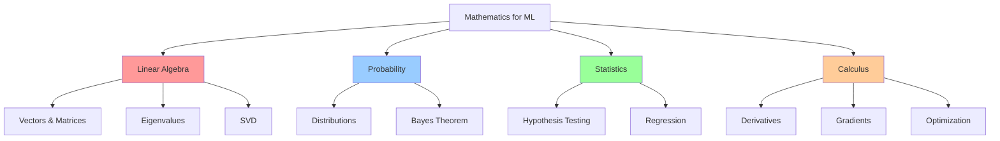

# 🔢 Week 42: Mathematics for AI/ML

> **Duration:** 24 hours | **Difficulty:** 🟠 Advanced | **Prerequisites:** Week 41, Basic calculus

## 🎯 Goal

Master the mathematical foundations essential for understanding machine learning and deep learning algorithms. Build intuition for optimization, probability, and statistics.

## 🎓 Learning Objectives

By the end of this week, you will:
- ✅ Master linear algebra concepts
- ✅ Understand probability distributions
- ✅ Learn statistical inference
- ✅ Master calculus for optimization
- ✅ Understand gradient descent
- ✅ Learn loss functions
- ✅ Implement optimization algorithms
- ✅ Apply mathematics to ML problems

## 📊 Mathematics Stack



## 📅 Daily Study Plan

### Monday: Linear Algebra (4 hours)

**Hour 1-2: Vectors & Matrices**
- Vector spaces
- Matrix operations
- Determinants
- Inverse matrices
- Rank and null space

**Hour 2-3: Advanced Concepts**
- Eigenvalues and eigenvectors
- Matrix decomposition
- Singular Value Decomposition (SVD)
- Principal Component Analysis (PCA)

**Hour 3-4: Hands-on**
- Implement matrix operations
- Compute eigenvalues
- Apply to data reduction

### Tuesday: Probability & Distributions (4 hours)

**Hour 1-2: Probability Fundamentals**
- Conditional probability
- Independence
- Bayes' theorem
- Probability distributions

**Hour 2-3: Common Distributions**
- Normal distribution
- Poisson distribution
- Exponential distribution
- Binomial distribution
- Beta distribution

**Hour 3-4: Practice**
- Calculate probabilities
- Fit distributions
- Use in ML context

### Wednesday: Statistics (4 hours)

**Hour 1-2: Descriptive Statistics**
- Mean, median, mode
- Variance, standard deviation
- Covariance and correlation
- Distribution properties

**Hour 2-3: Inferential Statistics**
- Hypothesis testing
- Confidence intervals
- P-values
- Statistical significance

**Hour 3-4: Practice**
- Hypothesis tests
- Confidence intervals
- A/B testing

### Thursday: Calculus & Optimization (4 hours)

**Hour 1-2: Calculus**
- Derivatives
- Partial derivatives
- Gradient vectors
- Hessian matrices
- Chain rule

**Hour 2-3: Optimization**
- Gradient descent
- Stochastic gradient descent
- Momentum
- Adam optimizer
- Convex optimization

**Hour 3-4: Implementation**
- Implement gradient descent
- Visualize optimization
- Compare algorithms

### Friday: Projects Setup (3 hours)

- Prepare development environment
- Set up notebooks

### Saturday & Sunday: Projects (6 hours total)

- Build mathematical projects

## 📖 Core Concepts

### Linear Algebra Foundations

```python
import numpy as np

# Vectors
v1 = np.array([1, 2, 3])
v2 = np.array([4, 5, 6])

# Dot product
dot = np.dot(v1, v2)  # 32

# Cross product
cross = np.cross(v1, v2)

# Matrices
A = np.array([[1, 2], [3, 4]])
B = np.array([[5, 6], [7, 8]])

# Matrix multiplication
C = np.dot(A, B)
C = A @ B  # Alternative

# Determinant
det_A = np.linalg.det(A)

# Eigenvalues and eigenvectors
eigenvalues, eigenvectors = np.linalg.eig(A)

# Matrix decomposition
U, S, Vt = np.linalg.svd(A)
```

### Probability & Bayes Theorem

```python
import numpy as np
from scipy import stats

# Normal distribution
normal = stats.norm(loc=0, scale=1)
prob = normal.pdf(0)  # Probability density
cum_prob = normal.cdf(1)  # Cumulative probability

# Bayes' Theorem
# P(A|B) = P(B|A) * P(A) / P(B)

# Example: Disease testing
P_disease = 0.01  # Prior
P_pos_given_disease = 0.95  # Sensitivity
P_pos_given_no_disease = 0.10  # False positive rate

P_disease_given_pos = (
    P_pos_given_disease * P_disease /
    (P_pos_given_disease * P_disease + 
     P_pos_given_no_disease * (1 - P_disease))
)
print(f"P(Disease|Positive) = {P_disease_given_pos:.4f}")
```

### Gradient Descent

```python
import numpy as np
import matplotlib.pyplot as plt

def gradient_descent(x, y, learning_rate=0.01, iterations=1000):
    """
    Simple linear regression with gradient descent
    """
    m = len(x)
    w = 0  # Weight
    b = 0  # Bias
    
    costs = []
    
    for i in range(iterations):
        # Predictions
        y_pred = w * x + b
        
        # Cost (MSE)
        cost = np.sum((y_pred - y)**2) / (2 * m)
        costs.append(cost)
        
        # Gradients
        dw = np.sum((y_pred - y) * x) / m
        db = np.sum(y_pred - y) / m
        
        # Update parameters
        w -= learning_rate * dw
        b -= learning_rate * db
        
        if (i + 1) % 100 == 0:
            print(f"Iteration {i+1}: Cost = {cost:.4f}")
    
    return w, b, costs

# Example data
x = np.array([1, 2, 3, 4, 5])
y = np.array([2, 4, 5, 4, 5])

# Train
w, b, costs = gradient_descent(x, y)

# Plot
plt.plot(costs)
plt.xlabel('Iteration')
plt.ylabel('Cost')
plt.title('Gradient Descent Convergence')
plt.show()
```

### Loss Functions

```python
import numpy as np

# Mean Squared Error (Regression)
def mse(y_true, y_pred):
    return np.mean((y_pred - y_true)**2)

# Cross Entropy (Classification)
def cross_entropy(y_true, y_pred):
    """
    y_true: one-hot encoded
    y_pred: probabilities
    """
    epsilon = 1e-15
    y_pred = np.clip(y_pred, epsilon, 1 - epsilon)
    return -np.mean(y_true * np.log(y_pred))

# Binary Cross Entropy
def binary_cross_entropy(y_true, y_pred):
    epsilon = 1e-15
    y_pred = np.clip(y_pred, epsilon, 1 - epsilon)
    return -np.mean(y_true * np.log(y_pred) + 
                    (1 - y_true) * np.log(1 - y_pred))

# Log Loss
def log_loss(y_true, y_pred):
    return binary_cross_entropy(y_true, y_pred)
```

## 💻 Mini Projects

### Project 1: Linear Regression Implementation
**Duration:** 4 hours | **Difficulty:** 🟠 Advanced

#### Features
1. From-scratch implementation
2. Gradient descent optimization
3. Visualization of convergence
4. Performance metrics
5. Multiple features support

### Project 2: Gradient Descent Visualizer
**Duration:** 4 hours | **Difficulty:** 🟠 Advanced

#### Features
1. Interactive visualization
2. Multiple optimization algorithms
3. Step-by-step animation
4. Contour plots
5. Parameter adjustment

### Project 3: Matrix Calculator
**Duration:** 3 hours | **Difficulty:** 🟠 Advanced

#### Features
1. Matrix operations
2. Eigenvalue computation
3. Matrix decomposition
4. Visualization
5. Performance benchmarks

## 📚 Resources

### Official Documentation
- [NumPy Linear Algebra](https://numpy.org/doc/stable/reference/routines.linalg.html)
- [SciPy Statistics](https://docs.scipy.org/doc/scipy/reference/stats.html)
- [3Blue1Brown - Essence of Algebra](https://www.youtube.com/playlist?list=PLZHQObOWTQDPHP40cpyl)
- [3Blue1Brown - Essence of Calculus](https://www.youtube.com/playlist?list=PLZHQObOWTQDMsr28mey6zH8LqKM6qH27J)

### YouTube Playlists
- [3Blue1Brown - Linear Algebra](https://www.youtube.com/playlist?list=PLZHQObOWTQDPHP40cpyl)
- [StatQuest - Statistics](https://www.youtube.com/user/joshstarmer)
- [DeepLearning.AI - Math for ML](https://www.deeplearning.ai/)

### Books
- **Linear Algebra Done Right** - Sheldon Axler
- **Calculus** - James Stewart
- **Introduction to Probability** - Blitzstein & Hwang

## ✅ Weekly Checklist

- [ ] Master linear algebra fundamentals
- [ ] Understand probability distributions
- [ ] Learn statistical inference
- [ ] Implement gradient descent
- [ ] Understand loss functions
- [ ] Complete 3 math projects
- [ ] Solve 20+ mathematical problems
- [ ] Ready for Week 43 (Machine Learning)

---

**Next:** [Week 43 - Machine Learning Fundamentals 🤖](Week-43.md)
