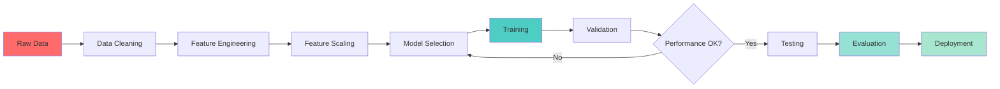

# 🤖 Week 43: Machine Learning Fundamentals

> **Duration:** 24 hours | **Difficulty:** 🟠 Advanced | **Prerequisites:** Week 41-42

## 🎯 Goal

Learn core machine learning concepts and algorithms. Build end-to-end ML pipelines using scikit-learn for regression, classification, and clustering tasks.

## 🎓 Learning Objectives

By the end of this week, you will:
- ✅ Understand ML problem types
- ✅ Master scikit-learn framework
- ✅ Build regression models
- ✅ Build classification models
- ✅ Perform clustering analysis
- ✅ Engineer features effectively
- ✅ Validate models properly
- ✅ Evaluate model performance

## 📊 ML Pipeline Architecture



## 📅 Daily Study Plan

### Monday: ML Fundamentals & Scikit-Learn (4 hours)

**Hour 1-2: ML Concepts**
- Supervised vs unsupervised
- Training and testing
- Overfitting and underfitting
- Bias-variance tradeoff
- Cross-validation

**Hour 2-3: Scikit-Learn Basics**
- Data preprocessing
- Train-test split
- Pipeline creation
- Model API
- Parameter tuning

**Hour 3-4: Hands-on**
- Load datasets
- Create pipelines
- Train models

### Tuesday: Regression (4 hours)

**Hour 1-2: Regression Algorithms**
- Linear regression
- Polynomial regression
- Ridge and Lasso
- Elastic Net
- SVR

**Hour 2-3: Evaluation Metrics**
- MSE, RMSE
- MAE
- R² score
- Residual analysis

**Hour 3-4: Practice**
- Implement 5 regression models
- Compare performance
- Hyperparameter tuning

### Wednesday: Classification (4 hours)

**Hour 1-2: Classification Algorithms**
- Logistic regression
- Decision trees
- Random forests
- SVM
- Naive Bayes
- KNN

**Hour 2-3: Evaluation Metrics**
- Accuracy, precision, recall
- F1 score
- Confusion matrix
- ROC-AUC
- PR curve

**Hour 3-4: Practice**
- Implement 6 classifiers
- Compare performance
- Handle imbalanced data

### Thursday: Feature Engineering & Clustering (4 hours)

**Hour 1-2: Feature Engineering**
- Feature scaling
- Encoding categorical variables
- Feature selection
- Dimensionality reduction
- Creating new features

**Hour 2-3: Clustering**
- K-means clustering
- Hierarchical clustering
- DBSCAN
- Gaussian mixture models
- Evaluation metrics

**Hour 3-4: Practice**
- Engineer features
- Cluster datasets
- Evaluate results

### Friday: Projects Setup (3 hours)

- Prepare datasets
- Set up notebooks

### Saturday & Sunday: Projects (6 hours total)

- Build ML projects

## 📖 Core Concepts

### Scikit-Learn Workflow

```python
from sklearn.model_selection import train_test_split, cross_val_score
from sklearn.preprocessing import StandardScaler
from sklearn.linear_model import LogisticRegression
from sklearn.ensemble import RandomForestClassifier
from sklearn.metrics import accuracy_score, precision_score, recall_score, f1_score

# Load data
X = data.drop('target', axis=1)
y = data['target']

# Train-test split
X_train, X_test, y_train, y_test = train_test_split(
    X, y, test_size=0.2, random_state=42
)

# Feature scaling
scaler = StandardScaler()
X_train = scaler.fit_transform(X_train)
X_test = scaler.transform(X_test)

# Model training
model = LogisticRegression(random_state=42)
model.fit(X_train, y_train)

# Predictions
y_pred = model.predict(X_test)

# Evaluation
accuracy = accuracy_score(y_test, y_pred)
precision = precision_score(y_test, y_pred)
recall = recall_score(y_test, y_pred)
f1 = f1_score(y_test, y_pred)

print(f"Accuracy: {accuracy:.4f}")
print(f"Precision: {precision:.4f}")
print(f"Recall: {recall:.4f}")
print(f"F1 Score: {f1:.4f}")
```

### Regression Example

```python
from sklearn.linear_model import LinearRegression, Ridge
from sklearn.metrics import mean_squared_error, r2_score
import numpy as np

# Create model
model = LinearRegression()
model.fit(X_train, y_train)

# Predictions
y_pred = model.predict(X_test)

# Evaluation
mse = mean_squared_error(y_test, y_pred)
rmse = np.sqrt(mse)
r2 = r2_score(y_test, y_pred)

print(f"RMSE: {rmse:.4f}")
print(f"R² Score: {r2:.4f}")

# Feature importance
coefficients = model.coef_
print("Coefficients:", coefficients)
```

### Classification with Ensemble

```python
from sklearn.ensemble import RandomForestClassifier, GradientBoostingClassifier
from sklearn.model_selection import GridSearchCV

# Random Forest
rf = RandomForestClassifier(n_estimators=100, random_state=42)
rf.fit(X_train, y_train)
y_pred = rf.predict(X_test)

# Feature importance
feature_importance = rf.feature_importances_

# Hyperparameter tuning
param_grid = {
    'n_estimators': [50, 100, 200],
    'max_depth': [5, 10, 15],
    'min_samples_split': [2, 5, 10]
}

grid_search = GridSearchCV(
    RandomForestClassifier(random_state=42),
    param_grid,
    cv=5,
    n_jobs=-1
)
grid_search.fit(X_train, y_train)
print(f"Best params: {grid_search.best_params_}")
```

### Clustering

```python
from sklearn.cluster import KMeans, DBSCAN
from sklearn.metrics import silhouette_score, davies_bouldin_score

# K-means clustering
kmeans = KMeans(n_clusters=3, random_state=42)
clusters = kmeans.fit_predict(X)

# Evaluation
silhouette = silhouette_score(X, clusters)
db_index = davies_bouldin_score(X, clusters)

print(f"Silhouette Score: {silhouette:.4f}")
print(f"Davies-Bouldin Index: {db_index:.4f}")

# DBSCAN
dbscan = DBSCAN(eps=0.5, min_samples=5)
clusters = dbscan.fit_predict(X)
```

## 💻 Mini Projects

### Project 1: House Price Prediction
**Duration:** 4 hours | **Difficulty:** 🟠 Advanced

#### Features
1. Data loading and exploration
2. Feature engineering
3. Multiple regression models
4. Model evaluation
5. Price prediction API

#### Dataset
- Boston Housing or Kaggle House Prices

### Project 2: Spam Detection
**Duration:** 4 hours | **Difficulty:** 🟠 Advanced

#### Features
1. Text preprocessing
2. Feature extraction (TF-IDF)
3. Classification models
4. Performance metrics
5. Web interface

#### Tech Stack
- Scikit-learn, pandas
- Flask or Streamlit

### Project 3: Customer Segmentation
**Duration:** 3 hours | **Difficulty:** 🟠 Advanced

#### Features
1. Clustering analysis
2. Customer profiles
3. Visualization
4. Actionable insights
5. Segmentation report

## 📚 Resources

### Official Documentation
- [Scikit-Learn Documentation](https://scikit-learn.org/)
- [Scikit-Learn User Guide](https://scikit-learn.org/stable/user_guide.html)
- [Scikit-Learn Examples](https://scikit-learn.org/stable/auto_examples/)

### YouTube Playlists
- [Scikit-Learn Tutorial - Kaggle](https://www.youtube.com/watch?v=pxNKnfssCGE)
- [Machine Learning with Python - freeCodeCamp](https://www.youtube.com/watch?v=i_LwzRVP7bc)
- [StatQuest - ML Algorithms](https://www.youtube.com/user/joshstarmer)

### Books
- **Hands-On Machine Learning** - Aurélien Géron
- **Introduction to Statistical Learning** - James et al.
- **The Hundred-Page ML Book** - Andriy Burkov

## ✅ Weekly Checklist

- [ ] Master scikit-learn framework
- [ ] Build 3+ regression models
- [ ] Build 3+ classification models
- [ ] Perform clustering analysis
- [ ] Engineer features effectively
- [ ] Validate models properly
- [ ] Complete 3 ML projects
- [ ] Solve 15+ ML problems
- [ ] Ready for Week 44 (Deep Learning)

---

**Next:** [Week 44 - Deep Learning Fundamentals 🧠](Week-44.md)
