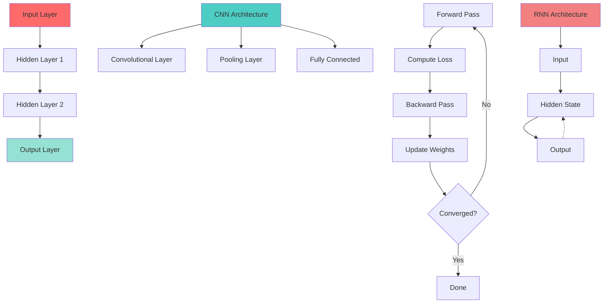

# 🧠 Week 44: Deep Learning Fundamentals

> **Duration:** 26 hours | **Difficulty:** 🔴 Advanced | **Prerequisites:** Week 41-43

## 🎯 Goal

Understand neural network architecture from first principles. Implement and train deep learning models for image and text tasks.

## 🎓 Learning Objectives

By the end of this week, you will:
- ✅ Understand neural network architecture
- ✅ Implement forward and backward propagation
- ✅ Master CNNs for image tasks
- ✅ Learn RNNs and LSTMs for sequences
- ✅ Understand attention mechanisms
- ✅ Learn transformer architecture
- ✅ Train and evaluate deep models

## 📊 Neural Network Architecture



## 📅 Daily Study Plan

### Monday: Neural Network Basics (4 hours)

**Hour 1-2: Fundamentals**
- Neurons and activation functions
- Forward propagation
- Loss functions
- Backpropagation algorithm

**Hour 2-3: Training**
- Gradient descent variants
- Learning rates
- Regularization (L1, L2, Dropout)
- Batch normalization

**Hour 3-4: Hands-on**
- Implement from scratch
- Train simple network
- Visualize learning

### Tuesday: Convolutional Neural Networks (4 hours)

**Hour 1-2: CNN Architecture**
- Convolution operation
- Filters and kernels
- Pooling layers
- Feature maps

**Hour 2-3: Advanced CNN**
- AlexNet, VGG, ResNet
- Transfer learning
- Data augmentation

**Hour 3-4: Implementation**
- Build CNN from scratch
- Image classification
- Visualization of filters

### Wednesday: Recurrent Neural Networks (4 hours)

**Hour 1-2: RNN Basics**
- Recurrent connections
- Sequence processing
- Vanishing gradient problem

**Hour 2-3: LSTM & GRU**
- Long Short-Term Memory
- Gated Recurrent Units
- Bidirectional RNNs

**Hour 3-4: Practice**
- Text generation
- Sequence classification
- Time series prediction

### Thursday: Attention & Transformers (4 hours)

**Hour 1-2: Attention Mechanism**
- Attention concepts
- Self-attention
- Multi-head attention
- Scaled dot-product

**Hour 2-3: Transformers**
- Transformer architecture
- Encoder-decoder
- Positional encoding
- Layer normalization

**Hour 3-4: Practice**
- Implement attention
- Build mini transformer
- Understand BERT

### Friday: Projects Setup (3 hours)

- Prepare datasets
- Set up GPU environment
- Initialize notebooks

### Saturday & Sunday: Projects (6 hours total)

- Build deep learning projects

## 📚 Core Concepts

### Backpropagation Example

```python
import numpy as np

class SimpleNN:
    def __init__(self, input_size, hidden_size, output_size):
        self.W1 = np.random.randn(input_size, hidden_size) * 0.01
        self.b1 = np.zeros((1, hidden_size))
        self.W2 = np.random.randn(hidden_size, output_size) * 0.01
        self.b2 = np.zeros((1, output_size))
    
    def relu(self, x):
        return np.maximum(0, x)
    
    def relu_derivative(self, x):
        return (x > 0).astype(float)
    
    def softmax(self, x):
        exp_x = np.exp(x - np.max(x, axis=1, keepdims=True))
        return exp_x / np.sum(exp_x, axis=1, keepdims=True)
    
    def forward(self, X):
        self.z1 = np.dot(X, self.W1) + self.b1
        self.a1 = self.relu(self.z1)
        self.z2 = np.dot(self.a1, self.W2) + self.b2
        self.a2 = self.softmax(self.z2)
        return self.a2
    
    def backward(self, X, y, output, learning_rate):
        m = X.shape[0]
        
        # Output layer gradients
        dz2 = output - y
        dW2 = np.dot(self.a1.T, dz2) / m
        db2 = np.sum(dz2, axis=0, keepdims=True) / m
        
        # Hidden layer gradients
        da1 = np.dot(dz2, self.W2.T)
        dz1 = da1 * self.relu_derivative(self.z1)
        dW1 = np.dot(X.T, dz1) / m
        db1 = np.sum(dz1, axis=0, keepdims=True) / m
        
        # Update weights
        self.W1 -= learning_rate * dW1
        self.b1 -= learning_rate * db1
        self.W2 -= learning_rate * dW2
        self.b2 -= learning_rate * db2
```

### CNN Convolution

```python
import numpy as np
from scipy.signal import convolve2d

def convolve_image(image, kernel):
    """
    Apply convolution to image with kernel
    """
    return convolve2d(image, kernel, mode='valid')

# Example: Sobel edge detection
sobel_x = np.array([[-1, 0, 1],
                    [-2, 0, 2],
                    [-1, 0, 1]])

sobel_y = np.array([[-1, -2, -1],
                    [0,  0,  0],
                    [1,  2,  1]])

edges_x = convolve_image(image, sobel_x)
edges_y = convolve_image(image, sobel_y)
```

### LSTM Cell

```python
class LSTMCell:
    def __init__(self, input_size, hidden_size):
        self.input_size = input_size
        self.hidden_size = hidden_size
        
        # Initialize weights
        self.Wf = np.random.randn(hidden_size, input_size + hidden_size)
        self.bf = np.zeros((hidden_size, 1))
        
        self.Wi = np.random.randn(hidden_size, input_size + hidden_size)
        self.bi = np.zeros((hidden_size, 1))
        
        self.Wc = np.random.randn(hidden_size, input_size + hidden_size)
        self.bc = np.zeros((hidden_size, 1))
        
        self.Wo = np.random.randn(hidden_size, input_size + hidden_size)
        self.bo = np.zeros((hidden_size, 1))
    
    def sigmoid(self, x):
        return 1 / (1 + np.exp(-x))
    
    def forward(self, x, h_prev, c_prev):
        # Concatenate input and hidden state
        concat = np.vstack([h_prev, x])
        
        # Forget gate
        f = self.sigmoid(np.dot(self.Wf, concat) + self.bf)
        
        # Input gate
        i = self.sigmoid(np.dot(self.Wi, concat) + self.bi)
        
        # Cell candidate
        c_tilde = np.tanh(np.dot(self.Wc, concat) + self.bc)
        
        # Cell state
        c = f * c_prev + i * c_tilde
        
        # Output gate
        o = self.sigmoid(np.dot(self.Wo, concat) + self.bo)
        
        # Hidden state
        h = o * np.tanh(c)
        
        return h, c
```

## 💻 Mini Projects

### Project 1: Digit Recognition (MNIST)
**Duration:** 4 hours | **Difficulty:** 🔴 Advanced

#### Features
1. CNN implementation
2. Data augmentation
3. Model evaluation
4. Visualization of predictions
5. Confusion matrix

### Project 2: Image Classifier
**Duration:** 4 hours | **Difficulty:** 🔴 Advanced

#### Features
1. Transfer learning
2. Fine-tuning
3. Data loading pipeline
4. Model deployment
5. REST API

### Project 3: Text Classifier
**Duration:** 3 hours | **Difficulty:** 🔴 Advanced

#### Features
1. Text preprocessing
2. Embedding layer
3. LSTM/GRU model
4. Sentiment analysis
5. Web interface

## 📖 Resources

### Official Documentation
- [PyTorch Tutorials](https://pytorch.org/tutorials/)
- [TensorFlow Tutorials](https://www.tensorflow.org/tutorials)
- [Deep Learning - Goodfellow et al.](https://www.deeplearningbook.org/)

### YouTube Playlists
- [3Blue1Brown - Neural Networks](https://www.youtube.com/playlist?list=PLZHQObOWTQDNU6R1_67000Dx_YKJH33fH)
- [Fast.ai - Deep Learning](https://www.fast.ai/)
- [Andrej Karpathy - Neural Networks](https://www.youtube.com/watch?v=VMj-3S1tku0)

### Books
- **Deep Learning** - Goodfellow, Bengio, Courville
- **Hands-On Machine Learning** - Aurélien Géron
- **Deep Learning with PyTorch** - Eli Stevens

## ✅ Weekly Checklist

- [ ] Understand neural network basics
- [ ] Implement backpropagation
- [ ] Build CNN for images
- [ ] Understand LSTM architecture
- [ ] Learn attention mechanisms
- [ ] Complete 3 deep learning projects
- [ ] Solve 15+ deep learning problems
- [ ] Ready for Week 45 (PyTorch/TensorFlow)

---

**Next:** [Week 45 - PyTorch & TensorFlow 🔥](Week-45.md)
