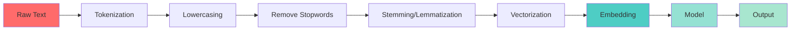

# 📝 Week 46: Natural Language Processing & Transformers

> **Duration:** 24 hours | **Difficulty:** 🔴 Advanced | **Prerequisites:** Week 44-45

## 🎯 Goal

Master NLP techniques and transformer models. Learn to work with text, embeddings, and state-of-the-art models like BERT and GPT.

## 🎓 Learning Objectives

By the end of this week, you will:
- ✅ Master text preprocessing
- ✅ Create word embeddings
- ✅ Understand transformer architecture
- ✅ Use HuggingFace models
- ✅ Fine-tune language models
- ✅ Build NLP applications
- ✅ Implement semantic search

## 🏗️ NLP Pipeline



## 📚 Core Concepts

### Text Preprocessing

```python
import nltk
from nltk.tokenize import word_tokenize
from nltk.corpus import stopwords
from nltk.stem import WordNetLemmatizer
import re

text = "The quick brown fox jumps over the lazy dog!"

# Lowercasing
text = text.lower()

# Remove special characters
text = re.sub(r'[^a-zA-Z\s]', '', text)

# Tokenization
tokens = word_tokenize(text)

# Remove stopwords
stop_words = set(stopwords.words('english'))
tokens = [t for t in tokens if t not in stop_words]

# Lemmatization
lemmatizer = WordNetLemmatizer()
tokens = [lemmatizer.lemmatize(t) for t in tokens]

print(tokens)
```

### Word Embeddings

```python
from gensim.models import Word2Vec
from sklearn.feature_extraction.text import TfidfVectorizer

# Word2Vec
sentences = [["cat", "sat", "mat"], ["dog", "ran", "park"]]
model = Word2Vec(sentences, vector_size=100, window=5, min_count=1)

# Get embedding
embedding = model.wv['cat']  # 100-dimensional vector

# TF-IDF Vectorization
vectorizer = TfidfVectorizer(max_features=1000)
X = vectorizer.fit_transform(documents)
```

### HuggingFace Transformers

```python
from transformers import AutoTokenizer, AutoModelForSequenceClassification
import torch

# Load pre-trained model
tokenizer = AutoTokenizer.from_pretrained("bert-base-uncased")
model = AutoModelForSequenceClassification.from_pretrained("bert-base-uncased")

# Tokenize and encode
text = "I love this movie!"
inputs = tokenizer(text, return_tensors="pt")

# Get predictions
with torch.no_grad():
    outputs = model(**inputs)
    logits = outputs.logits
    predictions = torch.softmax(logits, dim=1)

print(predictions)
```

### Fine-tuning BERT

```python
from transformers import Trainer, TrainingArguments
from transformers import AutoTokenizer, AutoModelForSequenceClassification
from datasets import load_dataset

# Load dataset
dataset = load_dataset('imdb')

# Tokenize
tokenizer = AutoTokenizer.from_pretrained('bert-base-uncased')

def preprocess(examples):
    return tokenizer(examples['text'], padding='max_length', truncation=True)

tokenized_datasets = dataset.map(preprocess, batched=True)

# Load model
model = AutoModelForSequenceClassification.from_pretrained('bert-base-uncased', num_labels=2)

# Training arguments
training_args = TrainingArguments(
    output_dir='./results',
    num_train_epochs=3,
    per_device_train_batch_size=8,
    per_device_eval_batch_size=8,
    learning_rate=2e-5,
    weight_decay=0.01,
)

# Trainer
trainer = Trainer(
    model=model,
    args=training_args,
    train_dataset=tokenized_datasets['train'],
    eval_dataset=tokenized_datasets['test'],
)

trainer.train()
```

## 💻 Mini Projects

### Project 1: Sentiment Analysis
**Duration:** 4 hours | **Difficulty:** 🔴 Advanced

#### Features
1. Text preprocessing
2. Model selection
3. Fine-tuning
4. REST API
5. Web interface

### Project 2: Text Summarizer
**Duration:** 4 hours | **Difficulty:** 🔴 Advanced

#### Features
1. Abstractive summarization
2. Extractive summarization
3. Multi-document support
4. Quality metrics
5. Batch processing

### Project 3: Question Answering System
**Duration:** 3 hours | **Difficulty:** 🔴 Advanced

#### Features
1. Context retrieval
2. Answer extraction
3. Confidence scores
4. Interactive interface
5. Multi-language support

## 📖 Resources

### Official Documentation
- [HuggingFace Documentation](https://huggingface.co/docs)
- [NLTK Documentation](https://www.nltk.org/)
- [spaCy Documentation](https://spacy.io/)
- [Gensim Documentation](https://radimrehurek.com/gensim/)

### YouTube Playlists
- [HuggingFace Course](https://huggingface.co/course/)
- [Andrej Karpathy - NLP](https://www.youtube.com/watch?v=kCc8FmEb1nY)
- [Jeremy Howard - NLP](https://www.youtube.com/watch?v=BIC_z8jVqWM)

### Books
- **Natural Language Processing with Transformers** - Tunstall, Werra, Wolf
- **Practical NLP** - Sohrab Hakimi
- **Speech and Language Processing** - Jurafsky & Martin

## ✅ Weekly Checklist

- [ ] Master text preprocessing
- [ ] Create word embeddings
- [ ] Understand transformers
- [ ] Use HuggingFace models
- [ ] Fine-tune language models
- [ ] Complete 3 NLP projects
- [ ] Solve 15+ NLP problems
- [ ] Ready for Week 47 (LLMs)

---

**Next:** [Week 47 - LLM Engineering 🚀](Week-47.md)
