# 🚀 Week 47: LLM Engineering & Prompt Engineering

> **Duration:** 24 hours | **Difficulty:** 🔴 Advanced | **Prerequisites:** Week 46

## 🎯 Goal

Master Large Language Model engineering. Learn to work with LLMs via APIs, implement prompt engineering techniques, and build intelligent applications.

## 📚 Learning Objectives

By the end of this week, you will:
- ✅ Understand LLM capabilities and limitations
- ✅ Work with OpenAI, Anthropic, and Google APIs
- ✅ Master prompt engineering techniques
- ✅ Implement prompt chaining and orchestration
- ✅ Use function calling and structured outputs
- ✅ Build LLM-powered applications
- ✅ Optimize costs and latency

## 📊 LLM Architecture Stack

```mermaid
graph TD
    A["LLM Providers"] --> A1["OpenAI"]
    A --> A2["Anthropic"]
    A --> A3["Google"]
    A --> A4["Open Source"]
    
    B["Prompt Engineering"] --> B1["Few-shot Learning"]
    B --> B2["Chain of Thought"]
    B --> B3["Structured Output"]
    B --> B4["Function Calling"]
    
    C["Application Patterns"] --> C1["Chat Applications"]
    C --> C2["Content Generation"]
    C --> C3["Code Assistants"]
    C --> C4["Data Analysis"]
    
    D["Optimization"] --> D1["Caching"]
    D --> D2["Batch Processing"]
    D --> D3["Token Management"]
    D --> D4["Cost Optimization"]
    
    style A fill:#ff9999
    style B fill:#99ccff
    style C fill:#99ff99
    style D fill:#ffcc99
```



## 📅 Daily Study Plan

### Monday: LLM Fundamentals (4 hours)

**Hour 1-2: LLM Concepts**
- Large language models overview
- Tokens and tokenization
- Context windows
- Temperature and parameters
- Models comparison

**Hour 2-3: API Setup**
- OpenAI API
- Anthropic API
- Authentication and keys
- Rate limiting
- Error handling

**Hour 3-4: First API Call**
- Simple completion
- Chat models
- Error handling
- Response parsing

### Tuesday: Prompt Engineering (4 hours)

**Hour 1-2: Prompt Techniques**
- Zero-shot prompting
- Few-shot learning
- Chain of Thought
- Self-consistency

**Hour 2-3: Advanced Prompts**
- ReAct pattern
- Tree of thoughts
- Reflection
- Prompt chaining

**Hour 3-4: Practice**
- Write 10 effective prompts
- Compare results
- Optimize prompts

### Wednesday: Function Calling & Structured Output (4 hours)

**Hour 1-2: Function Calling**
- Defining tools/functions
- Processing responses
- Error handling
- Multi-step workflows

**Hour 2-3: Structured Output**
- JSON mode
- Pydantic models
- Validation
- Type safety

**Hour 3-4: Integration**
- Combine with functions
- Real-world scenarios
- Testing

### Thursday: Building LLM Applications (4 hours)

**Hour 1-2: Common Patterns**
- Chat applications
- Code assistants
- Content generators
- Data analyzers

**Hour 2-3: Production Considerations**
- Streaming responses
- Caching
- Rate limiting
- Cost tracking

**Hour 3-4: Project Work**
- Start building applications

### Friday-Sunday: Projects (6 hours)

- Build 3 LLM applications

## 📖 Core Concepts

### OpenAI API Example

```python
from openai import OpenAI

client = OpenAI(api_key="sk-...")

# Simple completion
response = client.chat.completions.create(
    model="gpt-4",
    messages=[
        {"role": "system", "content": "You are a helpful assistant."},
        {"role": "user", "content": "Explain quantum computing."}
    ],
    temperature=0.7,
    max_tokens=500
)

print(response.choices[0].message.content)
```

### Prompt Chaining

```python
def step1_extract_info(text):
    response = client.chat.completions.create(
        model="gpt-4",
        messages=[
            {"role": "user", "content": f"Extract key points from: {text}"}
        ]
    )
    return response.choices[0].message.content

def step2_analyze(extracted):
    response = client.chat.completions.create(
        model="gpt-4",
        messages=[
            {"role": "user", "content": f"Analyze these points: {extracted}"}
        ]
    )
    return response.choices[0].message.content

def step3_summarize(analysis):
    response = client.chat.completions.create(
        model="gpt-4",
        messages=[
            {"role": "user", "content": f"Summarize: {analysis}"}
        ]
    )
    return response.choices[0].message.content

# Chain execution
info = step1_extract_info(document)
analysis = step2_analyze(info)
summary = step3_summarize(analysis)
```

### Function Calling

```python
tools = [
    {
        "type": "function",
        "function": {
            "name": "get_weather",
            "description": "Get weather for a location",
            "parameters": {
                "type": "object",
                "properties": {
                    "location": {"type": "string"},
                    "unit": {"type": "string", "enum": ["celsius", "fahrenheit"]}
                },
                "required": ["location"]
            }
        }
    }
]

response = client.chat.completions.create(
    model="gpt-4",
    messages=[{"role": "user", "content": "What's the weather in Paris?"}],
    tools=tools
)

if response.choices[0].message.tool_calls:
    for tool_call in response.choices[0].message.tool_calls:
        print(f"Function: {tool_call.function.name}")
        print(f"Args: {tool_call.function.arguments}")
```

## 💻 Mini Projects

### Project 1: AI Assistant
**Duration:** 4 hours | **Difficulty:** 🔴 Advanced

#### Features
1. Multi-turn conversation
2. Context management
3. Tool integration
4. Error handling
5. Streaming responses

### Project 2: Research Assistant
**Duration:** 4 hours | **Difficulty:** 🔴 Advanced

#### Features
1. Paper analysis
2. Citation extraction
3. Summary generation
4. Comparison analysis
5. Export capabilities

### Project 3: Code Reviewer
**Duration:** 3 hours | **Difficulty:** 🔴 Advanced

#### Features
1. Code analysis
2. Bug detection
3. Improvement suggestions
4. Best practices
5. GitHub integration

## 📚 Resources

### Official Documentation
- [OpenAI API Documentation](https://platform.openai.com/docs)
- [Anthropic Claude API](https://docs.anthropic.com/)
- [Google Gemini API](https://ai.google.dev/docs)
- [OpenAI Cookbook](https://github.com/openai/openai-cookbook)

### YouTube Playlists
- [OpenAI API Tutorial - freeCodeCamp](https://www.youtube.com/watch?v=jHv63Svg7uo)
- [Prompt Engineering - DeepLearning.AI](https://www.deeplearning.ai/short-courses/)
- [LLM Applications - AssemblyAI](https://www.youtube.com/@AssemblyAI)

### Books
- **Build a Large Language Model (From Scratch)** - Sebastian Raschka
- **Prompt Engineering for LLMs** - Various authors

## ✅ Weekly Checklist

- [ ] Understand LLM fundamentals
- [ ] Set up API credentials
- [ ] Make first API calls
- [ ] Master prompt engineering
- [ ] Implement function calling
- [ ] Build 3 LLM projects
- [ ] Optimize for cost and latency
- [ ] Ready for Week 48

---

**Next:** [Week 48 - Vector Databases & RAG 🗄️](Week-48.md)
