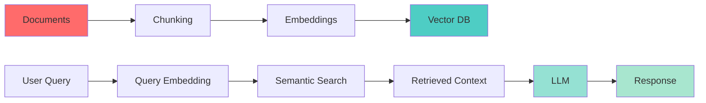

# 🗄️ Week 48: Vector Databases & RAG (Retrieval-Augmented Generation)

> **Duration:** 22 hours | **Difficulty:** 🔴 Advanced | **Prerequisites:** Week 47

## 🎯 Goal

Master vector embeddings and implement Retrieval-Augmented Generation systems. Build intelligent knowledge base systems.

## 📚 Learning Objectives

By the end of this week, you will:
- ✅ Understand embeddings and semantic search
- ✅ Work with vector databases
- ✅ Implement RAG architecture
- ✅ Chunk and embed documents
- ✅ Build semantic search systems
- ✅ Create knowledge bases
- ✅ Optimize retrieval

## 📊 RAG Architecture



## 📖 Core Concepts

### Embeddings

```python
from openai import OpenAI
import numpy as np

client = OpenAI()

# Generate embeddings
text = "The quick brown fox jumps over the lazy dog"
response = client.embeddings.create(
    input=text,
    model="text-embedding-3-small"
)

embedding = response.data[0].embedding
print(f"Embedding dimension: {len(embedding)}")
print(f"First 5 values: {embedding[:5]}")

# Cosine similarity
def cosine_similarity(a, b):
    return np.dot(a, b) / (np.linalg.norm(a) * np.linalg.norm(b))

text2 = "A quick brown fox"
response2 = client.embeddings.create(
    input=text2,
    model="text-embedding-3-small"
)
embedding2 = response2.data[0].embedding

similarity = cosine_similarity(embedding, embedding2)
print(f"Similarity: {similarity:.4f}")
```

### Vector Database - Pinecone

```python
from pinecone import Pinecone

pc = Pinecone(api_key="your-api-key")
index = pc.Index("document-store")

# Upsert vectors
vectors_to_upsert = [
    ("doc1", embedding1, {"source": "paper1.pdf"}),
    ("doc2", embedding2, {"source": "paper2.pdf"})
]
index.upsert(vectors=vectors_to_upsert)

# Query
query_embedding = client.embeddings.create(
    input="climate change effects",
    model="text-embedding-3-small"
).data[0].embedding

results = index.query(
    vector=query_embedding,
    top_k=3,
    include_metadata=True
)

for result in results.matches:
    print(f"Score: {result.score}, Source: {result.metadata['source']}")
```

### Document Chunking

```python
from langchain.text_splitter import RecursiveCharacterTextSplitter

text_splitter = RecursiveCharacterTextSplitter(
    chunk_size=1000,
    chunk_overlap=200,
    separators=["\n\n", "\n", " ", ""]
)

documents = text_splitter.split_text(large_document)

for i, chunk in enumerate(documents):
    embedding = client.embeddings.create(
        input=chunk,
        model="text-embedding-3-small"
    ).data[0].embedding
    
    index.upsert([(f"chunk_{i}", embedding, {"text": chunk})])
```

### RAG Pipeline

```python
def rag_pipeline(query):
    # 1. Embed query
    query_embedding = client.embeddings.create(
        input=query,
        model="text-embedding-3-small"
    ).data[0].embedding
    
    # 2. Retrieve context
    results = index.query(
        vector=query_embedding,
        top_k=3
    )
    
    context = "\n".join([match.metadata["text"] for match in results.matches])
    
    # 3. Generate response
    response = client.chat.completions.create(
        model="gpt-4",
        messages=[
            {"role": "system", "content": "You are a helpful assistant."},
            {"role": "user", "content": f"Context: {context}\n\nQuestion: {query}"}
        ]
    )
    
    return response.choices[0].message.content

# Usage
answer = rag_pipeline("What are the climate impacts?")
print(answer)
```

## 💻 Mini Projects

### Project 1: Private ChatGPT
**Duration:** 4 hours | **Difficulty:** 🔴 Advanced

#### Features
1. Document upload
2. Semantic search
3. Chat interface
4. Citation tracking
5. Cost tracking

### Project 2: Document Search Engine
**Duration:** 4 hours | **Difficulty:** 🔴 Advanced

#### Features
1. Full-text search
2. Semantic search
3. Filtering
4. Ranking
5. Export results

### Project 3: Knowledge Base
**Duration:** 3 hours | **Difficulty:** 🔴 Advanced

#### Features
1. Document management
2. Q&A system
3. Automatic indexing
4. Search analytics
5. Admin interface

## 📚 Resources

### Official Documentation
- [Pinecone Documentation](https://docs.pinecone.io/)
- [ChromaDB Documentation](https://docs.trychroma.com/)
- [Weaviate Documentation](https://weaviate.io/developers/weaviate)
- [FAISS Guide](https://github.com/facebookresearch/faiss/wiki)

## ✅ Weekly Checklist

- [ ] Understand embeddings
- [ ] Set up vector database
- [ ] Implement RAG system
- [ ] Chunk documents
- [ ] Build semantic search
- [ ] Complete 3 projects
- [ ] Ready for Week 49

---

**Next:** [Week 49 - AI Agents 🤖](Week-49.md)
