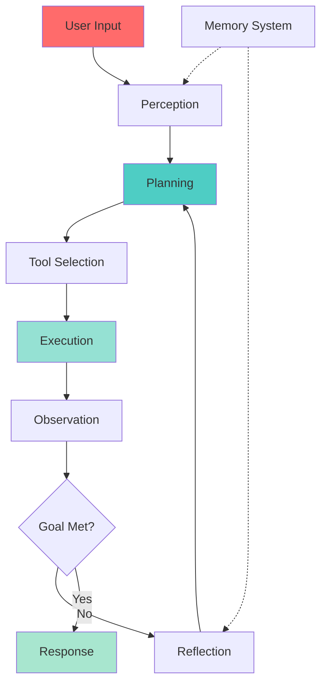

# 🤖 Week 49: AI Agents & Multi-Agent Systems

> **Duration:** 24 hours | **Difficulty:** 🔴 Advanced | **Prerequisites:** Week 47-48

## 🎯 Goal

Build autonomous AI agents that can plan, execute, and reflect. Master multi-agent systems and orchestration frameworks.

## 📚 Learning Objectives

By the end of this week, you will:
- ✅ Understand agentic architecture
- ✅ Implement ReAct pattern
- ✅ Build tool-using agents
- ✅ Implement memory systems
- ✅ Create multi-agent systems
- ✅ Use LangChain for orchestration
- ✅ Deploy agents in production

## 📊 Agent Architecture



## 📖 Core Concepts

### ReAct Pattern

```python
from langchain.agents import initialize_agent, Tool
from langchain_openai import ChatOpenAI

# Define tools
def calculator(expression):
    return str(eval(expression))

def web_search(query):
    # Simulate web search
    return f"Search results for: {query}"

tools = [
    Tool(
        name="Calculator",
        func=calculator,
        description="Useful for math calculations"
    ),
    Tool(
        name="Web Search",
        func=web_search,
        description="Search the web for information"
    )
]

llm = ChatOpenAI(model="gpt-4")
agent = initialize_agent(
    tools,
    llm,
    agent="react-docstore",
    verbose=True
)

response = agent.run("What is 2^10 and current weather?")
```

### Memory Management

```python
from langchain.memory import ConversationBufferMemory
from langchain.chat_models import ChatOpenAI
from langchain.chains import ConversationChain

memory = ConversationBufferMemory()
conversation = ConversationChain(
    llm=ChatOpenAI(model="gpt-4"),
    memory=memory,
    verbose=True
)

response1 = conversation.run("My name is Alice")
response2 = conversation.run("What's my name?")
```

### Multi-Agent System

```python
from crewai import Agent, Task, Crew

# Define agents
researcher = Agent(
    role="Research Analyst",
    goal="Find relevant information",
    tools=[web_search_tool]
)

writer = Agent(
    role="Content Writer",
    goal="Write engaging content",
    tools=[]
)

# Define tasks
research_task = Task(
    description="Research AI trends",
    agent=researcher,
    expected_output="Research findings"
)

write_task = Task(
    description="Write article from research",
    agent=writer,
    expected_output="Article"
)

# Create crew
crew = Crew(
    agents=[researcher, writer],
    tasks=[research_task, write_task]
)

result = crew.kickoff()
```

## 💻 Mini Projects

### Project 1: Travel Planning Agent
**Duration:** 4 hours | **Difficulty:** 🔴 Advanced

#### Features
1. Multi-step planning
2. Tool integration
3. Cost optimization
4. Itinerary generation
5. Real-time updates

### Project 2: Coding Agent
**Duration:** 4 hours | **Difficulty:** 🔴 Advanced

#### Features
1. Code analysis
2. Debugging
3. Testing
4. Documentation
5. Optimization suggestions

### Project 3: Research Agent
**Duration:** 3 hours | **Difficulty:** 🔴 Advanced

#### Features
1. Paper discovery
2. Analysis
3. Synthesis
4. Report generation

## 📚 Resources

### Official Documentation
- [LangChain Agents](https://python.langchain.com/docs/modules/agents/)
- [CrewAI Documentation](https://docs.crewai.com/)
- [AutoGen Documentation](https://microsoft.github.io/autogen/)

## ✅ Weekly Checklist

- [ ] Understand agent architecture
- [ ] Implement ReAct pattern
- [ ] Build tool-using agents
- [ ] Create memory systems
- [ ] Build multi-agent system
- [ ] Complete 3 projects
- [ ] Ready for Week 50

---

**Next:** [Week 50 - MLOps & Deployment 🚀](Week-50.md)
