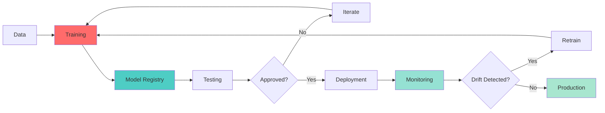

# 🚀 Week 50: MLOps & Production Deployment

> **Duration:** 24 hours | **Difficulty:** 🔴 Advanced | **Prerequisites:** Week 41-49

## 🎯 Goal

Deploy AI/ML models to production. Master MLOps workflows, monitoring, and enterprise deployment patterns.

## 📚 Learning Objectives

By the end of this week, you will:
- ✅ Set up MLOps pipelines
- ✅ Use model registries
- ✅ Implement model serving
- ✅ Monitor production models
- ✅ Implement CI/CD for ML
- ✅ Scale inference
- ✅ Deploy to cloud platforms

## 📊 MLOps Pipeline



## 📖 Core Concepts

### MLflow Setup

```python
import mlflow
from sklearn.model_selection import train_test_split
from sklearn.ensemble import RandomForestClassifier

# Set tracking URI
mlflow.set_tracking_uri("http://localhost:5000")

# Start experiment
with mlflow.start_run():
    # Log parameters
    mlflow.log_param("n_estimators", 100)
    mlflow.log_param("max_depth", 10)
    
    # Train model
    X_train, X_test, y_train, y_test = train_test_split(X, y, test_size=0.2)
    model = RandomForestClassifier(n_estimators=100, max_depth=10)
    model.fit(X_train, y_train)
    
    # Log metrics
    accuracy = model.score(X_test, y_test)
    mlflow.log_metric("accuracy", accuracy)
    
    # Log model
    mlflow.sklearn.log_model(model, "model")
```

### FastAPI Serving

```python
from fastapi import FastAPI, HTTPException
import mlflow.pyfunc
import numpy as np

app = FastAPI(title="ML Model API")

# Load model
model = mlflow.pyfunc.load_model("models:/mymodel/production")

@app.post("/predict")
async def predict(data: list[float]):
    try:
        input_data = np.array(data).reshape(1, -1)
        prediction = model.predict(input_data)
        return {"prediction": float(prediction[0])}
    except Exception as e:
        raise HTTPException(status_code=400, detail=str(e))

@app.get("/health")
async def health():
    return {"status": "healthy"}
```

### Docker Deployment

```dockerfile
FROM python:3.11-slim

WORKDIR /app

COPY requirements.txt .
RUN pip install --no-cache-dir -r requirements.txt

COPY . .

EXPOSE 8000

CMD ["uvicorn", "main:app", "--host", "0.0.0.0", "--port", "8000"]
```

### Monitoring with Prometheus

```python
from prometheus_client import Counter, Histogram
import time

# Metrics
predictions = Counter('predictions_total', 'Total predictions')
prediction_latency = Histogram('prediction_latency_seconds', 'Prediction latency')
prediction_errors = Counter('prediction_errors_total', 'Total errors')

@app.post("/predict")
async def predict(data: list[float]):
    start = time.time()
    try:
        result = model.predict(np.array(data).reshape(1, -1))
        predictions.inc()
        prediction_latency.observe(time.time() - start)
        return {"prediction": float(result[0])}
    except Exception as e:
        prediction_errors.inc()
        raise
```

## 💻 Mini Projects

### Project 1: Production AI API
**Duration:** 4 hours | **Difficulty:** 🔴 Advanced

#### Features
1. Model serving
2. Authentication
3. Rate limiting
4. Monitoring
5. Logging

### Project 2: RAG Chatbot
**Duration:** 4 hours | **Difficulty:** 🔴 Advanced

#### Features
1. Document ingestion
2. Vector storage
3. Retrieval pipeline
4. Chat interface
5. Admin panel

### Project 3: Enterprise Knowledge Assistant
**Duration:** 3 hours | **Difficulty:** 🔴 Advanced

#### Features
1. Multi-source integration
2. Fine-tuned LLM
3. Enterprise security
4. Audit logging
5. Performance optimization

## 📚 Resources

### Official Documentation
- [MLflow Documentation](https://mlflow.org/docs/latest/)
- [Weights & Biases Docs](https://docs.wandb.ai/)
- [FastAPI Documentation](https://fastapi.tiangolo.com/)
- [Kubernetes Documentation](https://kubernetes.io/docs/)

## ✅ Weekly Checklist

- [ ] Set up MLflow
- [ ] Build FastAPI server
- [ ] Containerize model
- [ ] Deploy to cloud
- [ ] Set up monitoring
- [ ] Complete 3 projects
- [ ] Production-ready system

---

**Congratulations on Week 50!** 🎉

You've completed the core curriculum. Consider Week 51-60 for specialized tracks.
