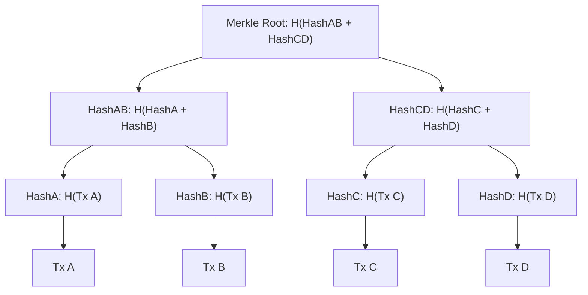

# 🎯 Week 51: Cryptography & Digital Signatures

> **Duration:** 24 hours | **Difficulty:** 🔴 Advanced | **Prerequisites:** Basic Math, Weeks 1-10

## 📌 Goal
Understand foundational cryptography: hashing math, symmetric vs asymmetric encryption systems, digital signatures, and Merkle tree calculations.

---

## 🎓 Learning Objectives
By the end of this week, you will:
- ✅ Understand and compute cryptographic hashes (SHA-256)
- ✅ Distinguish symmetric (AES) vs asymmetric (RSA, Elliptic Curves) encryption
- ✅ Construct and verify digital signatures (ECDSA)
- ✅ Build a Merkle Tree from scratch to generate proofs of inclusion
- ✅ Understand public/private key-pair derivation and wallet creation

---

## 📚 Prerequisites & Study Hours
- **Prerequisites**: Week 21 (Algorithms & Big O), basic JavaScript or Rust syntax.
- **Estimated Study Hours**: 24 hours
- **Difficulty**: 🔴 Advanced

---

## 📖 Concepts & Theory

### 1. Merkle Trees
A Merkle Tree is a binary tree of hashes. It allows verifying that a specific transaction is included in a block without downloading the entire block history ($O(\log N)$ Merkle Proof verification).



### 2. Public-Key Infrastructure (PKI)
Addresses are generated from private keys using elliptic curve point multiplication:
1. **Private Key**: A cryptographically secure random 256-bit integer.
2. **Public Key**: Derived using Elliptic Curve Point Multiplication ($Q = d \times G$, where $d$ is private key, $G$ is curve generator point). One-way function.
3. **Address**: Hash of the public key.

---

## 💻 Daily Study Plan

### 📅 Monday: Hashing Math & SHA-256
- Study one-way functions, collision resistance, and the pigeonhole principle.
- Practice hashing files and values in your terminal.

### 📅 Tuesday: Symmetric vs Asymmetric Systems
- Study block ciphers (AES-256) and public-key systems (RSA).
- Contrast processing speed vs security keys distribution.

### 📅 Wednesday: Elliptic Curve Cryptography (ECC)
- Learn the mathematics of elliptic curves ($y^2 = x^3 + ax + b$).
- Understand the Discrete Logarithm Problem (DLP) that secures ECC.

### 📅 Thursday: Merkle Trees & Verification
- Manually construct a 4-leaf Merkle Tree on paper.
- Write code to generate parent nodes from child leaf nodes.

### 📅 Friday: Projects Implementation
- Build the **Merkle Tree Visualizer** and **Password Manager** projects.

### 📅 Saturday: Problem Practice
- Solve the cryptographic implementation exercises.

### 📅 Sunday: Revision & Interview Prep
- Review key derivation patterns.

---

## 🧪 Projects & Implementation Guide

### Project 1: Merkle Tree Proof Visualizer
- **Architecture**: A module that builds a Merkle Tree from a list of transactions, generates an inclusion proof for a single leaf, and verifies the proof against the root.
- **Folder Structure**:
  ```
  merkle-visualizer/
  ├── MerkleTree.js
  ├── app.js
  └── package.json
  ```
- **Implementation Guide**: Use the `crypto` module in Node.js. Concatenate and double-hash adjacent elements to form the tree.

### Project 2: CLI Password Encrypter
- **Architecture**: App encrypting credentials using AES-256-GCM.

### Project 3: Key Pair Generator
- **Architecture**: Script deriving Ed25519 public/private keys and generating wallet addresses.

---

## 📝 Practice Exercises
1. Calculate the double SHA-256 hash of a string using Node's `crypto` module.
2. Write a script to encrypt a local `.json` file using a master passphrase.
3. Construct a Merkle Proof generator for 8 transaction inputs.
4. Manually sign a payload using an ECDSA private key and verify the signature using the matching public key.

---

## 💼 Interview Questions & Answers
- **Q**: What is a Replay Attack and how does cryptography prevent it?
- **A**: A replay attack occurs when an attacker intercepts a valid transaction signature and broadcasts it again on the network. Cryptography prevents this by including a **nonce** (a sequential counter) and the **Chain ID** inside the signed transaction payload, making reuse invalid.

---

## 📖 Official Resources
- [NIST Cryptographic Standards Guide](https://csrc.nist.gov/)
- [RFC 8032: Edwards-Curve Digital Signature Algorithm (Ed25519)](https://datatracker.ietf.org/doc/html/rfc8032)
