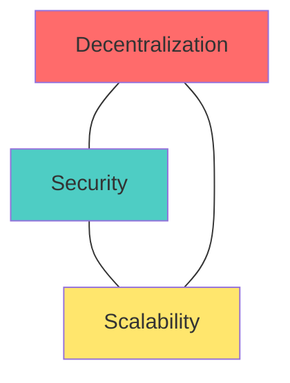

# 🎯 Week 59: Advanced Blockchain, Scaling & Layer 2

> **Duration:** 24 hours | **Difficulty:** 🔴 Advanced | **Prerequisites:** Weeks 53, 57 & 58

## 📌 Goal
Understand advanced blockchain scaling mechanics, study cross-chain bridges, explore Optimistic and Zero-Knowledge (ZK) Rollup protocols, and simulate a Layer 2 scaling engine.

---

## 🎓 Learning Objectives
By the end of this week, you will:
- ✅ Understand blockchain scaling limitations (The Blockchain Trilemma)
- ✅ Explore Layer 2 scaling: State Channels, Sidechains, and Rollups
- ✅ Differentiate between Optimistic Rollups (Fraud Proofs) and ZK-Rollups (Validity Proofs)
- ✅ Master cross-chain bridge security and lock-and-mint architectures
- ✅ Explore Zero-Knowledge cryptography fundamentals (zk-SNARKs)
- ✅ Model a basic Layer 2 rollup validation system

---

## 📚 Prerequisites & Study Hours
- **Prerequisites**: Week 51 (Cryptography), Week 53 (Consensus and Block architectures).
- **Estimated Study Hours**: 24 hours
- **Difficulty**: 🔴 Advanced

---

## 📖 Concepts & Theory

### 1. The Blockchain Trilemma
Decentralized networks can satisfy at most two of the following properties simultaneously:
- **Decentralization**: Low entry barriers for validating nodes.
- **Security**: Resistance to network attacks.
- **Scalability**: High transaction throughput (TPS).


*Layer 2 Rollups solve this by moving execution off-chain while keeping security assertions on-chain.*

### 2. Rollup Architectures (Optimistic vs. ZK)
- **Optimistic Rollups (e.g. Arbitrum, Optimism)**: Assumes all transactions are valid by default. Validators submit state transitions. If a validator suspects fraud, they can submit a **Fraud Proof** within a challenge window (usually 7 days).
- **ZK-Rollups (e.g. zkSync, Starknet)**: Executes transactions off-chain and generates a cryptographic **Validity Proof** (zk-SNARK/STARK). This proof is verified instantly on-chain, avoiding challenge windows.

---

## 💻 Daily Study Plan

### 📅 Monday: The Scaling Problem & Channels
- Study the scaling limits of Layer 1 blockchains.
- Learn about state channels (Lightning Network) and sidechains (Polygon PoS).

### 📅 Tuesday: Rollup Foundations
- Study rollup architectures: transaction compression, calldata space, and state roots.
- Explore sequencer operations and block production.

### 📅 Wednesday: Optimistic vs ZK Rollups
- Compare Fraud Proofs vs. Validity Proofs.
- Study challenge periods and finality limitations.

### 📅 Thursday: Cross-Chain Bridges
- Learn about bridge architectures: Lock-and-Mint, Burn-and-Mint, and Atomic Swaps.
- Audit historic bridge exploits (Ronin Bridge, Wormhole).

### 📅 Friday: Projects Implementation
- Build the **Bridge Simulator** and **L2 Rollup State Tracker** scripts.

### 📅 Saturday: ZK Cryptography Basics
- Read up on Zero-Knowledge foundations: Interactive vs Non-Interactive proofs, proving keys, and verification keys.

### 📅 Sunday: Revision & Interview Prep
- Review rollup data availability and EVM compatibility.

---

## 🧪 Projects & Implementation Guide

### Project 1: Layer 2 Rollup State Tracker
- **Architecture**: A Node.js application simulating a sequencer compressing transactions into batch roots, and a mock Layer 1 contract verifying transaction proofs.
- **Folder Structure**:
  ```
  l2-rollup/
  ├── Sequencer.js
  ├── Layer1Contract.js
  └── test.js
  ```
- **Implementation Guide**: Compute Merkle Roots of transaction batches. The mock L1 contract verifies proofs of states before updating its root storage.

### Project 2: Lock-and-Mint Bridge Simulator
- **Architecture**: Script simulating transferring tokens between two distinct chains via lock/mint events.

### Project 3: ZK Proof Verification Client
- **Architecture**: App verifying simple zk-SNARK proof structures using javascript libraries.

---

## 📝 Practice Exercises
1. Calculate transaction calldata cost compression rates on Ethereum after batching.
2. Build a local bridge simulator that emits a "Locked" event and prints matching mint details.
3. Write a mock challenge validation script that reverses an Optimistic Rollup state root if a transaction fails signature audits.
4. Implement a Merkle Proof verification function in Rust or JavaScript.

---

## 💼 Interview Questions & Answers
- **Q**: What is "Data Availability" in the context of rollups?
- **A**: Data Availability ensures that all transactional data required to reconstruct the current blockchain state is published publicly (on the Layer 1 host chain). Without this data, users cannot calculate state transitions independently or challenge fraudulent states.

---

## 📖 Official Resources
- [Ethereum Developer Guides: Layer 2 Scaling](https://ethereum.org/en/developers/docs/scaling/#layer-2-scaling)
- [Starknet Developer Documentation](https://docs.starknet.io/)
- [Arbitrum Developer Portal](https://developer.arbitrum.io/)
